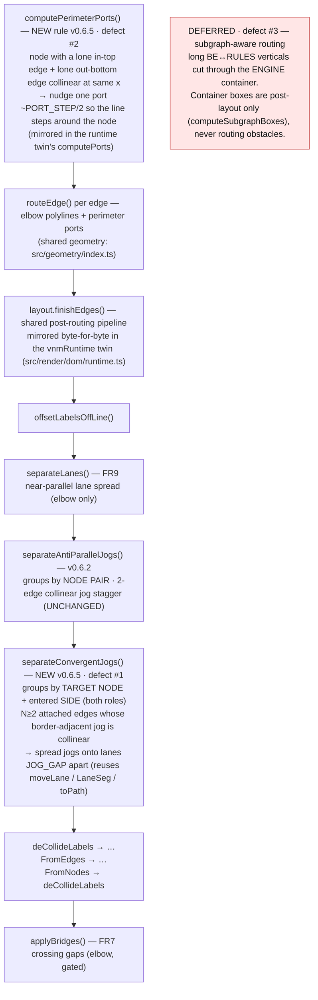

Status: **accepted** (user, 2026-07-15) — D1 → A (defer #3 subgraph routing), D2 → A (include #2 MCP skewer), D3 → A (new convergence pass)

# Plan — dense-edge-routing (v0.6.5)

Status: awaiting acceptance

**Edge-routing quality on dense diagrams.** On a real, dense `flowchart TB`
(`architecture.mmd`) three edge-routing defects show up at once. This plan fixes
the **two tractable ones** as additive, gated, elbow-only passes in the shared
edge-routing pipeline — a **multi-edge convergence de-tangle** (#1, the natural
generalization of the v0.6.2 anti-parallel de-cramp) and a **skewer nudge** (#2) —
and **defers the third** (long edges cutting through an unrelated subgraph
container) because avoiding it needs subgraph-aware routing, a large,
high-regression change. Every change is mirrored byte-for-byte in the
`vnmRuntime` twin and gated so clean diagrams stay byte-identical.

## Goal

On `flowchart TB` diagrams dense enough that several edges converge on one node,
make the routing **legible**: no knot of collinear crossbars where edges meet a
border, and no straight line that appears to run through a node. Ship as
**v0.6.5**. **Acceptance signal:** re-rendering `architecture.mmd` at `--style
clean --theme light/dark` shows the four edges into `Rules · Sets · Runs` fanning
in on distinct levels (no tangle) and `MCP surface` no longer skewered — while the
gallery/example snapshots, the `dom-runtime-parity` guard, and all unit tests stay
green, and clean diagrams without a convergence bundle stay byte-identical.

## Context — what exists (code = source of truth)

The renderer routes every edge through **shared pure geometry**
(`src/geometry/index.ts`) and then runs a fixed sequence of **post-routing passes**
via `layout.finishEdges()` (`src/layout/index.ts:64`). That whole pipeline is
**re-implemented byte-for-byte** inside the inlined DOM runtime
(`src/render/dom/runtime.ts`) — the `dom-runtime-parity` test
(`test/dom-runtime-parity.test.ts`) fails on any drift. This is the recurring
trap: **every geometry change lands twice.**

The pipeline today (`finishEdges`, lines 64-78, mirrored in the runtime at
`runtime.ts:1850-1868` and again at `2719+`):

```
offsetLabelsOffLine → separateLanes → separateAntiParallelJogs
  → deCollideLabels → …FromEdges → …FromNodes → deCollideLabels → applyBridges
```

Ports are assigned up front by `computePerimeterPorts`
(`geometry/index.ts:249`) — each edge attaches to a node border chosen by
direction, and edges that share a side are spread onto channels `PORT_STEP=30`
apart. The **v0.6.2** `separateAntiParallelJogs` (`geometry/index.ts:1008`)
de-cramps a *2-edge, same-node-pair* collinear jog using `moveLane` / `LaneSeg` /
`JOG_GAP=26` / `toPath`. `separateLanes` (`geometry/index.ts:894`) spreads
near-parallel runs but gates on `LANE_MIN_OVERLAP=40` overlap.

I verified the real geometry by instrumenting `parse → layout(themes.light)` on
`architecture.mmd`. The relevant boxes and routes:

- **RULES** (`Rules · Sets · Runs`) top border at **y=1220**, center x=464.
  Four edges attach there, correctly spread to x=**419/449/479/509**:
  `e8 CONSOLE→RULES` (REST), `e4 MCP→RULES`, `e5 BE→RULES` (stream context, a
  *target*), `e6 RULES→BE` (findings, a *source*).
- **MCP** center x=**400**, top y=758, bottom y=818. `e3 AGENT→MCP` (author
  rules) attaches to MCP **top** at offset 0 → x=400; `e4 MCP→RULES` attaches to
  MCP **bottom** at offset 0 → x=400.
- **ENGINE** container box x **211..577**, y **722..1294** (members RULES, MCP,
  CONSOLE).

## The three defects — verified root cause

### Defect #1 — convergence tangle at `Rules · Sets · Runs` (FIX)

The four edges into RULES's top all make their **border-adjacent horizontal jog
at the same y=1190** (30px above the border): `e8` x298→419, `e4` x400→449, `e5`
x510→479, `e6` x509→536. Four collinear crossbars plus the four vertical drops
crossing them merge into one knot above RULES.

**Why the shipped passes miss it** (verified in code):
- `separateLanes` **skips** — the crossbars overlap on the parallel (x) axis by
  only ~19px (`e8/e4`), below `LANE_MIN_OVERLAP=40`; the rest don't overlap at all.
- `separateAntiParallelJogs` **misses** — it groups by **node pair**, and these
  are three different pairs. Even the one genuine pair (`BE↔RULES`: e5+e6) is
  skipped, because its "first interior run wins" rule (`geometry/index.ts:1046`)
  picks e5's jog at y=368 and e6's at y=1190 — **not collinear** → skipped.

**Root cause:** no pass generalizes the jog-stagger from a node **pair** to a node
**side**. This is exactly the case the goal calls out: 3-4 edges converging on one
border with collinear jogs.

### Defect #2 — `MCP surface` skewered (FIX, cosmetic)

`e3` enters MCP top at x=400 and `e4` leaves MCP bottom at x=400. Both are the
**lone** edge on their side, so `computePerimeterPorts` gives each offset 0 (side
center) → collinear at x=400 → a straight vertical appears to run through MCP.

**Root cause:** `computePerimeterPorts` spreads *within* a side but has no
cross-side rule, so a lone-in-top + lone-out-bottom pair lands collinear. (Note:
nodes paint *over* edges in the 5-layer draw order, so the line is occluded behind
MCP; the defect is the **aligned in/out illusion**, not a literal line across the
fill — hence this is the more cosmetic of the two fixes.)

### Defect #3 — long edges cut through the ENGINE container (DEFER)

`e5` (x=510) and `e6` (x=536) run y=368→1190 straight through the ENGINE box
interior (x 211..577, y 722..1294). RULES sits at the bottom of ENGINE and BE
sits above it, so **any orthogonal route between them must traverse ENGINE's
vertical extent** unless it detours around the container's left (x<211) or right
(x>577) side.

**Root cause:** subgraph container boxes are computed **after** dagre by
`computeSubgraphBoxes` (`geometry/index.ts:1513`, called at `layout/index.ts:279`)
and used **only** for the container visual and `contentBounds` — they are **never
fed into routing**. Routing has zero awareness of containers as obstacles.

**Why defer:** there is **no small nudge** that fixes this — avoiding the
container requires genuine **subgraph-aware / obstacle routing** (route around the
container, or bias dagre's cluster waypoints, or add a container-avoidance pass).
That touches the core routing model, risks regressions across *every* subgraph
diagram + the gallery heroes (`microservices`, `nested-subgraphs`) + the parity
twin, and is a **LARGE, high-risk change**. It deserves its own feature, not a
rushed rider on v0.6.5.

## Functional requirements

- **FR1 — convergence de-tangle.** A **new** gated, elbow-only pass
  `separateConvergentJogs` in `finishEdges` groups edges by **(attached node,
  attached side)** — across both roles (an edge *entering* a target side and an
  edge *leaving* a source side both count). For a group of **≥2** edges whose
  **border-adjacent jog** (the interior axis-aligned run nearest that border) is
  **collinear** (same perpendicular coordinate), spread those jogs onto distinct
  lanes **`JOG_GAP=26` apart**, centred on the bundle mean, ordered so each jog
  biases toward its own far end. Reuses `moveLane` / `LaneSeg` / `toPath`.
- **FR2 — skewer nudge.** A **new** rule in `computePerimeterPorts`: when a node
  has exactly one edge on its **top** and one on its **bottom** that would be
  **collinear** (both offset 0, |Δx| below a small tolerance), offset one port by
  ~`PORT_STEP/2` so the in and out lines are visibly distinct.
- **FR3 — parity.** Both changes are mirrored **byte-for-byte** in the
  `vnmRuntime` twin (`src/render/dom/runtime.ts`): `separateConvergentJogs` next to
  the twin's `separateAntiParallelJogs`, the port rule inside `computePorts`. The
  `dom-runtime-parity` test must stay green (extend it to cover the new pass).
- **FR4 — gated / additive / deterministic.** Elbow-only; fires only on a genuine
  convergence bundle / skewer pair; **no RNG/clock**; idempotent (a spread bundle
  is `JOG_GAP` apart → no longer collinear → never re-fires). Every diagram
  *without* a convergence bundle or a skewer pair renders **byte-identical**;
  curved/sketch tiers are untouched.
- **FR5 — preserve prior invariants.** The v0.6.2 two-edge anti-parallel stagger,
  the v0.6.4 label-off-line offsets, the FR6 label de-collision, FR7 bridges, and
  `flowchart-render-legibility` all keep working; state + class tiers (which share
  `finishEdges`) keep their behavior.
- **FR6 — version bump.** 0.6.4 → **0.6.5** in `package.json`, `src/cli/run.ts`
  (`VERSION`), `test/cli.test.ts` (the `--version` assertion), and
  `docs/_config.yml` (`version`).
- **FR7 — defect #3 documented as deferred**, with the root cause, in the report,
  so the follow-up has a running start.

## Approach (recommended)

Two **small, additive, gated** changes in the **shared geometry**, each mirrored
in the runtime twin — no change to how edges route in the common case.

**#1 — `separateConvergentJogs` (new pass, generalizes v0.6.2).** Add a new
exported function in `geometry/index.ts` and call it in `finishEdges` **right after
`separateAntiParallelJogs`**. Group by `(nodeId, side)` using the resolved
`EdgePorts` (which already carry each endpoint's `side`). For each group, take each
edge's **border-adjacent jog** — the interior run nearest that border (the last
run before a target's perpendicular approach, or the first run after a source's
perpendicular departure), *not* the "first interior run" the anti-parallel pass
uses, which is the fix for why e5/e6 were missed. If ≥2 jogs are collinear, spread
them `JOG_GAP` apart via `moveLane`, ordered by each edge's far-end perpendicular
coordinate + edge index (deterministic). It **composes** with the anti-parallel
pass rather than replacing it: the two group on disjoint keys (pair vs side), so
the shipped state-diagram stagger is untouched.

**#2 — skewer nudge in `computePerimeterPorts`.** After the per-side spread loop,
add a cross-side check: a node with a single top-attachment and a single
bottom-attachment that are collinear gets one side's offset bumped by `PORT_STEP/2`.
Mirror the identical rule in the twin's `computePorts`.

**Order of work:** (1) `separateConvergentJogs` in geometry + wire into
`finishEdges`; (2) mirror in the twin; (3) skewer nudge in `computePerimeterPorts`
+ twin; (4) extend `dom-runtime-parity` + add targeted unit tests; (5) refresh
snapshots + regenerate gallery/examples/heroes; (6) version bump; (7) visual
re-verify `architecture.mmd`.

### Intended design — where the new passes slot in



### Alternatives considered

- **Fold #1 into `separateAntiParallelJogs`** (re-key it from pair to side).
  Rejected — it would change the shipped v0.6.2 pass's grouping and risk the state
  diagram's byte-identity; a **separate, composing** pass is lower-risk and keeps
  each pass's intent single. *(Decision D3.)*
- **Widen `separateLanes`' `LANE_MIN_OVERLAP` gate** so it catches the crossbars.
  Rejected — it's a global constant; loosening it would re-lane unrelated
  near-parallel runs across every diagram (broad snapshot churn, real regression
  risk).
- **Skewer (#2): do nothing / accept it.** Viable — it's occluded behind the
  opaque node and arguably standard. Offered as **Decision D2** (include vs defer).
- **Defect #3: attempt a partial nudge in v0.6.5.** Rejected — no partial nudge
  actually clears the container; see Decision D1.

## Changes checklist (build order)

- `src/geometry/index.ts` — add `separateConvergentJogs(edges, ports, style)`
  (new, exported); reuse `moveLane` / `LaneSeg` / `JOG_GAP` / `toPath`. Add the
  cross-side skewer rule inside `computePerimeterPorts`.
- `src/layout/index.ts` — import + call `separateConvergentJogs` in `finishEdges`
  after `separateAntiParallelJogs` (it needs the `EdgePorts`; thread them in, or
  recompute the attached side from geometry).
- `src/render/dom/runtime.ts` — mirror both changes byte-for-byte (twin
  `separateConvergentJogs` in both pipeline copies at ~1854 and ~2724; twin
  `computePorts` skewer rule).
- `test/dom-runtime-parity.test.ts` — extend to drive a convergence + skewer
  fixture and assert twin ↔ shared parity.
- `test/geometry.test.ts` + `test/layout.test.ts` — unit tests for the new pass
  (fires on a collinear border bundle; no-ops on a single edge / already-spread /
  curved) and the skewer rule; assert **byte-identity** on a non-convergent diagram.
- `test/__snapshots__/*.snap` — refresh only where a fixture actually has a
  convergence bundle / skewer pair (expect little or no churn).
- `package.json`, `src/cli/run.ts`, `test/cli.test.ts`, `docs/_config.yml` — bump
  0.6.4 → 0.6.5.
- Regenerate assets: `npm run build && npm run docs && npm run examples && npm run
  heroes` (all byte-deterministic).

## Tests — what's verified, at which level

- **Unit (geometry):** `separateConvergentJogs` spreads a synthetic collinear
  border bundle to `JOG_GAP` lanes; no-ops on a single edge, an already-spread
  bundle, and any curved edge; the skewer rule offsets a lone in-top/out-bottom
  pair and leaves a spread side alone. **Byte-identity** assertion on a
  non-convergent diagram (unchanged path strings).
- **Unit (layout):** `finishEdges` on the `architecture.mmd` model → the four
  RULES-top jogs land on four distinct y-levels; the v0.6.2 anti-parallel stagger
  and v0.6.4 label offsets are unchanged.
- **Parity (mandatory):** `dom-runtime-parity` stays green with the new pass +
  skewer rule mirrored; extend it to cover a convergence fixture.
- **Regression:** full `npm test` green; `render-svg` / `state-svg` / `class-svg`
  snapshots reviewed — churn only where a real bundle exists.
- **CLI:** `--version` → `0.6.5`.
- **Visual (mandatory):** re-render `architecture.mmd` at `--style clean --theme
  light` and `--theme dark` (SVG + PNG) — RULES fan-in de-tangled, MCP no longer
  skewered; and re-render the `microservices` / `nested-subgraphs` gallery heroes
  to confirm no visual regression (and to document that #3's container-cut is
  unchanged/deferred).

## Out of scope

- **Defect #3 — subgraph-aware / obstacle routing** (long edges avoiding an
  unrelated container). Deferred to its own feature; documented with root cause.
- Curved and sketch edge styles (the new passes are elbow-only, matching v0.6.2).
- Sequence tier (its own routing; excluded from this line work, as before).
- Any change to dagre options, node placement, or the perimeter-port `PORT_STEP`
  spread itself.

## As-built refinements (② implement, 2026-07-15)

Three plan details were resolved against the **real routed geometry** (instrumented
on `architecture.mmd`) during implementation. None changes scope; each is the
correct realization of an FR against the two hard bars (byte-identity + the visual
acceptance bar):

1. **Convergence gate is `CONVERGE_MIN = 3`, not `≥2` (FR1).** A corpus scan showed
   **zero** fixtures with a ≥3 collinear border bundle but **seven** with 2-edge
   cross-pair bundles. Firing on the 2-edge cases would churn seven *clean* fixtures
   (violating "clean diagrams byte-identical") for cases that aren't the knot the
   goal targets. `≥3` fixes the 4-edge RULES tangle (and BE's 3-edge bundle) with
   **zero** fixture churn, and is disjoint from the anti-parallel pass (which owns
   2-edge node pairs) on every current fixture. The keys (pair vs side) are not
   mutually exclusive *in principle* — a source endpoint's `i=1` border jog could be
   moved by both — but a double-move is benign: `moveLane` writes an absolute lane so
   the convergent pass (running second) wins, the result is deterministic and
   byte-identical across both twins, and it never occurs on the corpus (0 convergent
   firings) nor on architecture.mmd (the RULES bundle is not an anti-parallel pair).
   The 2-edge "or ≥2 that anti-parallel doesn't handle" option is left to a follow-up.
2. **The fan anchors AWAY from the border (FR1).** The jogs are border-adjacent (a
   rank-gap outside the node), so a literal "centred on the mean" spread pushes the
   border-nearest lane *across* the border (RULES: a lane at y=1229 vs the border at
   1220). The pass therefore centres on the mean **then translates the fan so its
   border-nearest lane anchors on the mean**, opening outward — border-safe,
   parameter-free, still ordered by far-end so each jog biases toward its own end.
3. **The skewer gate keys on the FAR-NODE direction, not the port heading (FR2).**
   dagre routes both of MCP's edges straight down its centre column, so the
   immediate-bend heading is a false "aligned". Gating on whether the two edges' FAR
   nodes sit on opposite sides of the node centre (AGENT left vs RULES right) fires
   on the true skewer and **not** on a genuine straight `A→B→C` pass (far nodes on
   the centre) — 0 corpus firings, so ordinary ports stay byte-identical.

Verified on rendered PNGs (clean, light + dark): RULES reads as a distinct staircase
fan (no knot); MCP's in (x=385.25) and out (x=400.25) are offset; defect #3 (long
edges through ENGINE) remains, as deferred.

## Summary (TL;DR)

- **What:** v0.6.5 fixes **two** dense-diagram edge-routing defects — a **4-edge
  convergence tangle** where edges meet `Rules · Sets · Runs` (#1) and a **straight
  line skewering `MCP surface`** (#2) — and **defers** the third (long edges
  cutting through the `Validation Engine` container, #3).
- **Why:** #1 is the natural generalization of the shipped v0.6.2 anti-parallel
  de-cramp from a node **pair** to a node **side**; #2 is a small port nudge; #3
  has **no small fix** — it needs subgraph-aware routing, a large high-regression
  change.
- **How:** two additive, gated, **elbow-only** changes in the shared geometry
  (`separateConvergentJogs` in `finishEdges`; a cross-side rule in
  `computePerimeterPorts`), each **mirrored byte-for-byte** in the `vnmRuntime`
  twin, so clean diagrams stay byte-identical and the `dom-runtime-parity` guard +
  all tests stay green.
- **Next:** accept this scope (Decisions **D1** defer #3, **D2** include vs defer
  #2, **D3** new pass vs re-key the existing one), then `/gogo:go` runs
  implement → review → test → report on this same item.
