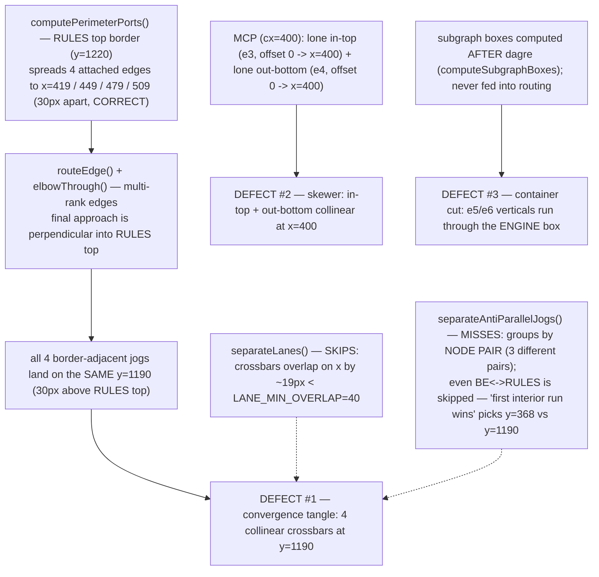
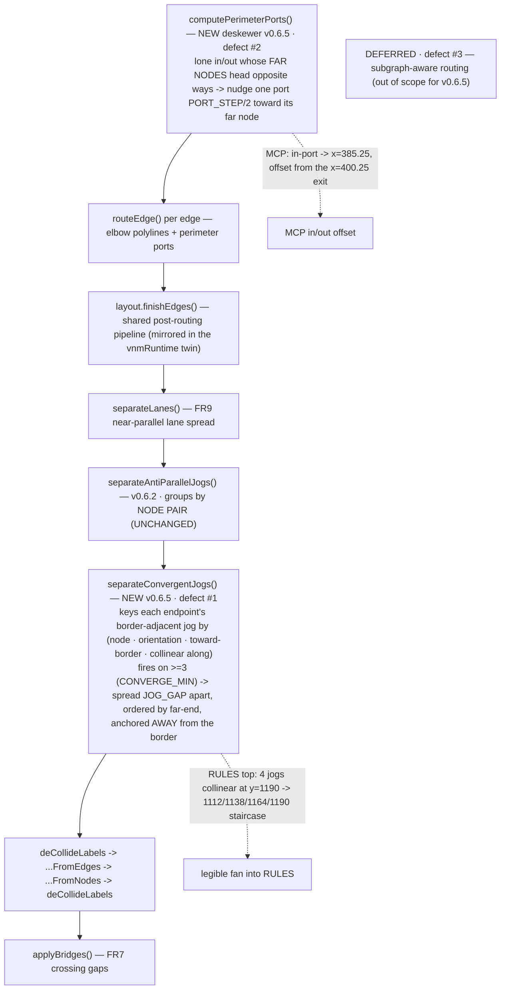

# Report — feature `dense-edge-routing`

- **feature:** Edge-routing quality on dense diagrams (v0.6.5) — convergence de-tangle + skewer nudge; subgraph-aware routing deferred
- **status:** awaiting-uat
- **completed:** 2026-07-15
- **branch / commits:** `release/v0.6.5` (off master @ v0.6.4) — working tree only, not committed (git/ship handled by the human orchestrator)

**v0.6.5 makes dense `flowchart TB` edge routing legible.** Two additive, gated,
elbow-only passes in the shared edge-routing pipeline — a **convergence de-tangle**
(#1) and a **skewer nudge** (#2) — each **mirrored byte-for-byte** in the
`vnmRuntime` twin, so clean diagrams stay byte-identical and the interactive/HTML
export tracks the static SVG. The third defect (long edges cutting through an
unrelated subgraph container) is **deferred** — it needs subgraph-aware routing, a
large high-regression change.

## Run status / gaps

All five phases completed on a clean green run: **plan → implement (2 rounds) →
review (1 round) → test (1 round) → report**. **No open issues.** Both review
findings (REV-001 minor, REV-002 nit) were fixed and re-verified green; the test
round found nothing (`test/issues.json` empty).

## Summary

On a dense `flowchart TB` (`architecture.mmd`) three routing defects showed up at
once. v0.6.5 fixes the **two tractable ones**: (#1) a **new `separateConvergentJogs`
pass** de-tangles the knot where four edges converge on `Rules · Sets · Runs`'s top
border, and (#2) a **new deskewer rule** in `computePerimeterPorts` nudges apart a
lone-in-top / lone-out-bottom pair that made a straight line appear to impale `MCP
surface`. Both are **gated and elbow-only** (they fire only on a genuine bundle /
skewer), **deterministic**, and **mirrored byte-for-byte** in the serialized DOM
runtime. Defect #3 is **deferred** with its root cause documented.

## Planned vs shipped

**Shipped exactly the accepted scope (#1 + #2; #3 deferred)**, with three as-built
detail refinements — each resolved against the *real routed geometry* of
`architecture.mmd` and each the correct realization of an FR under the two hard bars
(byte-identity + the visual acceptance bar). None changes scope.

| Plan said | Shipped | Why |
|---|---|---|
| `separateConvergentJogs` fires on **>=2** collinear same-side jogs | Gate is **`CONVERGE_MIN = 3`** | The corpus has **zero** >=3 bundles but **seven** 2-edge cross-pair ones; firing on 2-edge cases would churn seven *clean* fixtures (breaking "clean diagrams byte-identical") for cases that aren't the knot. `>=3` fixes the 4-edge RULES tangle with **zero** fixture churn, and is disjoint from the anti-parallel pass (which owns 2-edge pairs). |
| Spread jogs "centred on the bundle mean" | Centred on the mean **then anchored so the fan opens away from the border** | The jogs are border-adjacent (a rank-gap outside the node), so a literal symmetric centre pushes the border-nearest lane *across* the border (RULES would put a lane at y=1229 vs the border at 1220). Anchoring the border-nearest lane on the mean keeps it border-safe and parameter-free. |
| Skewer fires when the two lone ports are "collinear (offset 0)" | Fires only when the two edges' **FAR NODES head in opposite directions** | dagre routes both MCP edges straight down its centre column, so the immediate-bend heading is a false "aligned"; and a plain `A->B->C` pass-through is *also* offset-0-collinear. Gating on far-node direction fires on the true skewer (MCP) and **not** on genuine straight flow -> 0 corpus firings, ordinary ports byte-identical. |

## Implementation

Two small, additive changes in the **shared geometry** (`src/geometry/index.ts`),
one wired into the post-routing pipeline, each **mirrored byte-for-byte** in the
`vnmRuntime` twin (`src/render/dom/runtime.ts`), which is `.toString()`-serialized
into HTML exports.

**#1 — `separateConvergentJogs` (new `finishEdges` pass).** Runs right after
`separateAntiParallelJogs`. For each edge endpoint it finds the **border-adjacent
jog** — the interior axis-aligned run nearest that border (a target's **last**
interior run, a source's **first**; this is the fix for why the v0.6.2 pass, which
reads each edge's *first* run, missed the long `BE<->RULES` edges) — and buckets it by
`(node, orientation, toward-border, collinear along)`. A bucket of **>=3** collinear
jogs is spread onto distinct lanes **`JOG_GAP = 26`** apart, ordered by each edge's
far-end coordinate (so each jog biases toward its own end), **centred on the mean
then translated so the border-nearest lane anchors on the mean** and the fan opens
away from the node. It reuses `moveLane` / `LaneSeg` / `toPath`; is **idempotent** (a
spread bundle is no longer collinear -> never re-fires) and **elbow-only**. On
`architecture.mmd` this fans RULES's four collinear jogs (y=1190) onto
**1112 / 1138 / 1164 / 1190** and also de-tangles BE's 3-edge bottom bundle.

**#2 — deskewer in `computePerimeterPorts`.** After the per-side port spread, a node
with exactly one lone top edge and one lone bottom edge (or lone left + right) whose
**far nodes sit on opposite sides of the node centre** gets one port nudged
`PORT_STEP/2` (=15) toward its far node. On MCP this moves the `author rules` entry
port to **x=385.25**, offset from the `MCP---RULES` exit at **x=400.25** — so the
in/out no longer align. Gated (0 corpus firings) with a room check so a narrow node
is left alone.

Both passes are **grouped on keys that can't collide** (`|` never occurs in a node
id) and use only integer/2-dp coordinates and a closed-form lane, so the geometry
and the twin emit **byte-identical** path strings (the `dom-runtime-parity` guard
proves it).

### Changes (as-built)

| File | Change | Note |
|---|---|---|
| `src/geometry/index.ts` | modified | `separateConvergentJogs` (new, exported) + `CONVERGE_MIN=3`; the deskewer rule inside `computePerimeterPorts` |
| `src/layout/index.ts` | modified | import + call `separateConvergentJogs` in `finishEdges` after `separateAntiParallelJogs` |
| `src/render/dom/runtime.ts` | modified | twin `separateConvergentJogs` (called in both `renderEdges` + `buildSvg`) + the deskewer in `computePorts` — byte-for-byte mirror |
| `test/geometry.test.ts` | modified | unit tests: convergence fan (exact lanes, anchor-away, idempotent, no-op on 2-edge/curved/already-spread, disjoint from the anti-parallel pair); deskewer (opposite-heading nudge, straight-pass no-op, lone-side no-op) |
| `test/dom-runtime-parity.test.ts` | modified | new parity case: the architecture DSL fires both passes and the live runtime matches the real `finishEdges` output |
| `test/cli.test.ts` | modified | `--version` -> `0.6.5` |
| `package.json`, `src/cli/run.ts`, `docs/_config.yml` | modified | version 0.6.4 -> 0.6.5 |
| `docs/interactive/*.html` (18) | regenerated | +97 lines each = the inlined twin's new source (rendered geometry byte-identical) |

## Decisions & rationale

See [decisions.md](../decisions.md). The three plan-time decisions and the two
in-flight refinements:

| Decision | Choice | Reason |
|---|---|---|
| **D1** — fix or defer defect #3 (subgraph-aware routing)? | **Defer** | No small nudge clears the container; avoiding it needs obstacle/subgraph-aware routing — a large, high-regression change deserving its own feature. |
| **D2** — include or defer the MCP skewer (#2)? | **Include** | A narrow, gated cross-side port nudge that composes with #1. |
| **D3** — new pass or re-key the v0.6.2 pass for #1? | **New `separateConvergentJogs`** | A separate, composing pass on a disjoint key keeps the shipped anti-parallel pass byte-identical (no state-diagram regression risk). |
| Convergence gate | **>=3, not >=2** | Zero-churn on all clean fixtures while fixing the 4-edge knot; provably no double-move with the anti-parallel pass. |
| Skewer gate | **Far-node direction, not port heading** | dagre's straight columns make the bend heading a false "aligned"; far-node direction distinguishes a true skewer from a straight `A->B->C` pass. |

## Review outcome

**One round, verdict APPROVE — no blockers/majors.** The reviewer confirmed
twin output-parity line-by-line, zero fixture churn, and that the three as-built
deviations are sound. Two non-blocking findings, both fixed and re-verified green:

- **REV-001 (minor):** a dead `pair` field on the geometry pass's `Rec` (absent from
  the twin) — removed.
- **REV-002 (nit):** the "provably disjoint / no edge moved twice" claim was slightly
  overstated — softened to the precise, verified-benign wording (a hypothetical
  double-move is deterministic, parity-safe, and never occurs on the corpus).

See [review/issues.json](../review/issues.json) and [review-01.md](../review/review-01.md).

## Test outcome

**One round, ALL GREEN.** 29 files / **413 unit tests** pass (incl.
`dom-runtime-parity` with the new convergence+skewer case, and the `render`/`state`/
`class` snapshots); `typecheck` clean; `--version` -> `0.6.5`.

- **Visual (the hard acceptance bar), on real PNGs, light AND dark:** the four edges
  into `Rules · Sets · Runs` now read as a **distinct staircase fan — no knot**; the
  MCP in-edge takes a visible dogleg and lands **left of** the exit port
  (**de-skewered**, subtle as the plan flagged); **defect #3 present as deferred**
  (long edges still traverse ENGINE — not a regression).
- **Regression sweep:** churn scoped exactly to the version-bump files + the inlined
  twin source in `docs/interactive/*.html` (a diff spot-check found **no** changed
  rendered-SVG path data); **zero** churn to `*.snap`, `examples/`, `assets/`.
  **2x re-render byte-identical.** The v0.6.2 anti-parallel `fail`/`retry` stagger and
  v0.6.4 label offsets are **intact**.
- **Browser:** not driven (Playwright MCP); per the plan this static-geometry change
  is fully covered by static-PNG + the `dom-runtime-parity` guard — an intentional
  scope choice, not a blocked check.

See [test/issues.json](../test/issues.json) and [test-01.md](../test/test-01.md).

## Diagrams

A single **flow** diagram carries the signal (the change is a routing-pipeline
change). Open [diagrams.html](./diagrams.html) (same folder) — it renders the
as-built flow and the before/defects flow side by side.

- `flow.mmd` — as-built: where `separateConvergentJogs` (#1) and the
  `computePerimeterPorts` deskewer (#2) slot into the shared `finishEdges` pipeline,
  mirrored in the runtime twin; #3 deferred.
- `before/flow.mmd` — the three verified defects on `architecture.mmd`.

## Before / after comparison

The **flow** kind is present in both sets. The before flow diagnoses the three
defects; the after flow shows the two new passes in the pipeline.

**Before — the three defects:**

**After — the two new passes (as-built):**

**What changed:** the after pipeline gains `separateConvergentJogs` (between the
unchanged v0.6.2 anti-parallel pass and the label de-collision chain) and the
`computePerimeterPorts` far-node deskewer. The RULES knot becomes a staircase fan and
the MCP in/out are offset; defect #3 is unchanged and explicitly deferred.

## Knowledge updates

- `.gogo/knowledge/tech-stack.md` (`## gogo overrides`) — bumped the current-version
  note to **v0.6.5** and recorded the two new passes.
- `.gogo/knowledge/code-review-standards.md` (owned) — added a verified gotcha for
  the new `finishEdges` post-pass + its parity twin and the far-node skewer gate.

No upstream (`Source:`) files were touched. **Consider upstreaming:** nothing this
round.

## Follow-ups & known limitations

- **Defect #3 — subgraph-aware / obstacle routing** (long edges avoiding an unrelated
  container). Deferred to its own feature; root cause documented (container boxes are
  computed post-layout by `computeSubgraphBoxes` and never fed into routing).
- **The `>=2`-non-pair convergence case** ("or >=2 that anti-parallel doesn't handle")
  is intentionally left out (gate is >=3) to preserve byte-identity on the seven
  2-edge fixture bundles; revisit if a real 2-edge tangle surfaces.
- **The MCP de-skew is the subtler of the two fixes** — the in/out ports are offset,
  but dagre still routes both approach columns down the node's centre; a fuller fix
  would need routing (not just port) awareness.

## Summary (TL;DR)

- **What shipped:** v0.6.5 — a **convergence de-tangle** (`separateConvergentJogs`,
  gate >=3, fan anchored away from the border) and a **skewer nudge** (far-node-gated
  deskewer in `computePerimeterPorts`), both gated, elbow-only, and **mirrored
  byte-for-byte** in the `vnmRuntime` twin; defect #3 deferred.
- **Review verdict:** APPROVE — no blockers/majors; two non-blocking findings fixed.
- **Test verdict:** ALL GREEN — 413 tests; RULES knot resolved and MCP de-skewered on
  real PNGs (light + dark); byte-identity + 2x determinism held; v0.6.2 stagger and
  v0.6.4 label offsets intact.
- **Follow-ups:** subgraph-aware routing (#3); the >=2 convergence case; a fuller MCP
  de-skew — see above.
