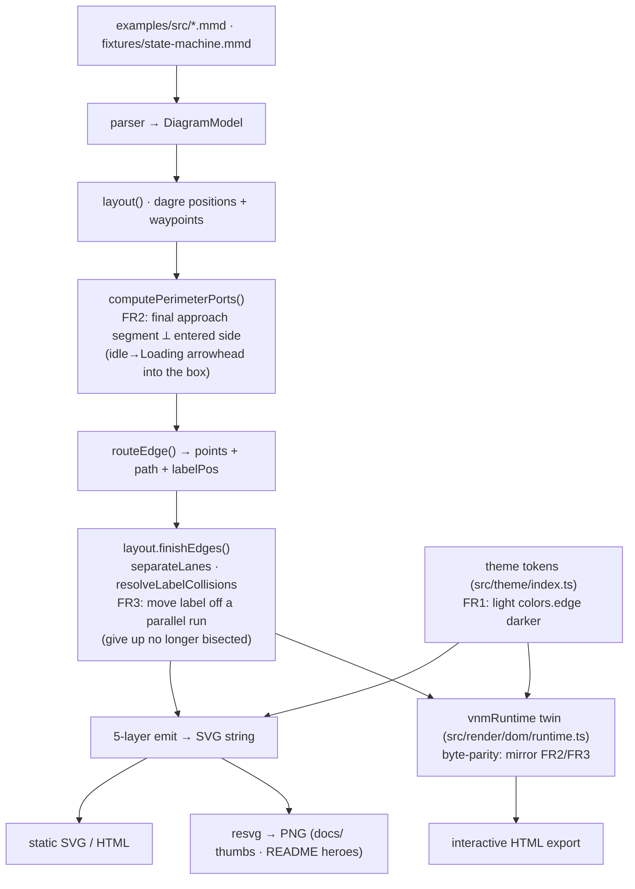

Status: **accepted** (user, 2026-07-13) · **as-built** (report ⑤, 2026-07-13)

> **As-built reconciliation (see [report/report.md](report/report.md)):** shipped as planned
> (FR1–FR4). Two reconciliations: (1) **FR2** landed as a shared `perpendicularizeEntry()`
> helper on `routeElbow` (both the naive elbow *and* `elbowThrough`, all node sides) — not
> in `computePerimeterPorts` as the intended chart sketched — and as a same-class bonus also
> fixed the flowchart `prod/fail→Done` side-entries. (2) **D6** (escalated during implement):
> the `example-sketch` hero was a **cache-lookup flowchart**, not the state machine D4 assumed;
> the user chose to reconstruct it as `fixtures/cache-lookup.mmd` (pixel-perfect). Review APPROVE,
> test GREEN.

# Plan — diagram render fixes (v0.6.1)

**In one line:** three rendering issues the user spotted on the v0.6.0 gallery/README
are **all live renderer/theme bugs, not stale images** — I proved every asset is
byte-reproducible from the current 0.6.0 renderer — so the fix is **two small, low-risk
code changes** (a light-theme edge-contrast bump + two targeted flowchart-geometry
nudges), then **re-render and eyeball** the specific diagrams with no regression to the
now-good ones.

## Goal

Fix the **3 remaining rendering issues** the user found reviewing the v0.6.0 output
(commit `04dfa00`, branch `docs/regenerate-0.6.0`) — with **zero regression** to the
other, now-good diagrams. The user asked first to **verify whether all images were
actually regenerated** at v0.6.0; that verification is done and is a headline finding
below.

**Acceptance signal:** re-rendering the named diagrams at the named themes shows (1) the
`idle→Loading` arrow entering the Loading box cleanly (arrowhead points *into* the box,
no doubling-back stub above it) and the `give up` label reading as one un-bisected word;
(2) the `Report failure` region's edges traceable with visible arrowheads; (3) the
state-diagram `clean·light` + `sketch·light` thumbnails reading as cleanly as their
`clean·dark`/`clean·fancy` siblings — while every previously-good diagram (all dark/fancy
variants, class, sequence, the fancy microservices hero) stays visually unchanged, the
`dom-runtime-parity` byte guard + all suites stay green, and the committed gallery/README
assets are regenerated deterministically.

## Context — regeneration verification (the user's first ask)

**Finding: every asset WAS regenerated at v0.6.0. None are stale.** Two independent
proofs:

1. **Git.** `git show --stat 04dfa00` shows **all 4** README heroes (`assets/example-*.png`)
   and **all 24** gallery thumbnails (`docs/assets/{flowchart,state,class,sequence}-*.png`)
   changed bytes in that commit, plus all 18 interactive HTMLs.
2. **Deterministic re-render (definitive).** The renderer is byte-deterministic (coding
   rule: no `Date.now`/`Math.random` in render paths). I rebuilt nothing (git tree clean,
   `dist/` is the committed 0.6.0 build) and re-rendered from the current renderer:
   - **All 12** flowchart+state thumbnails (`clean`/`sketch` × `light`/`dark`/`fancy`)
     are **md5-identical** to the committed `docs/assets/*.png`.
   - Heroes reproduced **byte-identically** at `--scale 2`: `example-dark` =
     `fixtures/state-machine.mmd --theme dark --style clean`; `example-fancy` =
     `fixtures/microservices.mmd --theme fancy --style clean`; `example-light` =
     `fixtures/ci-pipeline.mmd --theme light --style clean`.

   Byte-identical to a fresh render ⇒ the committed images came from *this* renderer ⇒
   **fresh, not stale.** The user's staleness suspicion for Issues 2 & 3 is disproven;
   these are **live** bugs that persist at 0.6.0.

   *One open provenance gap (not blocking, not one of the 3 issues):* `example-sketch.png`
   did **not** reproduce from any `fixtures/` or `examples/src/` source at scale 1-3 sketch
   — its exact source/command is unidentified. See D4.

### How the assets are produced (so we know what to re-render)

| Asset set | Source | Command / script |
|---|---|---|
| Gallery thumbnails `docs/assets/*.png` + interactive `docs/interactive/*.html` | `examples/src/{flowchart,state,class,sequence}.mmd` | `npm run docs` (`scripts/generate-docs.mjs`, drives built CLI, `--scale 2`) |
| `examples/` gallery png+svg | same `examples/src/*.mmd` | `npm run examples` (`scripts/generate-examples.mjs`) |
| README heroes `assets/example-*.png` | `fixtures/state-machine.mmd` (dark/light), `fixtures/microservices.mmd` (fancy), `fixtures/ci-pipeline.mmd` (light), `example-sketch` = **unknown** | **hand-run CLI** (no script) — `vnm render <fixture> --theme <t> --style <s> -f png --scale 2` |

Everything routes edges through **one shared geometry** (`src/geometry/index.ts`),
mirrored **byte-for-byte** in the inlined interactive runtime (`src/render/dom/runtime.ts`),
guarded by the `dom-runtime-parity` test. Colours come from **theme tokens**
(`src/theme/index.ts`) surfaced as `--vnm-*` CSS vars — **independent of geometry**. Two
prior features own this area and must not regress: `flowchart-render-legibility`
(5-layer draw order, `separateLanes`, `resolveLabelCollisions`, `applyEdgeBridges`,
heading-order ports — all byte-parity-mirrored) and `sketch-style`.

### Which diagram each issue is, and which tier renders it

| Issue | Diagram (source) | Render tier | Theme(s) reported |
|---|---|---|---|
| 1 | README dark hero — `fixtures/state-machine.mmd` (`graph TD`) | **flowchart** own-parser + dagre | dark (clean) |
| 2 | Flowchart gallery — `examples/src/flowchart.mmd` (`flowchart TD`) | **flowchart** own-parser + dagre | light thumbnail (gallery) |
| 3 | State gallery thumbs — `examples/src/state.mmd` (`stateDiagram-v2`) | **native state** re-skin (shares geometry) | `clean·light` + `sketch·light` |

## Diagnosed root causes (code = source of truth; confirmed by rendering + inspecting pixels)

**Issue 1a — `idle→Loading` arrowhead doubles back above the box.** The `idle→loading`
edge enters Loading's **top** side, but its heading-order port
(`computePerimeterPorts`, geometry:249-328) lands at a top-border x that is offset from
the vertical approach lane. `routeElbow` then adds a **short horizontal stub** to reach
the port, and because the *final* path segment is horizontal, the arrowhead orients
**horizontally (pointing left) and sits above the box** instead of pointing down into it
— the "doubling-back stub." (The `retry→loading` edge enters the bottom cleanly, for
contrast.) Fix lives in the port/final-approach handling so the last segment into a node
is perpendicular to the entered side.

**Issue 1b — `give up` label looks like it wraps to 2 lines.** The flowchart renderer
**never auto-wraps** edge labels — `layout/index.ts:477` splits a label only on an
explicit `\n` (from ` `, parser:483). So "give up" is a single line; what the user saw
is the label **placed on top of a near-parallel vertical run** — the `ready→idle` and
`give up` lines run ~20px apart (below `LANE_GAP`=26) up to Idle, and the label
(`labelPoint`, geometry:1167, sits at the route's mid-segment) lands right where a
vertical line **bisects the text** → reads as broken/2-line. The existing de-collision
passes handle label-vs-label / label-vs-node / label-vs-**perpendicular**-edge, but not a
label sitting on a **parallel** lane. "Nudge it up and it fits" = relocate the label to
open space clear of the run.

**Issue 2 — `Report failure` edges "merge, no arrowhead."** Primary cause is the **same
low light-theme contrast as Issue 3** (see below): in the `clean·light` thumbnail the
faint edges make the near-collinear `lint --no--> fail` (into the cylinder **top**) and
`fail --> done` (out the cylinder **bottom**) read as one pass-through line, with the
arrowheads (into the cylinder top, into `Done`) too faint to see; `prod→done` and
`fail→done` also converge on `Done` in that low-contrast band. **In dark, the identical
geometry is fully traceable with visible arrowheads** (verified via high-res crop) — so
this is not a routing bug. A possible *secondary* minor geometry nit: the arrowhead into
the cylinder **top** sits on the cylinder's top-ellipse rim (tight even in dark) — to be
confirmed by re-render after the contrast fix.

**Issue 3 — state `clean·light` + `sketch·light` thumbnails merge near Loading/Error/retry.**
The smoking gun: `state-clean-light.png` and `state-clean-dark.png` have **identical
geometry** (routing is theme-independent by architecture; both are clean elbow). The
`fail`/`retry`/Error region is a little cramped in **all** themes, but only reads as
"merged/unclear" in **light** because the edge stroke is too low-contrast:
`edge:#8a93a6` on `background:#f7f8fb` (light) vs `edge:#6b7488` on `#0f1117` (dark) and
`#7d88c4` + curved (fancy). It is **worst for `sketch·light`** — thin multi-stroke wobbly
lines on near-white are extremely faint. Fix = **darken the light-theme edge token** — a
colour-only change with **no geometry impact**, so dark/fancy and every layout stay
byte-identical.

**The unifying insight:** Issues 2 and 3 are largely the **same** root cause — the light
theme's edge stroke is too low-contrast, which is exactly why they only show in
`light`/`sketch·light` while the `dark`/`fancy` siblings "look clean." Issue 1 is genuine
flowchart geometry (visible even in high-contrast dark).

## Functional requirements

- **FR1 — Light-theme edge contrast (fixes Issue 3, and Issue 2's primary symptom).**
  Raise the `light` theme `edge` stroke contrast against its `#f7f8fb` background to
  roughly dark-parity, so near-parallel/cramped edge runs and arrowheads stay legible in
  `clean·light` and especially `sketch·light`. **No geometry change** — dark/fancy and all
  layouts unchanged. Applies through `cssVars()` so static SVG, PNG, and interactive HTML
  all pick it up.
- **FR2 — `idle→Loading` clean entry (Issue 1a).** An edge entering a node side must end
  with a segment **perpendicular** to that side, so the arrowhead points *into* the node
  and no doubling-back stub is drawn above/beside the box. Flowchart family (flowchart +
  native state/class that share the geometry); mirrored byte-for-byte in the runtime twin.
- **FR3 — `give up` label off the parallel run (Issue 1b).** An edge label must not be
  bisected by a near-parallel edge run; relocate/nudge it (along its own edge, or off the
  run) into open space so the text reads as one uninterrupted word. Mirrored in the twin.
- **FR4 — No regression + deterministic re-render.** `dom-runtime-parity` byte guard +
  all unit/e2e suites green; renders deterministic (byte-identical on a second run); the
  committed gallery (`docs/`, `examples/`) and README heroes regenerated; **only** the
  intended assets change, each visually verified; previously-good diagrams unchanged
  (dark/fancy geometry byte-identical, only light *colours* differ).

## Approach (recommended) + alternatives

**Recommended: fix the two real causes, smallest change each, then re-render + eyeball.**

1. **FR1 — theme token (Issue 2+3).** Change **one** value: light `colors.edge`
   `#8a93a6` → a darker slate (target contrast comparable to dark's edge; e.g. in the
   `#5c6478`/`#6b7488`-for-light family — exact value tuned by eye during implement).
   Optionally nudge `edge.width` or the `sketch` stroke only if light still reads thin.
   Colour-only ⇒ zero geometry/snapshot churn beyond colour bytes; dark/fancy untouched.
2. **FR2/FR3 — flowchart geometry (Issue 1).** Two targeted edits in
   `src/geometry/index.ts` (+ the byte-identical twin in `src/render/dom/runtime.ts`):
   (a) ensure the final approach segment into a port is perpendicular to the entered side
   (kills the doubling-back stub + fixes arrowhead direction); (b) extend label placement
   so a label is moved off a parallel run it would sit on. Keep both **gated/minimal** so
   edges that already route cleanly stay byte-identical (protect the legibility feature's
   snapshots + parity guard).
3. **Re-render + verify (this is a rendering project — pixels are the spec).** Rebuild,
   run `npm run docs` + `npm run examples`, re-run the 4 hero commands, then **`git diff`
   the assets** and **eyeball** each changed image at its theme; confirm the good ones are
   unchanged.

**Alternatives considered:**
- **Geometry de-cramp for Issues 2/3** (spread the `fail`/`retry`/Report-failure runs).
  *Rejected as primary:* it would change the **now-good** dark/fancy geometry the user
  explicitly likes — higher regression risk — and doesn't explain the light-vs-dark
  discrepancy (identical geometry). Kept only as a deferred follow-up if a residual
  cramp remains after the contrast fix.
- **Treat `give up` as contrast-only** (skip FR3). *Rejected:* the label sits **on** a
  line even in high-contrast dark — a genuine placement bug the user named.
- **Global edge-contrast bump across all themes.** *Rejected:* dark/fancy already read
  well; changing them is unnecessary churn and risks regressing liked diagrams.

## Changes checklist (build order)

1. **FR1 · `src/theme/index.ts`** — darken `lightTokens.colors.edge` (and, only if
   needed by eye, `light` `edge.width` / sketch stroke). Tune the exact hex during
   implement against `clean·light` + `sketch·light`.
2. **FR2 · `src/geometry/index.ts`** — final-approach/port fix so an edge's last segment
   is perpendicular to the entered side (no doubling-back stub; arrowhead into the node).
   Keep clean-routing edges byte-identical.
3. **FR3 · `src/geometry/index.ts`** — label placement moves an edge label off a
   near-parallel run into open space (extend the de-collision, or nudge along the edge).
4. **FR2/FR3 twin · `src/render/dom/runtime.ts`** — mirror the geometry edits
   **byte-for-byte** (the recurring parity trap); extend `dom-runtime-parity` coverage.
5. **Tests** — add geometry unit assertions (perpendicular final segment / arrowhead
   direction; label plate clears parallel runs by a min gap); keep determinism +
   parity guards green.
6. **Regenerate assets** — `npm run build` → `npm run docs` → `npm run examples` → 4 hero
   commands (recovered above; sketch hero per D4). `git diff` to confirm only intended
   files changed; visually verify each.
7. *(D5, optional)* **`scripts/generate-heroes.mjs`** — capture the 4 hero commands so
   heroes regenerate deterministically (also resolves the D4 provenance gap).

## Tests

Because this project's output **is** rendered images, verification is both automated and
**visual** (re-render + eyeball the specific diagrams/themes):

- **Unit (`test/`):** `dom-runtime-parity` byte guard green; determinism (no clock/RNG);
  new assertions — an edge into a side ends perpendicular to it (FR2); a relocated label
  plate does not intersect a parallel run within the min gap (FR3); the theme change is
  colour-only (non-Issue-1 layouts byte-identical).
- **Visual / e2e (the real spec):**
  - *Issue 1:* `fixtures/state-machine.mmd` `clean dark` (hero) — Loading arrow enters
    cleanly (arrowhead into the top, no stub); `give up` reads as one un-bisected word.
  - *Issue 2:* `examples/src/flowchart.mmd` `clean light` — Report-failure/Done edges
    traceable, arrowheads visible.
  - *Issue 3:* `examples/src/state.mmd` `clean light` + `sketch light` — fail/retry/Error
    region reads clean; `clean·dark`/`clean·fancy` geometry unchanged.
  - *Regression sweep:* re-render the **full** gallery + all heroes; `git diff` shows only
    intended changes; dark/fancy geometry byte-identical (only light colours change);
    class/sequence/microservices-fancy hero unchanged; no new artifacts. Re-render twice →
    byte-identical (determinism).

## Intended design (how a rendered edge flows, and where the fixes sit)

The subject is the **product's render pipeline** — where colour and geometry come from —
not the task list. `charts/flow.mmd` (intended) and `charts/before/flow.mmd` (as-is
defects at their real code sites) render in `charts/diagrams.html`.

## Out of scope

- The **sequence** tier (excluded from the line work; unchanged).
- Deferred `flowchart-render-legibility` follow-ups: left/right side edge attachment;
  extreme-drag lane re-merge / endpoint comb-stagger (TEST-004).
- Changing the **dark** or **fancy** themes, or any geometry for the now-good diagrams.
- A full lane/bus routing overhaul; a geometry de-cramp of the state `fail/retry` region
  (deferred follow-up, only if a residual cramp survives the contrast fix).

## Decisions needing your call

See `decisions.md`. In short: **D1** treat Issues 2+3 as the shared light-contrast fix
(recommended) vs a geometry de-cramp; **D2** accept that darkening the light edge changes
**all** light diagrams' appearance (an improvement, not a regression) + how dark to go;
**D3** fix both Issue-1 sub-bugs in shared flowchart geometry (accepting managed
regression risk to the legibility feature, mitigated by regenerate + re-verify); **D4**
identify the unknown `example-sketch.png` source so its hero can be regenerated; **D5**
(optional) add a tiny hero-generation script.

## Summary (TL;DR)

- **What:** fix the 3 v0.6.0 render issues — (1) the `idle→Loading` doubling-back arrow +
  the bisected `give up` label on the dark hero, (2) the "merged, no-arrowhead" edges by
  `Report failure`, (3) the faint/merged state `clean·light`+`sketch·light` thumbnails.
- **Verification the user asked for:** **all images WERE regenerated at v0.6.0** — proven
  byte-identical to a fresh render of the deterministic renderer. **Nothing is stale;**
  all three are live renderer/theme bugs.
- **Root cause:** Issues **2 & 3 are the same** low **light-theme edge contrast**
  (`#8a93a6` on near-white) — dark/fancy read fine on identical geometry; Issue **1** is
  two genuine flowchart-geometry bugs (port final-segment orientation + a label placed on
  a parallel run).
- **Approach (chosen):** one **theme-token** contrast bump (colour-only, zero geometry
  churn) + two **targeted** flowchart-geometry nudges mirrored byte-for-byte in the
  runtime twin, then **re-render + eyeball** every affected diagram with a full-gallery
  regression sweep.
- **Next:** you accept (resolving D1-D5), then `/gogo:go` runs implement → review → test →
  report. **No code is written until you accept.**
