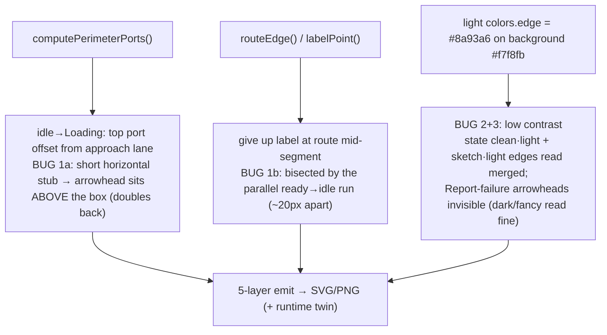
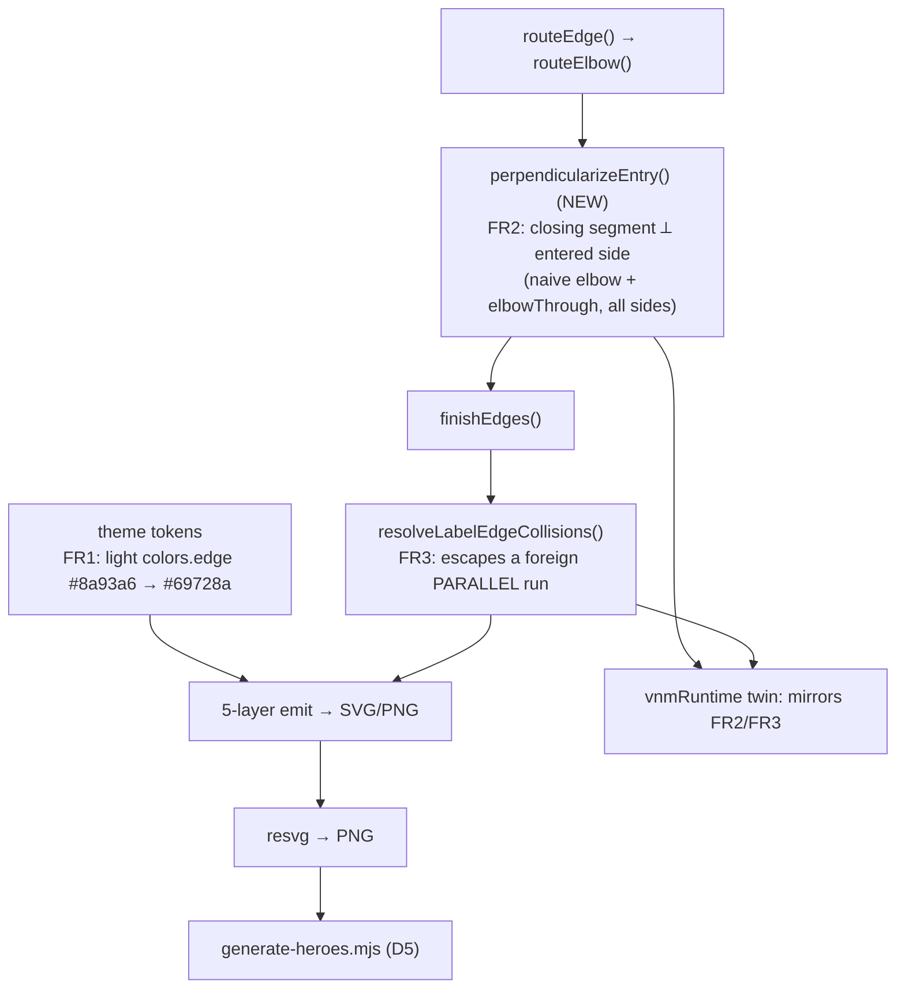

# Report — feature `diagram-render-fixes-v0.6.1`

- **feature:** Fix 3 v0.6.0 render issues (light-theme edge contrast + two flowchart-geometry nudges), no regression
- **status:** awaiting-uat
- **completed:** 2026-07-13
- **branch / commits:** `docs/regenerate-0.6.0` (working tree; not yet committed)

## Run status / gaps

**All phases completed; no open issues.** Plan → implement (2 rounds) → review (APPROVE, 3 non-blocking findings resolved) → test (GREEN, 0 issues) → report. One decision (**D6**) was escalated mid-implement and resolved by the user. One nit (**REV-003**) is a documented, deferred known-limitation carried forward from a prior feature — not a gap in this work.

## Summary

The user reviewed the v0.6.0 gallery/README and flagged three render issues; their first ask was to **verify whether the images were even regenerated at v0.6.0** (they were — proven byte-identical to a fresh render). All three turned out to be **live renderer/theme bugs, not stale images**, and split into exactly two root causes: a **too-faint light-theme edge stroke** (Issues 2 + 3) and **two genuine flowchart-geometry defects** (Issue 1). The fix is three small, low-risk changes — one theme-token colour, two targeted geometry edits mirrored byte-for-byte in the interactive-export runtime twin — then a full deterministic re-render of the committed galleries and README heroes.

## Planned vs shipped

Shipped **as planned** (FR1–FR4), with two additions surfaced during implementation:

- **Bonus fix (in-scope, same bug class):** FR2's perpendicular-entry fix also corrected the flowchart `prod→Done` / `fail→Done` side-entries (arrowheads were jabbing the Done circle's shoulders). Same helper, no extra code — a strict improvement.
- **D6 (escalated + user-resolved):** the plan's D4 assumed the `example-sketch` README hero was the state machine rendered sketch. On opening the actual PNG it was a **cache-lookup flowchart** whose DSL was never committed. The user chose to **reconstruct it as a committed fixture** (`fixtures/cache-lookup.mmd`, verified pixel-perfect) rather than swap in the state machine.

## Implementation

The three fixes live in the **one shared geometry module** (`src/geometry`) and the **theme tokens** (`src/theme`), with every geometry change mirrored byte-for-byte in the inlined DOM runtime twin (`src/render/dom/runtime.ts`) that powers the interactive HTML export.

- **FR1 — light-theme edge contrast (Issues 2 + 3).** One token: light `colors.edge` `#8a93a6` → `#69728a` (≈4.5:1 on the `#f7f8fb` background, matching the dark theme's edge legibility). **Colour-only** — zero geometry impact, so dark/fancy and every layout stay byte-identical; the four light-theme snapshot updates are stroke/fill-only. This was the *shared* root cause of both the merged state·light thumbnails and the invisible Report-failure arrowheads (dark/fancy read fine on identical geometry).
- **FR2 — perpendicular final approach (Issue 1a).** New shared helper `perpendicularizeEntry()`: when a routed elbow's **closing segment runs parallel to the entered border** (a sideways stub — the "doubling-back" arrow), it swaps the last elbow corner (both endpoints fixed) so the closing segment is **perpendicular** and the arrowhead points *into* the node. Applied to **both** the naive-elbow branch and `elbowThrough`, so it covers every side, not just the reported top-entry. A route that already enters perpendicular is left byte-identical (proven by zero snapshot churn on the good diagrams).
- **FR3 — label off a parallel run (Issue 1b).** `resolveLabelEdgeCollisions` (which already dodged *perpendicular* crossings) now also **escapes a foreign PARALLEL run** that bisects a label, by sliding the label **along its own axis** past the run's nearer bounded end — so the `give up` label lifts up off the line while staying on its own edge (exactly the user's "nudge it up and it fits").
- **Byte-parity twin.** Both FR2 and FR3 mirrored in `runtime.ts`; a new `dom-runtime-parity` test drives the state-machine fixture (which exercises both branches) and byte-compares `toSvgString()` to `renderSvg`.
- **D5 — hero provenance.** `scripts/generate-heroes.mjs` (+ `npm run heroes`) captures all four README hero recipes so they regenerate deterministically — the heroes were the only asset set previously rendered by hand.

### Changes (as-built)

| File | Change | Note |
|---|---|---|
| `src/theme/index.ts` | modified | FR1: light `colors.edge` `#8a93a6` → `#69728a` (dark-parity, colour-only) |
| `src/geometry/index.ts` | modified | FR2: new `perpendicularizeEntry()` helper, called from both `routeElbow` branches; FR3: `resolveLabelEdgeCollisions` extended to escape parallel runs; doc-comments for the exterior-approach invariant |
| `src/render/dom/runtime.ts` | modified | Byte-parity twin: mirrors `perpendicularizeEntry` + the FR3 parallel branch |
| `test/geometry.test.ts` | modified | +5 unit tests (FR2 top/bottom entry, already-perpendicular no-op, FR3 parallel escape + no-op) |
| `test/dom-runtime-parity.test.ts` | modified | +1 parity test locking both FR2/FR3 twins (REV-001) |
| `test/__snapshots__/{render,state,class,sequence}-svg.test.ts.snap` | modified | Light-theme edge colour only (verified zero coordinate churn) |
| `e2e/render-fixes-v0.6.1.spec.ts` | added | +5 real-browser e2e (idle→Loading ⟂ entry, give-up clearance) |
| `fixtures/cache-lookup.mmd` | added | D6: reconstructed source for the `example-sketch` hero |
| `scripts/generate-heroes.mjs`, `package.json` | added / modified | D5: `npm run heroes`, 4 hero recipes |
| `assets/example-{dark,light,sketch}.png`, `docs/**`, `examples/**` | regenerated | Deterministic re-render; `example-fancy` unchanged |

## Decisions & rationale

See [decisions.md](../decisions.md). D1–D5 were resolved at plan acceptance; D6 was escalated during implement.

| Decision | Choice | Reason |
|---|---|---|
| D1 — Issues 2+3 strategy | Light-theme contrast fix (not geometry de-cramp) | Light-vs-dark discrepancy on *identical* geometry is logically forced to be contrast; lowest regression risk |
| D2 — contrast strength | Darken to ~dark-parity (`#69728a`, ~4.5:1) | Matches the crisp read of dark; the change is uniformly an improvement to all light diagrams |
| D3 — Issue-1 scope | Fix both 1a and 1b in shared geometry + twin | Both were user-reported; the label sits on a line even in high-contrast dark (a real placement bug) |
| D4 — sketch hero source | Superseded by D6 | The premise (state machine) proved factually wrong on inspection |
| D5 — hero script | Add `generate-heroes.mjs` | Hand-rendered heroes caused the provenance gap; a ~40-line script makes them deterministic |
| **D6 — example-sketch is a cache-lookup flowchart** | **Reconstruct as `fixtures/cache-lookup.mmd`** | The hero's DSL was never committed; reconstruction (verified pixel-perfect) keeps the existing hero, picks up the FR1 fix, and truly resolves provenance — vs swapping in a different diagram (D4 literal) or leaving it stale |

## Review outcome

**Verdict: APPROVE** (fresh-eyes `gogo-reviewer`, 1 round). Independent re-run of the baseline was green; three non-blocking findings, all resolved:

- **REV-001 (P2) — fixed:** `dom-runtime-parity` wasn't extended for the FR2/FR3 twins (the project's recurring drift trap). Added a parity test that drives the state-machine fixture through the real runtime and byte-compares to the static render (bite-verified).
- **REV-002 (P3 nit) — fixed:** documented `perpendicularizeEntry`'s exterior-approach invariant + added a bottom-entry sign-check test.
- **REV-003 (P3 nit) — deferred:** FR3 parallel-escape isn't clamped to the label's own-run extent (a co-extensive run could over-slide; not observed). A continuation of the already-accepted `flowchart-render-legibility` REV-008 own-run-clamp follow-up.

See [review/issues.json](../review/issues.json) and [review-01.md](../review/review-01.md).

## Test outcome

**Verdict: GREEN — done-bar met, 0 open issues.** Build + typecheck clean; **397/397 unit** (incl. `dom-runtime-parity` + `geometry`); **84/84 e2e** (79 pre-existing + 5 new).

Because the output *is* rendered images, the tester verified against real pixels: all four named diagrams re-rendered fresh via the CLI, byte-identical (md5) to the regenerated assets, with before/after (`git show HEAD:<path>`) comparisons confirming **Issue 1a** (stub gone, clean arrow into Loading), **1b** (give-up reads as one word), **2** (Report-failure/Done arrowheads traceable), **3** (state light/sketch contrast materially better) are genuine improvements. Regression sweep: `example-fancy.png` + all `*-fancy` assets untouched; class/sequence changed light-colour-only (zero coordinate churn); flowchart/state dark PNGs changed geometry as expected by FR2 (confirmed improvement). Determinism: 2× re-render byte-identical. **Interactive HTML twin** driven in real Chromium (via the bundled Playwright MCP): screenshots match the static PNGs, a live pointer-drag re-routes edges keeping the entry perpendicular, pan/zoom work, no console errors.

See [test/issues.json](../test/issues.json) and [test-01.md](../test/test-01.md).

## Diagrams

The as-built set — open [diagrams.html](./diagrams.html) (same folder):

- **flow** (`flow.mmd`) — the render-edge pipeline with the shipped fix sites (FR1 theme token; FR2 `perpendicularizeEntry()`; FR3 `resolveLabelEdgeCollisions` parallel-escape), the byte-parity runtime twin, and the new hero script + fixture.
- **sequence** (`sequence.mmd`) — the render call path through the fix points and its mirror in the interactive-export twin.

## Before / after comparison

The plan captured a **flow** before-set (the three defects at their code sites); the after-set adds a **sequence** (after-only). Side-by-side, `flow` kind:

**Before (as-is):**

**After (as-built):**

**What changed:** each defect node is replaced by its fix at the same code site — the port stub becomes the `perpendicularizeEntry` ⟂-approach, the bisected label becomes the parallel-run escape in `resolveLabelEdgeCollisions`, and the faint edge becomes the darker light token. The after-set adds the byte-parity twin and the D5 hero script as first-class pipeline steps. The **sequence** diagram is after-only (the render call path was not diagrammed at plan time).

## Knowledge updates

- **`tech-stack.md`** (proxy — `## gogo overrides` only): recorded the new `npm run heroes` command and the `fixtures/cache-lookup.mmd` hero source, so the build-command list stays accurate.

*Consider upstreaming (user's call):* if you keep a CONTRIBUTING/README note on regenerating assets, adding "heroes: `npm run heroes`" alongside `docs`/`examples` would document the now-scripted hero pipeline.

## Follow-ups & known limitations

- **REV-003 (deferred):** the FR3 parallel-escape (and the pre-existing perpendicular case) don't clamp the label slide to the label's own-run extent, so a long co-extensive bisecting run could over-slide the label. Not observed in any real diagram; carried forward as the existing `flowchart-render-legibility` REV-008 own-run-clamp follow-up, now also covering the FR3 branch.
- **Deferred from the plan (unchanged):** a geometry de-cramp of the state `fail/retry/Error` region (kept as a follow-up only if a residual cramp survives the contrast fix — it reads clearly now); left/right side edge attachment and extreme-drag lane re-merge (prior-feature TEST-004).

## Summary (TL;DR)

- **What shipped:** three v0.6.0 render fixes — **FR1** a dark-parity light-edge colour (`#8a93a6`→`#69728a`, fixes the faint/merged Issues 2 + 3), **FR2** a shared `perpendicularizeEntry()` so arrowheads point *into* nodes (fixes the `idle→Loading` stub + a bonus flowchart Done-entry fix), and **FR3** a parallel-run escape in `resolveLabelEdgeCollisions` (un-bisects the `give up` label) — both geometry fixes mirrored byte-for-byte in the interactive-export runtime twin, plus `generate-heroes.mjs` (D5) and a reconstructed `cache-lookup.mmd` hero source (D6). All committed galleries + README heroes regenerated deterministically.
- **Review verdict:** **APPROVE** — 3 non-blocking findings, 2 fixed (parity coverage + doc/test), 1 deferred nit.
- **Test verdict:** **GREEN** — 397 unit + 84 e2e green; all three issues verified against real pixels + the interactive twin in a real browser; zero regressions; deterministic.
- **Follow-ups:** one deferred own-run-clamp nit (REV-003) + the plan's deferred geometry de-cramp — see **Follow-ups & known limitations**.
