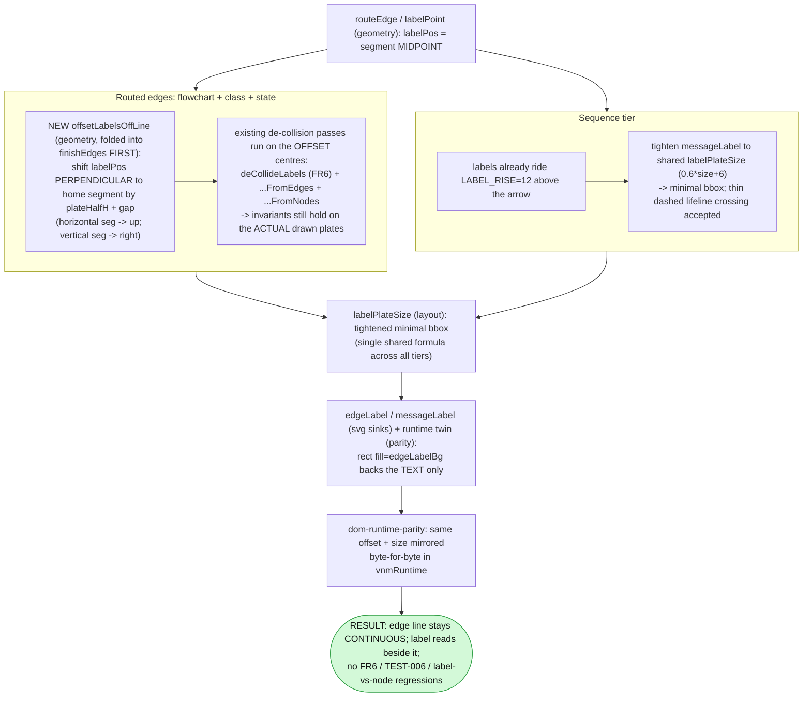

Status: **accepted** (user, 2026-07-15) — D1 → A (offset), D2 → A, D3 → A (defer)

# Plan — `edge-label-halo` (v0.6.4)

Status: awaiting acceptance

**Fix the edge-label background "halo" that masks the connecting line and leaves a
visible gap in every labeled edge.** Each label is drawn over an **opaque,
~text-width `<rect fill="<theme bg>">`** painted in a *later* layer, right on top of
the already-continuous edge line — so a text-width stretch of the line is blanked and
the edge reads as broken. Confirmed against the code across **all tiers** (flowchart,
class, state) and **themes**, and separately in **sequence** (where the same plate
masks crossing lifelines). The core question is a **design decision** — do we keep the
label on the line (and only soften the gap) or move it off the line (line stays
continuous)? This plan lays out the options and recommends one, but **you choose**.

## Goal

A labeled edge should read as **one continuous line with a legible label**, not a line
with a white gap punched through it — across flowchart / class / state / sequence, all
themes, both `clean` and `sketch`, in static SVG/PNG/HTML **and** the interactive
runtime — **without** regressing the existing label-collision work (FR6
`resolveLabelCollisions`, the v0.6.2 anti-parallel de-cramp, label-vs-node /
label-vs-crossing-edge passes) or breaking the `dom-runtime-parity` guard.

**Acceptance signal:** re-rendering the reproduction diagrams shows the edge line
running unbroken past each label (or, for the tighten-only path, a markedly smaller and
intentional-looking interruption); the 401-test suite stays green with snapshot updates
that reflect **only** the intended label change, each reviewed.

## Context — what exists, verified against the code

**The label is centered ON the line, then an opaque plate paints over the line.** This
is the mechanism, traced end-to-end:

1. **`labelPoint` (`src/geometry/index.ts:1324`)** places the label at the **midpoint of
   the edge's home segment — dead-center on the line**. `routeEdge` returns this as
   `labelPos`.
2. **`finishEdges` (`src/layout/index.ts:63`)** runs a mature chain of post-layout
   passes — `separateLanes` → `separateAntiParallelJogs` (v0.6.2) → `deCollideLabels`
   (FR6 all-pairs plate de-collision) → `deCollideLabelsFromEdges` (off crossing lines)
   → `deCollideLabelsFromNodes` (off node boxes) → `applyBridges`. **Every pass folds its
   shift into `edge.labelPos`, and every pass assumes the label sits on its own line.**
   All of it is **mirrored byte-for-byte in the runtime twin** (`src/render/dom/runtime.ts`,
   guarded by `test/dom-runtime-parity.test.ts`).
3. **`labelPlateSize` (`src/layout/index.ts:476`)** sizes the plate: `w = maxChars *
   font.size * 0.6 + 6`, `h = lines * lineHeight + 2`. With the default `font.size = 14`
   this is **only ~6px wider than the text itself**.
4. **The sinks emit an opaque rect + centered text** in a *later* draw layer:
   - Flowchart `edgeLabel` (`src/render/svg.ts:211`) — inlines the `0.6·size + 6` formula.
   - Class `edgeLabel` (`src/native/class/svg.ts:153`) and State `edgeLabel`
     (`src/native/state/svg.ts:103`) — both call the shared `labelPlateSize`.
   - Sequence `messageLabel` (`src/native/sequence/svg.ts:184`) — its **own, wider**
     formula `0.62·size + 10`, and it does **not** use `labelPlateSize`.
   - Runtime twin (`src/render/dom/runtime.ts:385` creates the plate with
     `fill="var(--vnm-edge-label-bg)"`; sizing re-inlined at `:837/:1131/:1149/:1837`).
   Every one paints `<rect ... fill="<edgeLabelBg>"/>` — **opaque** (light `#f7f8fb`,
   dark `#0f1117`, fancy `#0b1020`).
5. **Draw order (`src/render/svg.ts:90`):** `boxes → edges → labels → titles → nodes`.
   The edge path is drawn **whole and continuous**; the opaque plate is painted **after**
   it (line 184-185 confirms: "emitted in its own later layer … so a subsequent edge's
   path can never paint over it"). **So the "gap" is a paint-over, not a real break in
   the path.**

**Reproduced (built CLI, `light`):** flowchart `chat`→`<rect w="39.6" h="20">`,
`author rules`→`w="132"`... wait — measured exactly: `reason` (6ch) → `w="56.4"`,
`author rules` (12ch) → `w="106.8"`, `proxy chat auth` (15ch) → `w="132"`. **Identical
between `clean` and `sketch`** (the plate width is style-independent — not sketch-specific).
Sequence `POST /login` → `<rect w="105.48" h="22">`, all opaque `#f7f8fb`.

**Why sequence differs:** sequence already rides its label **above** the arrow
(`labelY = y − LABEL_RISE`, `LABEL_RISE = 12`, `src/native/sequence/layout.ts:143`). The
plate half-height is 11, so its bottom edge sits ~1px above the message line — the
**arrow is barely masked**. The real sequence symptom is that the opaque plate **blanks a
22px band of every vertical dashed lifeline it horizontally spans** (any participant
between source and target, and wide labels reaching the source/target lifelines).

**Parity surface (what a fix must keep in lockstep):**
- Flowchart **static** = `src/render/svg.ts`; flowchart/class/state **interactive** =
  the flowchart `vnmRuntime` (`src/render/dom/runtime.ts`) — the byte-for-byte twin.
- Class/State **static** = their own `edgeLabel`, both via shared `labelPlateSize`.
- Sequence **static AND interactive** = `src/native/sequence/svg.ts` — the interactive
  sequence **reuses the static SVG string** (`interactive.ts:56`), so there is **no
  separate sequence runtime label emit** to mirror. Fixing `messageLabel` fixes both.
- Shared size fn `labelPlateSize` feeds the FR6 collision resolver + the port spreader,
  so its formula and the sinks' must stay identical or the stagger math drifts.

## The core problem (the honest physics)

A label **cannot** be both centered on the line **and** leave the line continuous —
unless the line is drawn *through* the text (illegible). So there are exactly two
families of fix:

- **Keep the label on the line** → the line is necessarily interrupted; the best we can
  do is make the interruption **smaller / more intentional** (option a).
- **Move the label off the line** (perpendicular offset) → the line stays **continuous**;
  no gap (option d). This is the graphviz behaviour the user described as "standard."

Everything else (b, c) is a variation on these two.

## Functional requirements

- **FR1 — Continuous line (routed edges).** For flowchart/class/state, a labeled edge's
  line must read as unbroken through/past the label region (per the chosen strategy).
- **FR2 — Sequence legibility.** A message label must not blank the message arrow or
  heavily mask crossing lifelines; residual thin-dashed-lifeline crossing is acceptable.
- **FR3 — No collision regressions.** Must not reintroduce label-on-node,
  label-on-parallel-run, or label-on-crossing-edge overlaps; FR6 `resolveLabelCollisions`
  and the v0.6.2 anti-parallel stagger (TEST-006) invariants stay satisfied on the
  **actually-drawn** plate positions.
- **FR4 — Parity preserved.** Any geometry/size change is mirrored byte-for-byte in
  `vnmRuntime`; `dom-runtime-parity` stays green.
- **FR5 — Determinism.** No `Date.now`/`Math.random`; renders stay byte-stable.
- **FR6 — Scoped snapshot churn.** All 401 tests green; snapshot deltas reflect only the
  intended label change and are each reviewed.
- **FR7 — Cross-tier + cross-style.** Verified on flowchart + sequence (+ class/state) in
  `clean` and `sketch`, across `light`/`dark`/`fancy`.
- **FR8 — Version bump to v0.6.4** (`package.json`, `src/cli/run.ts`, `test/cli.test.ts`,
  and `docs/_config.yml` `version` cache-buster noted).

## Approach — option analysis, then recommendation

### The four requested options, assessed against the real code

| Option | What it does | Honest effect | Regression surface |
|---|---|---|---|
| **(a) Tighten halo to true bbox** | Drop the `+6` pad (and unify sequence's `0.62·size+10` to the shared `0.6·size+6`). | **Marginal.** Text alone is `chars·size·0.6` (≈50px for "reason"); removing the 6px pad shrinks the gap from ~56px to ~50px. **The line still visibly breaks.** | Low. Plates shrink a few px; positions barely move so FR6 holds; trivially mirrored. Changes **every** labeled edge. |
| **(b) CLI levers** `--label-padding <px>`, `--no-label-halo` | Additive, opt-in; default unchanged. | **Does not fix the default look** (the reported bug). `--no-label-halo` drops the plate → text glyphs clash with the line under them. A tuning escape hatch, not a fix. | Low but **additive scope**: option plumbing through library → element → CLI → runtime payload (the `--no-bridges`/`opts.bridges` pattern). Opt-in only. |
| **(c) Mask only label∩edge overlap** | Clip the plate to just the line-crossing region. | **No help.** The label is centered *on* the line, so the overlap **is** the full text width — identical to today. | n/a — dismiss. |
| **(d) Offset label perpendicular** | Shift the label off its own line (up for horizontal segs, right for vertical) so the line stays continuous. | **The only option that actually fixes "the line looks broken."** Matches graphviz. | **Highest.** Perturbs the mature `finishEdges` chain, changes **every** label position → broad snapshot churn, full runtime-twin re-mirror, must re-verify FR6 / TEST-006 / label-vs-node under the offset. |

### Recommended: a per-tier hybrid — **(d) for routed edges + (a) for sequence**

This is the simplest solution that **fully** works (continuous line), split by what each
tier actually needs:

- **Routed edges (flowchart / class / state) → option (d), scoped to one choke point.**
  Add a deterministic `offsetLabelsOffLine` pass folded into `finishEdges` **as the first
  step**, shifting each labeled edge's `labelPos` perpendicular to its home segment by
  `plateHalfHeight + gap` (≈13px; horizontal segment → up, vertical → right). Crucially,
  **the existing de-collision passes then run on the offset centers**, so FR6 /
  label-vs-node / label-vs-crossing-edge invariants hold on the **actual drawn plates** —
  we reuse the existing `labelPos`-folding architecture rather than bolt on a new one.
  Mirror the single new pass in the runtime twin (`foldLabelShifts` already exists at
  `runtime.ts:1814/2678` — the offset slots in beside it). The line stays continuous
  because the plate no longer sits on the line at all.

- **Sequence → option (a).** Perpendicular offset doesn't apply (labels are horizontal
  and already ride above their arrow via `LABEL_RISE`). Tighten `messageLabel` to the
  shared `labelPlateSize` (drop the wider `0.62·size+10`), unifying all tiers on one
  formula. Accept the residual thin-dashed-lifeline crossing behind the tightened plate —
  this is standard (mermaid does the same) and the task hint notes a thin dashed lifeline
  "may not need heavy masking at all." Optionally nudge `LABEL_RISE` if review wants more
  arrow clearance.

- **Optional (b) escape hatch.** If you want it, ship **`--no-label-halo`** (drop the
  plate) as a cheap, opt-in, non-default-changing lever using the `--no-bridges` pattern.
  Recommend **deferring** it — the default-look fix above *is* the bug fix; the lever is
  additive scope for a patch. Listed as decision **D3**.

**Why not tighten-only (a everywhere):** it's the safe, low-churn change, but it does
**not** satisfy FR1 — the line still breaks, just ~6px narrower. It's the honest
**fallback** if you'd rather not perturb the label subsystem in a patch release (see D1).

### Intended design (recommended path)



### The decision(s) I need from you

- **D1 (primary) — routed-edge strategy:** **(d) perpendicular offset** [recommended —
  the only fix that makes the line continuous; higher churn/risk] **vs (a) tighten-only**
  [safe, minimal, but the line still visibly breaks].
- **D2 — sequence:** tighten the plate + accept thin-lifeline crossing [recommended] vs a
  heavier treatment (e.g. more rise / lighter plate).
- **D3 — CLI levers (option b):** defer [recommended] vs ship `--no-label-halo` now.

### BDD scenarios (recommended path)

```gherkin
Feature: Continuous-line edge labels
  Scenario: Flowchart labeled edge (routed, option d)
    Given a flowchart edge "AGENT -->|reason| LLM" rendered at --theme light
    When the SVG is produced
    Then the edge path runs continuously from AGENT to LLM
    And the "reason" label sits beside the line (offset), not centered on it
    And no label plate overlaps a node box or another label plate

  Scenario: Sequence message label (option a)
    Given a sequence message "U->>A: POST /login"
    When the SVG is produced
    Then the message arrow is not masked by the label plate
    And the label plate is the shared minimal bbox width
    And any crossing dashed lifeline is at most lightly masked

  Scenario: Runtime parity holds
    Given the same models rendered through vnmRuntime
    Then the interactive edge-label plate positions match the static SVG
    And dom-runtime-parity stays green

  Scenario: No collision regressions
    Given the flowchart-render-legibility fixtures
    Then FR6 resolveLabelCollisions reports no overlapping plates
    And the v0.6.2 anti-parallel stagger (TEST-006) still holds
```

## Changes checklist (build order — recommended path)

1. **`src/geometry/index.ts`** — add `offsetLabelsOffLine` (perpendicular label-anchor
   offset from each edge's home segment) + a `PORT_LABEL_PAD`-style gap constant; export
   for the layout + parity twin.
2. **`src/layout/index.ts`** — call `offsetLabelsOffLine` **first** in `finishEdges`
   (before the de-collision chain). Tighten/confirm `labelPlateSize` as the single shared
   formula.
3. **`src/native/sequence/svg.ts`** — `messageLabel` → use shared `labelPlateSize`
   (drop the wider `0.62·size+10`); keep `LABEL_RISE`.
4. **`src/render/svg.ts`** — `edgeLabel` inline formula stays in lockstep with
   `labelPlateSize` (no on-line change needed; offset is applied upstream in geometry).
5. **`src/render/dom/runtime.ts`** — mirror `offsetLabelsOffLine` byte-for-byte beside
   `foldLabelShifts` (`:1814`, `:2678`); keep the plate-size inlines in sync.
6. **(Optional, D3)** `src/cli/run.ts` + library/element/payload — `--no-label-halo`
   plumbed via the `opts.bridges` pattern.
7. **Version:** `package.json` `0.6.3 → 0.6.4`; `src/cli/run.ts` `VERSION`;
   `test/cli.test.ts` asserted version. Note `docs/_config.yml` `version` cache-buster.
8. **Regenerate assets** (after `npm run build`): `npm run docs`, `npm run examples`,
   `npm run heroes` — snapshots/PNGs shift with the label change (expected, reviewed).

## Tests

- **Unit/snapshot (`vitest run`, all 401 green):** update `render-svg`, `class-svg`,
  `state-svg`, `sequence-svg`, `route`, `geometry`, `layout` snapshots — reviewing each
  delta to confirm it's only the intended label move/tighten.
- **`dom-runtime-parity.test.ts`:** extend to assert the new offset is mirrored; must stay
  green (the parity contract for the routed tiers).
- **Collision invariants:** re-run the flowchart-render-legibility fixtures — assert no
  plate-plate / plate-node / plate-crossing-edge overlap and the anti-parallel stagger
  (TEST-006) still holds **on the offset positions**.
- **Visual re-render (the acceptance evidence):** re-render `scratchpad/architecture.mmd`
  at `--style sketch --theme light` **and** `--style clean`, plus `examples/src/sequence.mmd`,
  and eyeball that the edge lines run continuous past their labels (routed) / the arrow is
  clear and lifelines are at most lightly crossed (sequence). Spot-check `dark` + `fancy`.
- **CLI:** `test/cli.test.ts` version assertion → `0.6.4`; if D3=ship, add a
  `--no-label-halo` case.

## Out of scope

- The **mermaid-fallback tier** (pie/gantt/ER/…) — those labels come from upstream mermaid.
- Any change to **edge routing** itself (waypoints, bridges, lane/bus routing) — this is
  label placement only; routes are untouched.
- Reworking `resolveLabelCollisions` / the anti-parallel machinery beyond feeding it the
  offset positions.
- New themes/tokens beyond an optional lighter/opacity treatment if D2 chooses it.

## As-built notes (② implement, v0.6.4)

The accepted approach shipped intact (option d for routed edges + option a tighten for
sequence, at the `finishEdges` choke point, mirrored byte-for-byte in the runtime twin).
Three small implementation corrections were needed to satisfy the **hard bar** ("line
reads continuous under every label; no label overlaps a node or another label"):

1. **Offset clears by the plate dimension *facing* the line.** The plan said
   `plateHalfHeight + gap` for both directions; that leaves a **vertical** edge's line
   under the plate (the plate's *width* faces a vertical line). As built:
   horizontal home segment → up by `plateHalfHeight + 3`; vertical → right by
   `plateHalfWidth + 3`. (`resolveLabelLineOffsets` in `src/geometry`, wrapper
   `offsetLabelsOffLine` in `src/layout`.)
2. **Off-line plates feed the content bounds.** An offset label can extend past the
   node/edge extent; `contentBounds` tracked only boxes + edge points, so a right-shifted
   label on the rightmost vertical edge clipped. Added `labelPlateCorners` → fed into
   `contentBounds` in both `layout()` and `applyPositions()`, mirrored in the runtime
   twin's `buildSvg` bounds (parity).
3. **A final label-label de-collision pass runs LAST.** `deCollideLabelsFromNodes`
   (node clearance, deliberately last) can repack an offset label into a neighbour on
   tight anti-parallel jogs (the state-diagram `fail`/`retry` pair). Re-running
   `deCollideLabels` after it holds the no-label-overlap bar. Mirrored in both runtime
   twins. Bounds it: node clearance and label separation are a bounded relaxation; the
   final pass makes label separation the last word for the small overlaps the node pass
   can introduce.

**Verification:** 401/401 unit+snapshot tests green; `dom-runtime-parity` 37/37; snapshot
churn is label-plate/label-text/viewBox only (no node/edge-path/structural change), each
reviewed. Visually confirmed on flowchart (fan-out + isolated vertical/horizontal),
sequence (arrows clear, plates tightened), state (dark; `fail`/`retry` separated), and the
gRPC/Ingress label-off-node fixture, across light/dark/fancy + clean/sketch. Assets
regenerated (`npm run docs`/`examples`/`heroes`).

## Summary (TL;DR)

- **What:** fix the opaque, ~text-width edge-label plate that paints over the continuous
  edge line (and over sequence lifelines), making every labeled edge look broken. Ships as
  **v0.6.4**.
- **Root cause (verified in code):** labels anchor **dead-center on the line**
  (`labelPoint`), then an **opaque `edgeLabelBg` rect** is painted in a later layer over
  the line — a paint-over, not a real path break. Same shared pipeline serves
  flowchart/class/state; sequence uses its own wider plate and masks crossing lifelines.
- **The decision is yours (D1):** a label can't be both on the line and leave it
  continuous. **Recommended = per-tier hybrid — option (d) perpendicular offset for routed
  edges (flowchart/class/state), option (a) tighten for sequence** — implemented at a
  single choke point in `finishEdges` so the existing FR6/anti-parallel/label-vs-node
  de-collision passes run on the offset positions and stay coherent, mirrored byte-for-byte
  in the runtime twin. Fallback = tighten-only (a), safe but the line still breaks.
- **Regression surface:** option (d) shifts **every** label position → broad but reviewed
  snapshot churn, full runtime-twin re-mirror, and a re-verify of the collision invariants;
  `dom-runtime-parity` + 401 tests must stay green.
- **Next:** accept a strategy (D1/D2/D3), then `/gogo:go` implements it.
