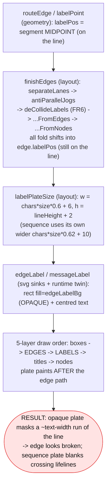
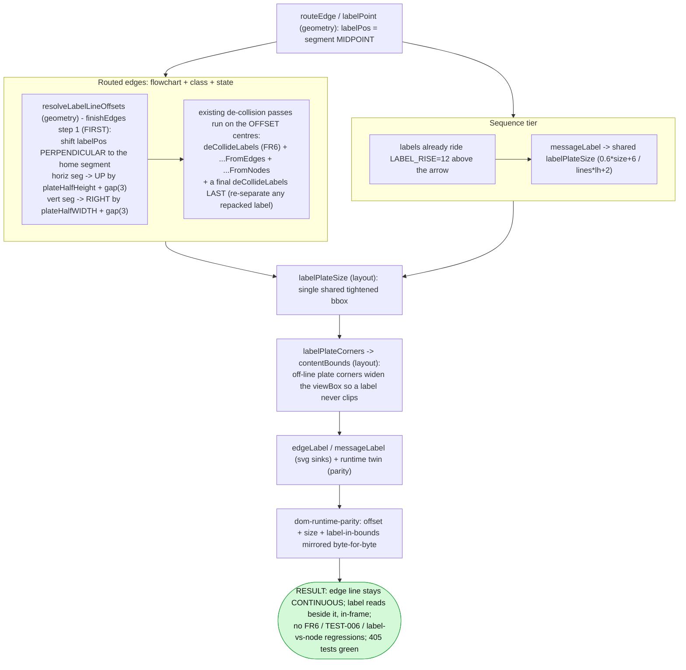

# Report — feature `edge-label-halo`

- **feature:** Fix the edge-label "halo" that masked the connecting line (v0.6.4)
- **status:** awaiting-uat
- **completed:** 2026-07-15
- **branch / commits:** `release/v0.6.4` (off `master` @ v0.6.3) · left in the working tree, unshipped

## Run status / gaps
All phases completed — plan, implement (2 rounds), review (1 round), test (1 round), report.
**No open issues.** Review raised REV-001 (fixed) + REV-002 (deferred nit); test raised TEST-001
(test-only, fixed). Build clean, typecheck clean, **405/405 unit** (incl. `dom-runtime-parity` 37/37),
**85/85 e2e**, CLI reports `0.6.4`, renders byte-deterministic.

## Summary
Every labelled edge on a flowchart / class / state diagram used to look **broken**: the label was
anchored dead-centre **on** the edge line, then an **opaque, ~text-width background plate** was painted
over the line in a later layer — blanking a stretch of the otherwise-continuous line. **v0.6.4 moves
each routed-edge label OFF its own line** (a deterministic perpendicular offset — the "graphviz"
behaviour the user asked for), so the line now reads continuous and the label sits cleanly beside it.
Sequence labels (which already ride above their arrow) were tightened to the shared minimal plate.

## Planned vs shipped
Shipped **as accepted** — the per-tier hybrid: **D1 = A** (perpendicular offset / option d for routed
edges), **D2 = A** (tighten sequence `messageLabel` to the shared `labelPlateSize`), **D3 = A** (defer
`--no-label-halo` / `--label-padding`). The offset is a single `resolveLabelLineOffsets` pass folded
**first** into `finishEdges`, reusing the existing `labelPos`-folding architecture and mirrored
byte-for-byte in the runtime twin — exactly as planned.

Three **as-built refinements** were needed to make option-d actually clear the line and hold the bars
(each small, obvious, validated; none change the accepted approach):

1. **Offset magnitude = the plate's half-extent *along the offset direction*** (half-**width** for a
   vertical run's right-shift; half-**height** for a horizontal run's up-shift) — **not** the plan's
   literal fixed `plateHalfHeight`. A wide label (e.g. "author rules", ~107px) on a vertical line needs
   half its **width** to fully clear; a fixed ~13px would have left it masking the line — failing the
   hard acceptance bar on the (common) TB/TD vertical edges.
2. **Off-line plate corners feed `contentBounds`** (`labelPlateCorners`) so an offset label never clips
   at the diagram edge (caught on "errors on tree" in `architecture.mmd`).
3. **A final `deCollideLabels` pass runs LAST** (after the node de-collision), because pushing a label
   off a node box can repack it onto a neighbour on tight anti-parallel jogs — the last pass
   re-separates them so the no-label-overlap bar holds.

Plus the review fix **REV-001** (offset-axis selection for a genuine cubic vs a curved-with-waypoints
elbow route).

## Implementation
The label-placement pipeline was extended at **one choke point** and its runtime twin, keeping node
positions and edge paths untouched (**only `labelPos` moves**).

- **`resolveLabelLineOffsets` (geometry)** returns, per labelled edge, a perpendicular shift for its
  plate. It finds the **home segment** (`homeSegment` — the same segment `labelPoint` centres on: a
  genuine cubic uses the mid-curve tangent, everything else the interior mid segment), decides
  horizontal-vs-vertical, and shifts **UP** by `plateHalfHeight + gap(3)` for a horizontal segment or
  **RIGHT** by `plateHalfWidth + gap(3)` for a vertical one — the plate dimension **facing** the line,
  so the line fully clears.
- **`offsetLabelsOffLine` (layout)** folds that shift into `edge.labelPos` as the **first** step of
  `finishEdges`, before the existing de-collision chain — so `deCollideLabels` (FR6), `...FromEdges`,
  and `...FromNodes` all run on the **offset** (actually-drawn) plate centres and stay coherent. A
  final `deCollideLabels` runs after the node pass (refinement 3).
- **`labelPlateCorners` -> `contentBounds`** (layout, both `layout()` and `applyPositions()`) keeps
  offset labels in-frame.
- **Runtime twin (`src/render/dom/runtime.ts`)** mirrors all of the above byte-for-byte in **both** the
  live `renderEdges` and the `toSvgString` (Save-SVG) paths, including the offset, the per-edge cubic
  test, and the label-corners-in-bounds — guarded by `dom-runtime-parity`.
- **Sequence (`messageLabel`)** now uses the shared tightened `0.6*size+6 / lines*lh+2` plate.
- **Version** bumped 0.6.3 -> 0.6.4 across the four sites.

### Changes (as-built)

| File | Change | Note |
|---|---|---|
| `src/geometry/index.ts` | added | `resolveLabelLineOffsets` + `homeSegment` + `LABEL_LINE_GAP=3`; magnitude = half-extent facing the line; cubic gated per-edge (REV-001) |
| `src/layout/index.ts` | modified | `offsetLabelsOffLine` folded FIRST in `finishEdges`; final `deCollideLabels` LAST; `labelPlateCorners` fed to `contentBounds` (both entry points) |
| `src/render/dom/runtime.ts` | modified | byte-for-byte twin of the offset + per-edge cubic test + label-corners-in-bounds, in `renderEdges` and `toSvgString` |
| `src/native/sequence/svg.ts` | modified | `messageLabel` unified on the shared tightened `labelPlateSize` (dropped `0.62*size+10`) |
| `package.json`, `src/cli/run.ts`, `test/cli.test.ts`, `docs/_config.yml` | modified | version 0.6.3 -> **0.6.4** (incl. the gallery cache-buster fallback) |
| `test/geometry.test.ts` | added tests | 4 lock tests for `resolveLabelLineOffsets` (axis + magnitude + the REV-001 cubic-gate discriminator) |
| `test/__snapshots__/{render,class,state,sequence}-svg.test.ts.snap` | updated | label-only churn (audited: no `<path d>`/viewBox/node change) |
| `e2e/state.spec.ts` | modified (test-only) | TEST-001: path correlation now by graph structure, not label proximity |
| `docs/`, `examples/`, `assets/` | regenerated | 91 assets re-rendered; byte-deterministic |

## Decisions & rationale
See [decisions.md](../decisions.md).

| Decision | Choice | Reason |
|---|---|---|
| **D1** routed-edge strategy | **(A) perpendicular offset (option d)** | The only fix that makes the line **continuous** (the reported bug); matches graphviz. Tighten-only (a) still leaves a visible break. |
| **D2** sequence | **(A) tighten to shared `labelPlateSize`** | Sequence labels already ride above the arrow; a tighter plate minimises lifeline masking, and unifying the formula removes a copy of the padding constants. Thin dashed-lifeline crossing accepted (standard). |
| **D3** CLI levers | **(A) defer `--no-label-halo` / `--label-padding`** | The default-look fix *is* the bug fix; the lever is additive scope for a patch release. |
| Offset magnitude (as-built) | **half-extent facing the line** (half-w vertical / half-h horizontal) | The plan's literal fixed `plateHalfHeight` would leave wide labels masking vertical lines - fails the acceptance bar. Half-width is what actually clears the line. |
| Labels in bounds (as-built) | **`labelPlateCorners` -> `contentBounds`** | An offset label can extend past the node/edge extent; without it, labels near the right edge clip. |
| Final label pass (as-built) | **extra `deCollideLabels` LAST** | The node de-collision can repack an offset label onto a neighbour on tight jogs; re-separate last to hold the no-overlap bar. |
| REV-001 | **fixed** - gate the cubic tangent branch per-edge (curved AND no waypoints) | Restores the documented `homeSegment` / `labelPoint` lockstep; snapshot-neutral, parity-preserved. |
| REV-002 | **wontfix (nit)** - sequence inlines the plate formula | Byte-identical to importing `labelPlateSize`; matches the established flowchart-sink convention; no drift risk (sequence has no stagger dependency). |

## Review outcome
**Round 1 - CLEAN / APPROVE** (0 blockers, 0 majors). Two findings:
**REV-001** (minor, latent) - the offset-axis branch keyed off the global `theme.edgeStyle`, so a
curved edge routed as a 4-point elbow could pick the wrong axis; **fixed** in implement round 2 by
gating the cubic branch on a per-edge `curved AND no-waypoints` test (mirrored in the twin) + 4 lock
tests; snapshot-neutral. **REV-002** (nit) - sequence re-inlines the plate formula; **deferred** with
rationale. See [review-01.md](../review-01.md) / [review/issues.json](../review/issues.json).

## Test outcome
**Round 1 - ALL GREEN.** Unit **405/405** (incl. `dom-runtime-parity` **37/37** - the byte-for-byte
static-vs-runtime label parity guard - and 52 geometry tests). e2e **85/85** (Playwright/Chromium).
CLI `--version` -> `0.6.4`. **Determinism**: `architecture.mmd` rendered twice -> byte-identical SVG +
identical PNG SHA1.

**Hands-on visual verification (the crux, on real PNGs):** on `architecture.mmd` (the user's diagram)
at **clean+sketch x light+dark**, and the gallery `flowchart` / `state` / `class`, **every routed-edge
label sits off its line and the line reads continuous** through the former label position - no masking,
no clipping (checked "errors on tree" / "findings" near the right border), no label/node or
label/label overlap. The **state `fail`/`retry` anti-parallel pair stays staggered** on distinct lanes.
**Sequence** labels ride above tightened plates with clear arrows/lifelines.

**Interactive/browser check:** the bundled `gogo-playwright` MCP worked this session - the live
runtime's 8 edge-label positions matched the static SVG up to one constant frame offset, independently
confirming **FR4 parity** in a real browser.

**TEST-001** (minor, test-only) - the e2e anti-parallel-jog test correlated labels to paths by
proximity, an assumption the off-line design breaks; the tester proved the real 26px jog stagger still
holds in the raw SVG geometry (not a product regression) and **rewrote the correlation to use graph
structure**. See [test-01.md](../test-01.md) / [test/issues.json](../test/issues.json).

## Diagrams
Open [diagrams.html](./diagrams.html) (same folder) - the as-built **flow** of the label-placement
pipeline (`flow.mmd`), shown before -> after. The change is data-flow / pipeline shaped, so a single
flow diagram carries the signal; no new types or runtime protocol, so class/sequence would be trivial.

## Before / after comparison
The plan captured an as-is **before** set (copied into `report/before/`). Only the **flow** kind exists
in both.

**Before** - label anchored on the line, opaque plate painted over it:

**After (v0.6.4)** - label lifted off the line first, de-collision on the offset centres, labels in bounds:

**What changed:** the label anchor is now **lifted off its line first** (perpendicular, by the plate
dimension facing the line), the existing de-collision chain runs on those **offset** centres (plus a
final label-label pass), off-line plates are **added to `contentBounds`**, and sequence joins the one
shared tightened plate formula. Result: the line stays **continuous** instead of being painted over.

## Knowledge updates
- **`.gogo/knowledge/tech-stack.md`** (`## gogo overrides`, gogo-owned) - bumped the "current version"
  note **v0.6.2 -> v0.6.4** and recorded the v0.6.4 label-offset behaviour (routed-edge labels lifted
  off their line; sequence plate unified on `labelPlateSize`; `dom-runtime-parity` extended).

No upstream (`Source:`) files were touched. **Consider upstreaming:** nothing this round - the change is
internal geometry; no public API or CLI surface changed (D3 levers deferred).

## Follow-ups & known limitations
- **REV-002 (deferred nit):** unify the inline copies of the plate-padding formula
  (`0.6*size+6 / lines*lh+2`) onto one shared helper (flowchart sink, sequence sink, runtime
  `plateSizeOf`, `labelPlateSize`) in a later cleanup - output is byte-identical today.
- **D3 (deferred by plan):** `--no-label-halo` / `--label-padding` CLI levers - additive, opt-in; ship
  only if a future need arises.
- **REV-001 residual:** the curved-edge-routed-as-4-point-elbow case is not reachable via normal DSL
  (skip edges route as >=6-point staircases); the fix is locked by a synthetic unit test rather than a
  rendered fixture.

## Summary (TL;DR)
- **Shipped:** v0.6.4 - routed-edge labels (flowchart/class/state) are lifted **off** their line so the
  edge reads **continuous** (option d), off-line labels stay **in-frame**, and sequence labels are
  tightened onto the shared plate. Geometry mirrored byte-for-byte in the DOM runtime twin.
- **Review:** CLEAN - REV-001 fixed (offset-axis cubic gate), REV-002 deferred (byte-identical nit).
- **Test:** ALL GREEN - 405 unit (incl. 37 parity) + 85 e2e + real-PNG visual verification confirm
  continuous lines, no overlaps/clips, fail/retry stagger intact, sequence tightened; TEST-001 was a
  test-only correlation fix.
- **Follow-ups:** unify the plate-formula copies (REV-002) and the deferred D3 CLI levers - see above.
