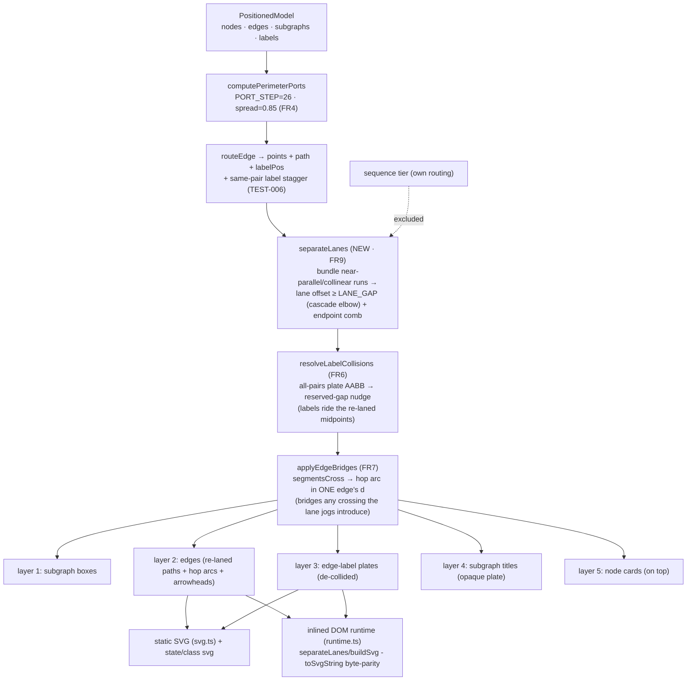

Status: **as-built / awaiting-uat** (2026-07-13) - FR1-FR9 all shipped + green across two UAT rounds. UAT round 2 pivoted **FR7 arc→GAP** (D11) and added the **D12 API-fan de-knot** (heading-order ports). User **accepted & shipped** (D13); TEST-004 (extreme-drag re-merge) + left/right side attachment accepted as documented follow-ups. 388 unit + 79 e2e green, byte-parity (flowchart + state) + determinism confirmed. See [report/report.md](report/report.md) for the full as-built account, [decisions.md](decisions.md) D1-D13, [uat.md](uat.md).

Status: **UAT round 1 re-accepted** (user, 2026-07-13) - FR1-FR8 stay the shipped, green **Done baseline**; this round adds **FR9 (edge-lane separation)** to fix the merged near-parallel runs the user boxed. Forks resolved: **D6=A scoped `separateLanes` post-pass · D7=A LANE_GAP≈14-16px, split ≥3 runs & overlap ≥40px · D8=A the 3 boxed bundles · D9=A widen mid-channels + comb-stagger the node-width-bound endpoint fans** (the "full fix — all 3 boxes"). See [uat.md](uat.md) round 1 + [decisions.md](decisions.md) D6-D9.

Status: **as-built / awaiting-uat** (shipped 2026-07-12) - FR1-FR8 all delivered as planned. The one implementation refinement beyond the plan text: the native class/state edge-label plate was unified to the shared `labelPlateSize` (review REV-002) so FR6's "no two plates overlap" guarantee actually holds for those tiers. See [report/report.md](report/report.md) for the full as-built account.
Re-accepted: **(user, 2026-07-12)** - D1=A expansion; forks resolved: **D2=arc hop · D3=overpass (more-horizontal edge hops) · D4=`bridges` per-style config toggle (default ON for clean elbow, OFF for curved/sketch, user-overridable) · D5=flowchart+state+class (sequence out)**.
Superseded acceptance: **accepted** (user, 2026-07-12) - FR1–FR5 already shipped + verified green on `fix/flowchart-render-legibility`.

# Plan - flowchart render legibility (edges/labels/titles stop overlapping text)

**In one line:** the first pass fixed the reported occlusion + fan-in bugs (FR1–FR5,
**shipped + green**); this **additive re-plan** closes the two things the user
expanded the scope to at the test gate - **(FR6)** give edge labels a *reserved
space* so **no two label plates overlap** (fixes the open **TEST-001** "batch
load"/"feed" clip), and **(FR7)** draw a small **bridge / line-jump** where two edge
lines cross so each stays distinguishable - both in the flowchart-family renderers
(flowchart + the native state/class tiers that share the geometry), **sequence
excluded**, mirrored across the static SVG and the inlined DOM runtime (byte-parity),
fully deterministic.

## Goal

The accepted plan (FR1–FR5) is **done and verified** (build/typecheck/346 unit/73 e2e
green + hands-on). At the test gate the tester found **TEST-001** (major, open) - two
*different* edges' label plates overlap and clip each other - and the user chose
**D1=A: fix now, and expand** the ask into two general mechanisms:

1. **Reserved-space de-collision (FR6).** Labels (and, already, arrows via the
   FR4 spread) get a small padding no other element may render into; when two labels
   would collide they move apart by that distance. **Concrete must-fix:** no two
   edge-label plates may overlap (**TEST-001**).
2. **Edge-crossing bridges / line-jumps (FR7).** Where two edge lines cross, the
   designated line draws a small hop/bridge so it reads as passing *over* the other
   and each line stays traceable (the user's attached reference shows hop arcs at
   crossings). Targets **flow + "activity"** diagrams; **sequence is explicitly out**
   (its lines/arrows already read fine - sequence only ever had text-over-line issues,
   fixed elsewhere).

**Acceptance signal (delta):** re-rendering the repro (`scratchpad/repro.mmd`) shows
**"batch load" and "feed" fully legible with a visible gap** (TEST-001 gone), and every
edge crossing shows a clean bridge so you can trace each line - verified by eye (PNG +
interactive HTML) and by new unit assertions, with the **byte-parity guard + all suites
green** and `examples/` regenerated.

### Goal delta - UAT round 1 (2026-07-12): FR9 edge-lane separation

At the UAT gate the user rejected the shipped work with a **new, distinct** problem (see
[uat.md](uat.md) round 1 + `uat-round1-annotated.png`, 3 red boxes): long **near-parallel
edge runs merge in a shared channel** so an individual line can't be traced -
> "those line are merging together I do not know which line is which… we need to keep those
> line separate…"

Code-grounded and measured on the repro (routing it through `layout()`): the merged runs sit
**one `PORT_STEP` apart** - the middle channel is `batch load`(x≈397) · `IN→HUB`(x≈417) ·
`feed`(x≈437), three vertical runs **20px apart over a 120px overlap**; the Ingress-out and
HUB-in bundles are 26px combs. FR4 spreads the **anchors**, but the runs *between* the spread
anchors keep that one-step gap for their whole length. This is **not** FR7 (a parallel bundle
has **no** proper crossing - `segmentsCross` returns `null` for `denom===0`), **not** FR6
(labels, not lines), **not** FR4 (endpoints, not runs). It is exactly the **"full lane/bus
orthogonal routing so long parallel approaches never run merged"** that this plan's *Out of
scope* + report *Follow-ups* deferred. **This round pulls that deferred lane-routing INTO
scope** as **FR9**, additive on the FR1–FR8 baseline.

**Acceptance signal (FR9 delta):** re-rendering the repro shows the **three boxed bundles
visibly separated** - each line individually traceable (a minimum lane gap between adjacent
parallel runs), no node moved, FR6 labels + FR7 bridges still correct, the **byte-parity
guard + all suites green**, and `examples/` regenerated. Verified by eye (PNG + interactive
HTML across light/dark/fancy + clean/sketch) and by a new "no two near-parallel runs within
the min gap in a shared channel" unit assertion on the fan/bundle fixtures.

## Done (baseline) - FR1–FR8, do NOT rebuild

Already implemented on `fix/flowchart-render-legibility` and verified green (build/typecheck/
374 unit incl. `dom-runtime-parity`/79 e2e + hands-on). Treat as the fixed foundation this
UAT-round-1 re-plan builds FR9 **on top of** - FR9 does not touch any of these:

- **FR1** - explicit **5-layer draw order** (boxes → edges → edge-labels → subgraph
  titles → nodes) in both renderers.
- **FR2** - **opaque subgraph-title plate** + taller title band (`SUBGRAPH_TITLE_BAND`
  18→22).
- **FR3** - **tightened edge-label plate** (`0.6·chars+6 / lines·lh+2`), three copies in
  lockstep.
- **FR4** - **wider fan-in spread** (`PORT_STEP` 20→26, `PORT_SPREAD_FRAC` 0.7→0.85) -
  gives *arrows* their reserved spread **at the endpoints** (not the runs between them - the
  FR9 gap).
- **FR5** - **parity + determinism**: static SVG and inlined runtime byte-match; no
  `Date.now`/`random`; snapshots + examples regenerated.
- **FR6** - **label reserved-space de-collision** (`resolveLabelCollisions`, fixes TEST-001):
  no two edge-label **plates** overlap; shared geometry via `finishEdges`, byte-parity twin.
- **FR7** - **edge-crossing bridges** (`segmentsCross` + `applyEdgeBridges`): a quadratic arc
  hop spliced into the more-horizontal edge at each **point-crossing**; flow+state+class;
  `bridges` toggle (D4); sequence excluded.
- **FR8** - **parity + determinism + churn** (standing bar): both passes pure/deterministic;
  byte-parity guard green; snapshots + `examples/` regenerated.

## Context - what exists (code = source of truth)

Everything routes edges through **one shared geometry** (`src/geometry/index.ts`), so a
change there reaches every tier that consumes it:

| Tier | Path | Reaches shared geometry? |
|---|---|---|
| **flowchart** | `src/layout/index.ts` `layout()` → `computePerimeterPorts` + `routeEdge` → `src/render/svg.ts` | yes |
| **class** | `src/native/class/layout.ts:61` **reuses `layout()`** → `src/native/class/svg.ts` (own `edgeLabel`) | yes |
| **state** | `src/native/state/layout.ts:94-101` calls `computePerimeterPorts` + `routeEdge` → `src/native/state/svg.ts` (own path/label emit) | yes |
| **sequence** | `src/native/sequence/*` - **its own routing** (`seq-runtime.ts`) | **no - excluded** |
| **interactive runtime twin** | `src/render/dom/runtime.ts` - re-implements the geometry inline (`computePorts`, `routeBoxes`, `buildSvg`), `.toString()`-serialized into HTML exports | mirror, byte-parity-guarded |

**"Activity diagram" determination (asked for explicitly).** There is **no `activity`
diagram type in this codebase - and none in mermaid's `detectType`** either (renderer
ids are `flowchart | sequence | class | state | mermaid`, `src/mermaid/router.ts:22`).
In UML/mermaid terms an *activity* diagram is authored as a **flowchart** (process flow
with decisions) or, for lifecycle semantics, a **state diagram**. Both of those, plus
class, already route through the shared geometry above - so scoping the LINE work to
**the flowchart family (flowchart + state + class)** is exactly "flow + activity" in this
code, and **sequence stays out**. (Surfaced as **D5** in case you want the LINE work
narrowed to flowchart-only.)

**Where labels come from (FR6).** `routeEdge()` returns a `labelPos` per edge
(`geometry/index.ts:663`), stored on `edge.labelPos` in `layout()` (`layout/index.ts:155`)
and recomputed live in the runtime (`computePorts`→`routeBoxes`, `runtime.ts:1021,1127`).
Today the only label de-collision is `computeLabelShifts` (`geometry/index.ts:320`), which
**only staggers labels of edges sharing the same node *pair*** (the TEST-006 anti-parallel
fix). **TEST-001 is two *different* pairs** (`IN→K1 "batch load"` and `API→V1 "feed"`) whose
plates land within a plate-width of each other - unrelated edges never de-collide, so it
slips through. The plate rects are the same three-copy formula (`labelPlateSize` in
`layout/index.ts:322`, `edgeLabel` in `svg.ts:206`, and the runtime twin `svgEdgeLabel`
`runtime.ts:1931`).

**Where edge lines come from (FR7).** Each edge carries `points` (the routed polyline /
bezier knots) and a `path` (`d` string). Elbow edges are orthogonal polylines; the fancy
theme + curved style are beziers (`routeCurved`). Crossings between two edges are only
detectable with the **whole routed set** in hand - i.e. a **post-layout pass over all
edges**, not inside per-edge `routeEdge`.

**The hard constraint - byte-parity.** `dom-runtime-parity.test.ts:577-578` asserts
`handle.toSvgString()` **`toBe(renderSvgFromModel(edited model))`** after drag+resize, in
clean **and** sketch. So any FR6/FR7 mechanism added to the static path
(`layout()`/`applyPositions()`/`svg.ts`) must be **re-implemented byte-identically** in the
runtime twin (`computePorts`/`buildSvg`), and stay deterministic (no `Date.now`/`random`)
so both sides agree every frame.

## Functional requirements

- **FR6 - Label reserved-space de-collision (fixes TEST-001).** After all edge labels are
  placed, **no two edge-label plates may overlap**: a shared, deterministic all-pairs pass
  detects AABB overlap between any two plate rects and nudges the colliding labels apart by
  at least a small reserved gap (`PORT_LABEL_PAD`), along the axis of least push. It runs in
  the shared geometry so **flowchart + class + state** all benefit, and is mirrored
  byte-for-byte in the runtime twin. It **generalizes** (does not replace) the existing
  same-pair stagger.
- **FR7 - Edge-crossing bridges (line-jumps) for the flowchart family.** A shared,
  deterministic post-layout pass detects where two edge **segments cross** and rewrites the
  `d` of exactly **one** edge at each crossing to draw a small **arc hop** over the crossed
  line (**D2=arc**), choosing the hopping edge as the **more-horizontal segment**, ties by
  edge index (**D3=overpass**). Applied to the flowchart-family renderers that share geometry
  (flowchart + state + class - **D5**); **sequence is excluded**. Mirrored in the static SVG
  and the runtime twin (byte-parity).
  **Config toggle (D4).** Bridges are gated by a **`bridges` option** - `SvgRenderOptions.bridges?: boolean`
  (API) + a CLI `--bridges/--no-bridges` flag + a field on the runtime payload options - with a
  **per-style default: ON for clean elbow edges, OFF for curved (fancy) and sketch** (arc-splicing
  beziers / rough strokes is deferred). When unset it follows that default; when set it forces
  on/off. FR6 label de-collision is **always-on**, independent of this toggle.
- **FR8 - Parity + determinism + churn (standing bar, extends FR5).** Both new passes are
  pure and deterministic (fixed iteration order by edge index, then segment index; no RNG /
  clock); the byte-parity guard stays green; snapshots + `examples/` are regenerated to the
  new look. ~~Physically **moving crossing lines apart** (lane routing) stays **deferred**~~
  → **superseded by FR9** (UAT round 1): lane separation is now in scope.
- **FR9 - Edge-lane separation (UAT round 1; fixes the merged-runs defect).** A new
  deterministic **post-layout pass** in the shared geometry - `separateLanes(edges, theme)`,
  run inside `finishEdges` **before** `deCollideLabels`/`applyBridges` - guarantees that no two
  **near-parallel, near-collinear** edge segments sharing a channel run within a **minimum lane
  gap** (`LANE_GAP`) of each other:
  1. **Detect bundles.** Group edge segments that are near-parallel (same orientation) **and**
     near-collinear (within `LANE_GAP` on the perpendicular axis) **and** overlapping on the
     parallel axis for ≥ a threshold length (`LANE_MIN_OVERLAP`), so only runs that actually
     read as merged are touched - a lone segment or a brief brush-past is left alone.
  2. **Assign lanes + offset.** Order each bundle deterministically (by current perpendicular
     coord, then edge index) and spread its members to distinct lanes ≥ `LANE_GAP` apart,
     **cascading** each offset through the connected elbow: moving a vertical run in x
     lengthens/shortens the horizontal segments on either side so the path stays orthogonal and
     **connected** to both anchors. Iterate in **bounded** passes to a deterministic fixpoint
     (offsetting one run can push it into another's lane).
  3. **Endpoint bundles (boxes 1 & 3).** When a fan's first/last run is anchored to a node
     border and the bundle is **wider than the node** (so pure widening would detach the
     anchor), apply a **staggered-depth comb**: each edge in the bundle turns at a different
     depth so the parallel bundle fans into a traceable comb rather than an impossible widen.
  Reaches **flowchart + state + class** via the existing `finishEdges` (D5, unchanged);
  **sequence excluded** (own routing). Mirrored **byte-for-byte** in the `runtime.ts` twin and
  fully deterministic (no RNG/clock). Runs **before** FR6 (so labels ride the re-laned
  midpoints) and **before** FR7 (so any crossings the lane jogs introduce still get bridged).
  Gated by the **same style rule as FR7** - clean elbow only; curved (beziers) and sketch stay
  deferred. **Scope guard:** FR9 targets the **endpoint fan bundles + shared mid-channels**
  (the 3 annotated cases); a fully-general "no two segments within N px *anywhere*" router
  stays out (see Out of scope / **D8**). Tunables (`LANE_GAP`, `LANE_MIN_OVERLAP`, comb on/off)
  are set by **D7/D9** at re-acceptance.

## Approach (recommended)

Two additive, deterministic **post-layout passes** in the shared geometry, each mirrored in
the runtime twin - no change to how individual edges route, so FR1–FR5 stay intact.

**A. Label reserved-space de-collision (FR6).** Add
`resolveLabelCollisions(rects, order) → shifts` to `src/geometry/index.ts`: given every
labelled edge's final plate rect (centre from `labelPos`, size from `labelPlateSize`),
sweep pairs in edge-index order; on AABB overlap, push the two plates apart along the axis
that needs the *smaller* move until they clear by `PORT_LABEL_PAD`; a few bounded passes
converge (deterministic, cheap for tens of labels). Wire it:
- static - in `layout()` after the edge loop builds all `labelPos`
  (`layout/index.ts:139-157`) and identically in `applyPositions()`
  (`layout/index.ts:264-276`);
- runtime - after `buildSvg`/`renderEdges` collect all `labelPos`
  (`runtime.ts:2128-2134`, `1283`), mirrored byte-for-byte.
This subsumes cross-pair collisions like TEST-001 while leaving the same-pair stagger
(TEST-006) as the first, cheaper grouping. *Why not just widen the same-pair stagger:* it is
scoped to one node pair by construction; TEST-001 is two different pairs, so it needs a
set-level resolver.

**B. Edge-crossing bridges (FR7).** Add `applyEdgeBridges(edges, opts) → edges'` to the
shared geometry: for every unordered pair of edges, test their segments for a proper
crossing (orthogonal segments → a cheap axis-aligned test; determinism from fixed pair +
segment order); at each crossing pick the hopping edge by the **D3** rule and splice a small
**arc hop** (**D2**) into that edge's `d` at the crossing point (a short `A`/`Q` bump of a
fixed radius, oriented across the under-line). Run it after routing in `layout()` /
`applyPositions()` and mirror it in the runtime's `buildSvg` (and the live `renderEdges`
path element). *Why a post-pass, not per-edge routing:* a crossing is a property of two
edges, invisible to either one's own `routeEdge`. *Why bridges, not lane-routing:* moving
the lines apart is the orthogonal-routing rework the first plan deferred; bridges reach the
same legibility goal at a fraction of the cost/risk and keep every node position stable.

**C. Scope + determinism guards.** Keep sequence untouched (own routing). Keep both passes
free of clock/RNG. Treat curved/sketch conservatively in v1 (**D2/D4**): arc hops are clean
on orthogonal elbow paths; on beziers/rough strokes they are harder, so the default
recommendation is bridges on **clean elbow** edges and leave curved/sketch crossings as-is
until a follow-up (still deterministic, no regressions to those styles).

**E. Edge-lane separation (FR9) - RECOMMENDED approach + honest cost.** A third additive,
deterministic post-layout pass `separateLanes(edges, theme)`, wired into `finishEdges` **first**
(before `deCollideLabels`, before `applyBridges`), mirrored byte-for-byte in the `runtime.ts`
twin. It runs on the routed **orthogonal polylines** (`edge.points`): bundle near-parallel +
near-collinear + overlapping segments, assign lanes ≥ `LANE_GAP`, and **cascade** each offset
into the two adjacent horizontal segments so every path stays connected and orthogonal; iterate
to a bounded deterministic fixpoint; comb-stagger the endpoint fans that are wider than their
node. *Why a post-pass, not a new router:* it reuses the exact FR6/FR7 shape (a pure function
over the whole routed set, mirrored in the twin) and keeps **every node position stable** -
lowest-risk way to reach the goal.

**Be candid - this is the substantial routing work the first plan deferred, and it is
genuinely harder than FR6/FR7:**
- **Connectivity cascade is the crux.** Offsetting a **mid**-segment (box 2) is clean - just
  re-x the two H-neighbours. But a fan's **first/last** run (boxes 1 & 3) is pinned to the node
  border and **bounded by node width** (Ingress ≈ 90px already holds 4 lanes at 26px), so you
  cannot widen the lanes - you must **comb-stagger** (add jogs), which *adds* visual complexity,
  can create **new crossings** (→ more FR7 bridges - which is exactly why FR9 runs before FR7),
  and pushes **bounds** outward (interacts with the latent REV-004 nit).
- **Convergence must be deterministic.** Lane relaxation can oscillate; it needs a fixed
  iteration order + bounded passes + a stable tiebreak (like `resolveLabelCollisions`, but
  2-D-coupled through the cascade). This is the part most likely to need 1-2 extra
  implement/review rounds.
- **Byte-parity doubles it.** The whole pass is re-implemented in `runtime.ts` and must produce
  byte-identical `points`/`path`; it re-snapshots every flowchart/state/class example.

Given that, the **recommended shape is the *scoped* pass** (E above): fix the **endpoint fan
bundles + shared mid-channels** to a min lane gap, comb only where node width forces it, and
leave the fully-general "no two segments within N px anywhere" router **out** (D8). That
addresses all three annotated boxes at materially lower risk than a real orthogonal router.

### Alternatives considered
- **Widen the same-pair label stagger only** - cannot fix TEST-001 (different pairs).
  Rejected.
- **Translucent label plates** so an overlap shows both texts - still reads as a run-together
  blur; the reserved-space nudge is the correct fix. Rejected.
- **Gap/notch line-jump** (erase a small gap in the under-line) instead of an arc bump -
  simpler on curved/rough paths but background-dependent (fails on textured/transparent
  backgrounds) and reads less clearly as a bridge. Offered as **D2** option B.
- **An opt-in `--bridges` flag** instead of default-on - adds a new dimension to thread
  through CLI/API/theme/runtime/parity; the simplest version is one deterministic default
  behaviour + a one-time re-snapshot. Offered as **D4**.

**FR9 (lane separation) alternatives - ranked by value ÷ cost/risk:**
- **(a) Scoped post-layout lane-separation pass** (the FR9 recommendation, Approach E) -
  bundle + lane + cascade + endpoint comb, over the routed polylines, mirrored + deterministic.
  *Value:* high - hits all 3 boxes. *Cost/risk:* high but bounded (cascade convergence + parity
  + re-snapshot). **Recommended.**
- **(b) Tune dagre only** (bigger `nodesep`/`ranksep`, edge `weight`/`minlen`) - dagre has **no
  true orthogonal edge router**; more ranksep adds vertical room but leaves parallel runs the
  same `PORT_STEP` apart in x. *Value:* low for THIS defect. *Cost:* trivial. A cheap partial at
  best; does not "keep the lines separate". Rejected as the primary fix.
- **(c) Fuller per-edge lane routing in shared corridors** (a real orthogonal router with global
  lane assignment) - *Value:* highest (fully general). *Cost/risk:* highest - effectively a new
  router + a full parity twin + total re-snapshot. Deferred (this is the "everywhere" case D8
  leaves out).
- **(d) Partial: only de-bundle the hub fan-in/out + the shared mid-channel** (no fully general
  guarantee) - *Value:* medium-high (the 3 boxes are exactly these). *Cost/risk:* medium. This
  is what the **scoped** framing of (a) actually delivers; **D8** lets you dial (a)↔(d).
- **(e) Lighter still: just bump `PORT_STEP`/`LANE_GAP` + `ranksep`, no cascade** - widen the
  combs and hope. *Value:* low-medium (endpoint bundles bounded by node width barely move).
  *Cost:* low. Offered under **D9** as the "worth-it?" floor if you'd rather a small win than the
  routing rework.
- **Fully-general lane router (option c)** stays **out of scope** (D8); FR9 = the scoped (a)/(d).

### Design forks - RESOLVED at re-acceptance (user, 2026-07-12; see `decisions.md` D2–D5)
- **D2 = arc bump** - the hop glyph is a small semicircular arc.
- **D3 = overpass** - the more-horizontal edge at a crossing hops; ties by edge index.
- **D4 = `bridges` per-style config toggle** - option (API `bridges?: boolean` + CLI
  `--bridges/--no-bridges` + runtime payload), default **ON for clean elbow, OFF for curved/sketch**,
  user-overridable. (FR6 de-collision always-on.)
- **D5 = flowchart + state + class**; sequence excluded; ~~lane-routing stays deferred~~ (now FR9).

### Design forks - OPEN for UAT-round-1 re-acceptance (FR9; see `decisions.md` D6–D9)
- **D6 - Approach depth.** (a) scoped post-layout lane-separation pass [Approach E] vs (c) a
  fuller orthogonal router. **Recommend (a)** - reuses the FR6/FR7 post-pass pattern, keeps every
  node fixed, lowest bounded risk that fully works.
- **D7 - Aggressiveness (`LANE_GAP` + when to split).** How wide is a lane and when does a bundle
  qualify? **Recommend `LANE_GAP ≈ 14-16px`** (a touch under one `PORT_STEP`, enough to read a
  1.5px stroke), split a bundle only when **≥3 runs** share a channel within the gap **and**
  overlap ≥ `LANE_MIN_OVERLAP ≈ 40px` - so only genuinely-merged runs move, avoiding churn on
  tidy diagrams. Trade-off: bigger gap = clearer but pushes bounds / forces more combs.
- **D8 - Scope (which runs).** (a) endpoint fan bundles + shared mid-channels [the 3 boxes] vs
  a fully-general "no two segments within N px anywhere" guarantee. **Recommend the scoped set**
  - it fixes the reported defect; the global guarantee is option (c), deferred.
- **D9 - Endpoint bundles: comb-stagger, or pure widen + accept the floor?** The endpoint fans
  (boxes 1 & 3) are bounded by node width. **Recommend: widen first, add the comb-stagger only
  where the bundle is wider than its node** - the only way to actually separate those two, at the
  cost of extra jogs + possible new crossings (which FR7 then bridges). The lighter floor (widen
  only, no comb) is the "is this worth the routing rework?" fallback - honest call for the user.

## Changes checklist - FR9 (build order; FR1–FR8 already built, do NOT rebuild)

1. `src/geometry/index.ts` - add **`separateLanes(edges, theme, opts?)`** (FR9) + helpers
   (`bundleSegments`, `cascadeOffset`, and the endpoint comb-stagger) + `LANE_GAP` /
   `LANE_MIN_OVERLAP` constants; export what the parity test needs. Pure + deterministic
   (fixed bundle order, bounded relaxation passes, no RNG/clock).
2. `src/layout/index.ts` - call `separateLanes` **first inside `finishEdges`** (before
   `deCollideLabels` → before `applyBridges`), gated by the FR7 style rule (clean elbow). This
   automatically reaches `layout()`, `applyPositions()`, and the native **state** re-route.
3. `src/render/dom/runtime.ts` - **mirror `separateLanes` byte-for-byte** in the twin, called at
   the same point in both `buildSvg` (toSvgString parity) and `renderEdges` (live drag/resize),
   so `toSvgString()` still equals `renderSvgFromModel`. **The parity trap - this is the load-
   bearing step.**
4. `src/native/state/layout.ts` + `src/native/class/layout.ts` - no new call needed (they route
   via `finishEdges` / `layout()`), but **verify** state's post-shrink re-route and class's reuse
   both pick up FR9; regenerate their snapshots.
5. `src/render/svg.ts` - no new sink logic (paths/labels already emit from `edge.path`/`labelPos`);
   confirm re-laned `points`/`path` render cleanly with markers/dash and that `contentBounds`
   still encloses the widened runs (watch REV-004).
6. *(No new CLI/API surface.)* FR9 follows the **existing `bridges`/style gate** - no new flag
   unless **D9** asks for a `lanes` toggle (only if the user wants it opt-out).
7. `test/*` - new FR9 assertions (below); refresh `test/__snapshots__`.
8. `npm run build && npm run examples` - regenerate the gallery to the new look; re-render
   `scratchpad/repro.mmd` for the FR9 done-bar (the 3 boxes separated).

### (FR6/FR7 checklist - already built, kept for reference)

1. `src/geometry/index.ts` - add `resolveLabelCollisions` (FR6) and `applyEdgeBridges`
   (+ a small `segmentsCross` helper) (FR7); export what the runtime parity test needs.
   `applyEdgeBridges` takes a `bridges` boolean so callers gate it (D4).
2. `src/layout/index.ts` - call the FR6 resolver after the edge loop in `layout()` **and**
   `applyPositions()` (always-on). Thread a **`bridges` flag** through `LayoutOptions` and
   apply the FR7 bridge pass only when on; **per-style default helper** (ON iff clean elbow,
   i.e. `edgeStyle==="elbow"` && not sketch) computes the effective default when unset.
3. `src/render/svg.ts` - add **`bridges?: boolean` to `SvgRenderOptions`**; resolve the
   per-style default and pass it into layout/the bridge pass; verify the bridged `d` renders
   cleanly with markers/dash. (Labels already emit from `edge.labelPos`, paths from `edge.path`.)
4. `src/cli/index.ts` - add a **`--bridges` / `--no-bridges`** flag (commander) wired to the
   `bridges` option; default unset → per-style default.
5. `src/render/dom/runtime.ts` (+ `payload.ts`) - carry `bridges` in the runtime **payload
   options**; mirror FR6 + FR7 byte-for-byte in `computePorts`/`buildSvg` and the live
   `renderEdges`, so `toSvgString()` still matches the static SVG (the parity trap).
6. `src/native/state/layout.ts` + `src/native/class/layout.ts` (+ their svg as needed) -
   apply the same FR6/FR7 passes so state/class crossings/labels get the fix (per **D5**);
   pick their per-style default (elbow/curved by theme).
7. `test/*` - new assertions (below); refresh `test/__snapshots__`.
8. `npm run build && npm run examples` - regenerate the gallery to the new look; re-render
   `scratchpad/repro.mmd` for the hands-on done-bar.

## Tests

| Level | Verifies |
|---|---|
| unit `geometry` (FR9) | for the repro's **fan/bundle fixtures** (Ingress-out, batch-load/feed mid-channel, HUB fan-in), **no two near-parallel + y-overlapping runs sit within `LANE_GAP`** after `separateLanes`; every edge's polyline stays **orthogonal + connected** to both anchors (no detached ends); the pass is **deterministic + idempotent** (stable on re-run, converges in ≤ bounded passes, no RNG) |
| unit `geometry` (FR9) | a **tidy diagram** with no merged runs is **byte-unchanged** by `separateLanes` (no churn); a mid-channel bundle offsets via **H-neighbour cascade** (segment count preserved / one jog added), and an **endpoint bundle wider than its node** gets the **comb-stagger** |
| unit `dom-runtime-parity` (FR9) | `toSvgString()` still **byte-matches** `renderSvgFromModel` after FR9 (clean **and** sketch), incl. a **lane fixture** - the core guard |
| unit `geometry` | **no two label plates intersect** for a close-parallel fixture (the TEST-001 shape); `resolveLabelCollisions` is idempotent + deterministic (stable output on re-run, no RNG) |
| unit `geometry` | `segmentsCross` correctness (crossing vs touching-at-endpoint vs parallel); `applyEdgeBridges` picks the **same** hopping edge deterministically and inserts exactly one hop per crossing |
| unit `render-svg` | a crossing fixture emits a bridge arc in the hopping edge's `d`; markers/dash still valid; a no-crossing diagram is byte-unchanged (no spurious hops) |
| unit `dom-runtime-parity` | `toSvgString()` still **byte-matches** `renderSvgFromModel` after FR6+FR7 (clean **and** sketch), incl. a crossing + close-label fixture - the core guard |
| snapshot | updated `render-svg` / examples snapshots reflect de-collided labels + bridges |
| e2e (Playwright) | HTML export of the repro: labels legible with a gap, crossings show hops, **the 3 boxed bundles are separated (FR9)**, and lines stay separated **after a drag re-route**, **0 console errors** (extends the subgraph/interaction + `bridges-and-labels` specs) |
| hands-on | re-render `scratchpad/repro.mmd` → PNG + interactive HTML across light/dark/fancy + clean/sketch; done-bar: **the 3 boxes (Ingress-out fan · batch-load/feed mid-channel · HUB fan-in) each read as separate traceable lines**, **"batch load"/"feed" have a visible gap**, and each crossing is traceable |

## BDD scenarios

Role: a user rendering a **flowchart / state ("activity")** diagram with close-running
labelled edges and crossing lines via `vnm render` (static) or the interactive HTML export.

```gherkin
Feature: Reserved-space labels and edge-crossing bridges (flow/activity only)

  Background:
    Given a flowchart-family diagram with two near-parallel labelled edges and at least one edge crossing
    And it is rendered to static SVG/PNG and to the interactive HTML export

  Scenario: Two different edges' labels never overlap (TEST-001)
    Given edges "IN -->|batch load| K1" and "API -->|feed| V1" route close together
    When the diagram is rendered
    Then the "batch load" and "feed" plates do not intersect
    And both labels are fully legible with a visible gap between them

  Scenario: Crossing lines read as one passing over the other
    Given two edge lines cross at a point
    When the diagram is rendered
    Then exactly one of the two lines draws a small bridge/hop at the crossing
    And the same line hops every time the same model is rendered (deterministic)

  Scenario: Near-parallel edge runs are separated into distinct lanes (FR9)
    Given three edges whose vertical runs share a channel within one PORT_STEP
      (the "batch load" / "IN->HUB" / "feed" middle channel of the repro)
    When the diagram is rendered
    Then no two of those runs sit within LANE_GAP of each other
    And each line is individually traceable, with every path still connected to its nodes
    And no node has moved

  Scenario: A hub fan-in / fan-out bundle reads as separate lines (FR9)
    Given a node with a fan of 4+ incident edges bunched at its border
    When the diagram is rendered
    Then the bundle is spread (or comb-staggered when wider than the node) so each line is distinct

  Scenario: Sequence diagrams are untouched by the line work
    Given a sequence diagram with crossing message lines
    When it is rendered
    Then no bridge glyphs are added and its output is unchanged

  Scenario: A tidy diagram is byte-unchanged
    Given a diagram whose edges neither cross, nor place labels within a plate-width, nor share a channel within LANE_GAP
    When it is rendered
    Then its SVG is unchanged (no spurious hops, nudges, or lane moves)

  Scenario: Static SVG and interactive runtime stay in byte-parity
    Given the same edited model rendered by the static SVG and by the runtime's toSvgString
    When both are produced (clean and sketch)
    Then they are byte-identical
    And the dom-runtime-parity guard passes
```

## Out of scope
- ~~**Full lane/bus orthogonal routing** to physically move crossing lines apart~~ → **now in
  scope as FR9** (UAT round 1), scoped to the endpoint fan bundles + shared mid-channels.
- **A fully-general orthogonal edge router** ("no two segments within N px *anywhere*", global
  lane assignment across all corridors - option (c) / **D8**) - FR9 is the *scoped* pass; the
  general router stays deferred (it is effectively a new renderer + a full parity twin).
- **Curved (bezier) & sketch lane separation** - FR9 follows the FR7 style gate (clean elbow
  only); re-laning beziers / rough strokes stays a scoped follow-up.
- **Sequence renderer** line/arrow changes - its routing is separate and already reads fine
  (only text-over-line issues, handled elsewhere).
- Rerouting edges to avoid the subgraph title band (opaque plate, already shipped in FR2).
- Bridges on **curved/bezier and sketch** crossings if **D2/D4** keep v1 to clean elbow
  edges (a scoped follow-up, not a regression to those styles).
- Any interactive-editing behaviour change beyond edges re-bridging/re-de-colliding live on
  drag/resize (drag/resize/pin otherwise unaffected).

## Intended design - FR9 lane separation added to the shipped `finishEdges` pipeline



FR9 slots in as the **first** step of the shared `finishEdges(edges, theme, bridges?)` (which
already runs `deCollideLabels` then `applyBridges`), so all three passes reach flowchart + state
+ class identically and the runtime twin mirrors all three byte-for-byte. Order is deliberate:
**lanes first** (moves the runs), then **labels** (ride the moved midpoints), then **bridges**
(hop any crossings the lane jogs create).

## Summary (TL;DR)

- **What (UAT round 1):** an **additive FR9** on top of the shipped, green **FR1–FR8 baseline**
  - **edge-lane separation**: a deterministic post-layout pass (`separateLanes`, first in
  `finishEdges`) that spreads **near-parallel runs sharing a channel** into distinct lanes
  (≥ `LANE_GAP`, cascading the elbow so paths stay connected; endpoint fans get a comb-stagger),
  so you can trace each line. FR1–FR8 unchanged.
- **Why:** the user rejected at UAT with a **new, distinct** defect (3 boxes: Ingress-out fan ·
  batch-load/feed mid-channel · HUB fan-in) - measured at **20-26px** (one `PORT_STEP`) merged
  runs. This is **not** FR7 (no crossing), FR6 (labels), or FR4 (endpoints); it is exactly the
  **lane-routing the first plan deferred**, now pulled into scope.
- **How:** one more deterministic pass in the shared geometry reaching flowchart + state + class,
  **mirrored byte-for-byte** in the runtime twin (the parity trap), ordered **lanes → labels →
  bridges**; **sequence excluded**; the fully-general router + curved/sketch stay deferred.
- **Honest risk:** this is the substantial routing work - the **elbow-connectivity cascade** and
  **deterministic convergence** are the hard parts, and the **endpoint fans are bounded by node
  width** (need combs, which add jogs / new crossings / bounds pressure). Expect a heavier
  implement/review loop than FR6/FR7 and a full re-snapshot.
- **OPEN forks to decide at re-acceptance (D6–D9):** **D6** approach (scoped post-pass vs full
  router - rec: post-pass), **D7** aggressiveness (`LANE_GAP≈14-16`, split ≥3 runs / ≥40px
  overlap), **D8** scope (the 3 boxes vs everywhere - rec: scoped), **D9** endpoint combs vs
  widen-only floor (the "is the routing rework worth it?" call). Recommendations noted per fork.
- **Next:** on **re-acceptance** the SAME work item reruns ②→⑤; new FR9 unit + byte-parity +
  snapshot + e2e/hands-on tests prove the 3 boxes separated, examples regenerated.

---

## (Superseded) Summary - the FR6/FR7 re-plan (kept for the audit trail)

- **What:** an **additive** re-plan on top of the shipped FR1–FR5 - **FR6** gives edge
  labels a *reserved space* so **no two plates overlap** (fixes the open **TEST-001**
  clip), and **FR7** draws a small **bridge/line-jump** where two edge lines cross so each
  stays traceable.
- **Why:** the user expanded scope at the test gate (**D1=A**) into general de-collision +
  line-jumps for **flow/activity** diagrams; a clipped label and untraceable crossings
  contradict the feature's "no overlaps" legibility goal.
- **How:** two deterministic **post-layout passes** in the shared geometry
  (`resolveLabelCollisions`, `applyEdgeBridges`), reaching flowchart + state + class for
  free, **mirrored byte-for-byte** in the inlined runtime twin (the parity trap); **sequence
  excluded**; lane-routing stays deferred (bridges instead).
- **Forks decided at re-acceptance:** **D2** arc bump, **D3** more-horizontal hops, **D4**
  `bridges` per-style toggle, **D5** flow+state+class.
