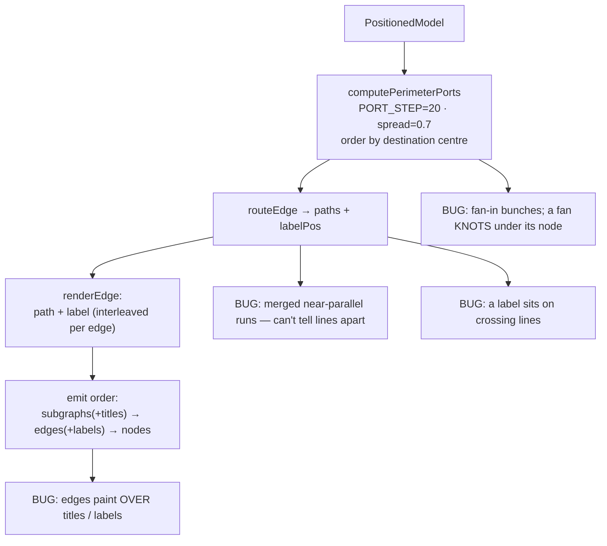
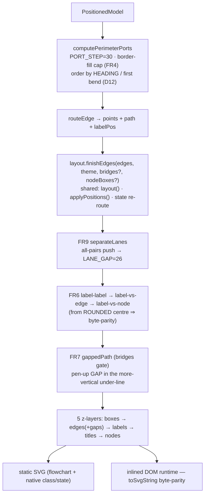

# Report — feature `flowchart-render-legibility`

- **feature:** Legible flowchart rendering — edges/labels/titles stop overlapping text, label de-collision, edge-lane separation, crossing gaps, and a de-knotted node fan
- **status:** awaiting-uat
- **completed:** 2026-07-13
- **branch / commits:** `fix/flowchart-render-legibility` (from `master`; **not yet committed** — gogo defers commits to the user)

**What shipped, in one breath:** the static SVG and the inlined interactive runtime paint in an explicit 5-layer order (nothing legible gets covered), give subgraph titles an opaque plate, tighten the edge-label plate, spread fan-in arrowheads, **de-collide overlapping edge labels** (from each other, from node boxes, and from crossing edges), **separate merged near-parallel edge runs onto their own lanes**, cut a **clean gap into the under-line at each crossing** (so you can tell which line is which), and **order a node's fan ports by where each edge actually heads** (so a fan never knots under its node) — all deterministic and byte-parity-guarded across both renderers.

## Run status / gaps

**All phases completed; no open issues.** plan ① → implement ② (8 rounds) → review ③ (6 rounds) → test ④ (6 rounds) → report ⑤, looping through **two UAT rounds** of user feedback. Every review/test finding is `verified` / `fixed` / dispositioned `wontfix`.

- **TEST-004** (`wontfix`, documented follow-up): the FR9 lane separation can re-merge when a node is **hauled far out** of its layout (an extreme drag). All *user-reported* defects are fixed; the remaining case needs the **comb-stagger for endpoint fans**, which the user declined at D9/D10/D11 and again accepted as a follow-up at **D13** ("accept & ship"). Not resolved — tracked in Follow-ups.

This feature grew in three arcs: the original **FR1–FR5** occlusion/fan fixes (shipped, reviewed, tested green), then at the test gate the user expanded scope (D1=A) into **FR6–FR8** (label de-collision + edge-crossing marks), then two UAT rounds added **FR9** (lane separation) and pivoted the crossing glyph from **arcs to gaps**, plus the **D12** API-fan de-knot.

## Summary

Six reported legibility problems were fixed in shared geometry + its byte-parity runtime twin: **(1)** edges painting over titles/labels → an explicit **5-layer draw order** + opaque title plate (FR1–FR2); **(2)** bunched fan-in arrowheads → **wider perimeter spread** with a border-filling cap (FR4); **(3)** two unrelated edge labels overlapping → **reserved-space de-collision** (FR6, fixed TEST-001); **(4)** merged near-parallel edge runs you couldn't tell apart → **lane separation** onto distinct channels (FR9); **(5)** crossings and a label sitting on lines → a **pen-up gap in the under-line at each crossing** plus **label-vs-edge / label-vs-node** de-collision (the FR7 arc→gap pivot); **(6)** a node's outgoing fan knotting under the node → **heading-order ports** (D12). Everything is mirrored byte-for-byte in the `.toString()`-serialized DOM runtime (interactive HTML == static SVG) and is deterministic (no clock/RNG), so snapshots stay stable.

## Planned vs shipped

Shipped **as planned** for FR1–FR9, with the user redirecting two details live at the UAT gate:

- **FR7 pivoted arc → gap (D11).** The plan drew a small **overpass arc** at each crossing; on seeing it the user asked instead for **"just a space"** — break the under-line with a gap so the break itself shows which line passes over. `applyEdgeBridges`/`gappedPath` now splice an ~8px pen-up gap (`L … M …`) into the **more-vertical** edge; same `bridges` / `--no-bridges` gate.
- **FR9 added (UAT round 1).** The user boxed three regions of merged parallel runs ("keep those lines separate"). Added `separateLanes` (all-pairs iterative push, `LANE_GAP=26`) into `finishEdges`, plus **label-vs-node** and **label-vs-edge** de-collision so a plate never sits on a box or a foreign line.
- **FR9 endpoint approach reversed (D10).** A first attempt spread edges at the *source* (a dagre `edgesep`-style bus); the user found it visibly worse than the compact `separateLanes` offset and it was reverted — the compact offset is the settled approach.
- **D12 added (UAT round 2).** The API Gateway fan knotted; ports were ordered by destination centre while dagre routes some edges sideways. Shipped **heading-order ports**.
- **REV-002 refinement:** the native class/state static SVG drew the *old looser* plate while FR6 de-collided the *tight* one — unified `native/{class,state}/svg.ts` `edgeLabel` with the shared `labelPlateSize`.
- **Out of scope, as planned / deferred:** the sequence renderer's lines (only ever had text-over-line issues, fixed elsewhere); curved/sketch gaps (clean elbow only); **left/right side edge attachment** (the user's "more space" idea — a follow-up); the **comb-stagger** for endpoint fans / extreme-drag re-merge (TEST-004).

## Implementation

The whole change lives in **shared geometry** (`src/geometry/index.ts`) plus its **byte-parity twin** in the inlined runtime (`src/render/dom/runtime.ts`), routed through one shared post-layout pipeline, so every tier that consumes the geometry benefits at once.

**FR1 layered draw order** — both renderers emit in explicit z-layers: **subgraph boxes → edges → edge-labels → subgraph titles → nodes**. The runtime uses five `<g class="vnm-*-layer">` groups (append order = paint order). No edge can cover a label or title.

**FR2 opaque subgraph title** — the title renders on an opaque `subgraphFill` rounded plate, drawn *after* edges; `SUBGRAPH_TITLE_BAND` 18→22 clears the top member.

**FR3 tightened label plate** — `0.6·chars+6 / lines·lh+2`, kept in lockstep across `labelPlateSize`, the SVG sink, and the runtime twin.

**FR4 wider fan-in spread** — `PORT_STEP` grew to 30 and `PORT_SPREAD_FRAC` was **replaced** by a **border-filling cap** `min(PORT_STEP, (borderLen − 2·PORT_MARGIN)/(k−1))`, so a busy hub's fan-in uses almost the whole node width instead of bunching, while the `anchorBound` corner clamp still protects short sides.

**FR6 label reserved-space de-collision** — a shared `resolveLabelCollisions` runs an all-pairs AABB pass over the final label plates and nudges any overlapping pair apart along the axis of least penetration until they clear by `PORT_LABEL_PAD` (6). Runs via `layout.finishEdges()` (shared by `layout()`, `applyPositions()`, and the native state re-route; class inherits it). It de-collides from the **rounded** plate centre so an un-collided label is byte-unchanged.

**FR9 lane separation** — `separateLanes` collects the interior axis-aligned run of every edge, and in an **all-pairs iterative push** (order-robust, `LANE_PASSES=8`) shoves any two overlapping near-parallel runs (`LANE_MIN_OVERLAP=40`) apart to `LANE_GAP=26`, rebuilding the moved edge's path. Runs **first** in `finishEdges`. This is what pulls the three boxed merged bundles onto their own channels.

**Label-vs-node / label-vs-edge** — after the label-label pass, `resolveLabelNodeCollisions` pushes a plate off any node box, and `resolveLabelEdgeCollisions` slides a label along **its own edge** off any perpendicular foreign crossing line (`LABEL_NODE_PAD=10`). Together they moved "gRPC stream" off the Ingress box and clear of the lines it used to cover (6 crossings → 0).

**FR7 edge-crossing gaps (arc → gap pivot, D11)** — `segmentsCross` finds proper crossings; `applyEdgeBridges`/`gappedPath` splice a small **pen-up gap** (`GAP_RADIUS=4`, ~8px `L x y M x y L`) into the **more-vertical** (under) edge at each crossing while the more-horizontal edge stays continuous — the gap itself shows which line passes over. Corner-guarded and overlap-guarded. Gated by **`bridges`**: default ON for clean elbow, OFF for curved (deferred) and sketch.

**D12 heading-order ports** — `computePerimeterPorts` gained an optional `bends` param; a shared border's ports are ordered by each edge's **actual heading** (its first interior dagre bend at the source end, its last at the target end) instead of the far node's centre, so an edge dagre steered sideways takes the port on that side instead of crossing a straight sibling. Straight edges (no bends) fall back to the centre → any diagram without detours is byte-identical. Wired from `layout()` (both call sites) + `native/state/layout.ts` (pseudo-reroute), mirrored in the runtime twin (`computePorts` reads `e.waypoints`).

**FR8 parity + determinism** — every new geometry function is re-implemented byte-identically inside `vnmRuntime`; the `dom-runtime-parity` guard byte-compares `toSvgString()` to `renderSvgFromModel` (including crossing-gap, de-collision, FR9-lane, and — new this round — a **state re-route** fixture). No `Date.now`/`Math.random`; snapshots + `examples/` regenerated.

### Changes (as-built)

| File | Change | Note |
|---|---|---|
| `src/geometry/index.ts` | modified | FR4 border-fill cap (`PORT_STEP=30`, `PORT_SPREAD_FRAC` removed); **FR6** `resolveLabelCollisions`; label-vs-node/edge (`resolveLabelNodeCollisions`, `resolveLabelEdgeCollisions`, `nearestRunAxis`); **FR7** `segmentsCross` / `applyEdgeBridges` / `gappedPath` (`GAP_RADIUS`); **FR9** `separateLanes` / `moveLane` / `shiftLabelOnSeg`; **D12** `computePerimeterPorts` `bends` param + heading-order `along` |
| `src/layout/index.ts` | modified | tightened `labelPlateSize`; `finishEdges` (lanes → label-label → label-vs-edge → label-vs-node → gaps); pass detour **bends** at both `computePerimeterPorts` call sites |
| `src/render/svg.ts` | modified | 5-layer emit; opaque subgraph-title plate; tightened `edgeLabel`; `bridges` option |
| `src/render/prepare.ts` / `route.ts` | modified | forward `bridges` to `layout()` and async class/state (REV-003) |
| `src/render/dom/runtime.ts` | modified | 5 `<g>` layer groups; **twins** of every geometry fn (separateLanes, gappedPath, label-vs-node/edge, **D12 heading-order** `computePorts`) in `buildSvg`/`renderEdges` |
| `src/render/dom/payload.ts` | modified | carry `bridges` in the payload |
| `src/native/state/layout.ts` | modified | re-apply `finishEdges` after the pseudo-state re-route (D5); **pass bends** (D12) |
| `src/native/class/layout.ts` | modified | thread `bridges` (FR6/7/9 + D12 inherited via `layout()`) |
| `src/native/{class,state}/svg.ts` | modified | **REV-002:** unify `edgeLabel` plate with `labelPlateSize` |
| `src/cli/run.ts` | modified | `--no-bridges` flag (now toggles crossing gaps), threaded to all tiers |
| `test/*`, `e2e/*` | added/modified | FR1–FR9 + D12 unit + parity guards (incl. geometry `bends`-order, layout API-fan no-inversion, **REV-009** state re-route parity); `e2e/bridges-and-labels.spec.ts`; stale-assertion fixes (TEST-002/003/005/006) |
| `test/__snapshots__/*`, `examples/*` | regenerated | final look |

## Decisions & rationale

See [decisions.md](../decisions.md) and [uat.md](../uat.md) for the full log.

| Decision | Choice | Reason |
|---|---|---|
| **D1** — fix label-vs-label (TEST-001) now or defer? | **Fix now, expanded** | Legibility feature; user chose to fix + add crossing marks. |
| **D2/D3** — crossing glyph & which line | initially **arc hop in the more-horizontal edge** | Matched the user's first reference; deterministic. Later pivoted (D11). |
| **D4** — crossing marks default-on vs opt-in | **Per-style toggle** (`bridges`; ON clean-elbow, OFF curved/sketch) | User wanted an on/off per style; simplest that fully works. |
| **D5** — line-work scope | **Flowchart + state + class** (sequence excluded) | "flow + activity" maps to the flowchart family; they share the geometry. |
| **D6–D9** — FR9 lane separation | **`separateLanes` post-pass, all 3 boxed bundles** | User boxed the merged runs; "full fix — all 3 boxes." |
| **D10** — FR9 endpoint approach | **Compact offset**, not source-spread | User saw the source-spread (`edgesep`) and found it worse; reverted. |
| **D11** — FR7 glyph | **Gap, not arc** | "just a space, this will also show which line is which." |
| **D12** — API-fan knot | **Heading-order ports** | Ports ordered by destination centre crossed a detour edge over a straight sibling; order by actual heading. |
| **D13** — after D12 green | **Accept & ship** | User verified the fix; TEST-004 + left/right accepted as follow-ups. |
| **REV-001 / REV-004** (nits) | **Keep / wontfix this pass** | Anticipated ripple / pre-existing, unobserved; folding in would churn every viewBox. |

## Review outcome

Six review rounds ([review/issues.json](../review/issues.json), `review-01…06.md`). R1 (FR1–5): clean (nit REV-001). R2 (FR6–7): **CHANGES** — caught **REV-002 (major)**, a real correctness gap the author's tests had masked (class/state drew the loose plate while FR6 de-collided the tight one), + REV-003/005. R3: APPROVE. R4 (FR9): APPROVE — byte-parity + `separateLanes` safety + border-fill cap verified adversarially. R5 (gap pivot + label-vs-edge): APPROVE. R6 (D12): **APPROVE** — verified the twin's coordinate-space order-preservation, that the reproDsl parity test genuinely reorders 4 source + 2 target ports, and backward-compat by running the whole corpus with/without the change (0 unintended port diffs); one nit **REV-009** (state re-route had only transitive parity coverage) **fixed in-round** with a dedicated bite-verified guard.

## Test outcome

Six test rounds ([test/issues.json](../test/issues.json), `test-01…06.md`). R1 found **TEST-001** (label overlap → D1=A). R2: GREEN (TEST-001 verified by measurement). R3 (FR9): confirmed the mid-channel + hub separation, found **TEST-004** (extreme-drag re-merge). R4: TEST-004 root-caused, reopened. R5 (gap pivot): green. R6 (**D12**): **GREEN** — 388 unit + **79 e2e**, determinism, and hands-on in a real browser: the API fan traces monotonic (no crossings) statically, byte-matches on load, and re-routes cleanly on a live drag. Two stale e2e assertions (TEST-005 old `Q` bridge glyph; TEST-006 crossing count 1→2) were proven **pre-existing** (toggling D12 off → byte-identical) and fixed in-round. **TEST-004** carried forward, then dispositioned `wontfix` (documented follow-up) at the user's **D13** accept.

## Diagrams

As-built set — open [diagrams.html](./diagrams.html) (same folder):

- **flow** (`flow.mmd`) — the shipped pipeline: `finishEdges` running lanes → label-label → label-vs-edge → label-vs-node → gaps, heading-order ports, the 5-layer emit, and both renderers held in byte-parity.
- **sequence** (`sequence.mmd`) — the render interaction: caller → `layout`/`finishEdges` → geometry → static SVG, with the runtime twin re-running the same passes for the interactive export.

## Before / after comparison

A before (as-is) **flow** set exists ([report/before/flow.mmd](./before/flow.mmd)); the after set adds a **sequence** diagram (after only).

**flow — before:**

**flow — after:**

**What changed:** the single-pass, per-edge interleaved emit became a routed pipeline running four deterministic post-layout passes via `finishEdges` (lane separation, three-way label de-collision, crossing gaps) with **heading-order ports**, emitted in five explicit z-layers — mirrored byte-for-byte in the runtime twin.

## Knowledge updates

Updated the gogo-owned knowledge (summaries only; no proxied `Source:` files touched):

- **`code-review-standards.md`** — the byte-parity gotcha (any label/edge geometry added to the static path must be mirrored byte-identically in the runtime twin, drawn with the *same* plate size the layout assumed — REV-002), and the **D12 coordinate-space rule**: port ordering keys (`along`) computed from bends vs box-centres stay order-consistent between the dagre-space geometry and the offset-removed runtime only because both shift by a single constant per axis.
- **`test-strategy.md`** — the label-de-collision, lane-separation, crossing-gap, and **heading-order-port** journeys; assert the *emitted* rect vs `labelPlateSize` (not the formula against itself); a fan-with-a-detour-edge fixture and a **state re-route** parity fixture (REV-009).
- **`project-knowledge.md`** — the `bridges` render option / CLI `--no-bridges` (now crossing gaps), the `finishEdges` pass order, and that flowchart + state + class share the geometry (sequence has its own routing).

## Follow-ups & known limitations

- **Left/right side edge attachment** — the user's own "join from left/right for more space" idea; route some edges out node sides so wide fans breathe. A larger routing change, explicitly deferred (a fresh plan → implement when picked up).
- **Extreme-drag lane re-merge / endpoint-fan comb-stagger (TEST-004)** — dragging a node *far* out of its layout can re-merge the separated lanes; endpoint-attached runs (box 1, the Ingress-out fan) are node-width-bound. Both need the deferred **staggered-depth comb**; declined at D9/D10/D11 and accepted as a follow-up at D13.
- **Curved & sketch crossing gaps** — deferred; only clean elbow edges get gaps in v1 (D4).
- **REV-004 / REV-008** (latent nits) — `contentBounds` doesn't enclose label plates (a far nudge could theoretically clip at the viewBox edge; `BOUNDS_PADDING=20` absorbs it, unobserved); the label-vs-edge slide has no self-run clamp (verified not to materialise across the corpus).

## Summary (TL;DR)

- **What shipped:** legible flowchart/state/class rendering — 5-layer draw order, opaque subgraph-title plate, tightened + **de-collided** edge labels (vs labels, nodes, and crossing edges), wider fan-in spread, **lane-separated** near-parallel runs, **crossing gaps** in the under-line (toggleable via `bridges` / `--no-bridges`), and **heading-order fan ports** so a node's fan never knots — all deterministic and byte-parity-mirrored in the interactive runtime.
- **Review verdict:** APPROVE (round 6) — caught one real correctness gap (REV-002) tests had masked, plus a coverage nit (REV-009) fixed in-round; every new twin byte-parity-verified.
- **Test verdict:** GREEN (round 6) — 388 unit + 79 e2e + hands-on browser/PNG/live-drag; determinism + byte-parity (flowchart *and* state) confirmed; 0 console errors.
- **Follow-ups:** left/right side attachment and the extreme-drag comb-stagger (TEST-004) remain deferred; two latent nits documented. See **Follow-ups** above.
