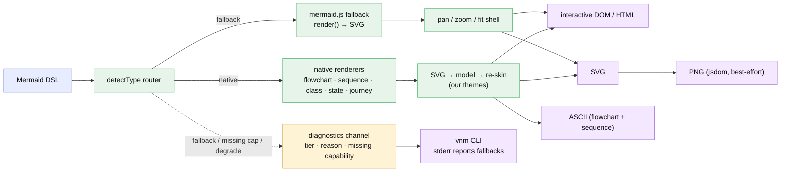

# Plan — hybrid diagram engine: mermaid.js fallback + native re-skinned renderers

Status: **as-built / tested-green** (2026-07-04) — implemented, reviewed (2 rounds), tested (2 rounds + fixes), all green. See `report/report.md`. Native tier shipped = flowchart + sequence + class + state (journey→fallback per D6); mermaid.js fallback for the rest; transparent CLI diagnostics (FR5). Two pre-publish follow-ups: D7 (jsdom→optional) and D9 (optional Chromium CLI path).

**In one breath:** grow `very-nice-mermaid` from "flowcharts only" to "**every**
Mermaid diagram type renders." Route the DSL by type: our **own themed,
interactive renderers** for the graph-like types (flowchart + **sequence, class,
state, user-journey**), and **mermaid.js as the fallback engine** (render → SVG)
for everything else (kanban, gantt, pie, ER, gitgraph, mindmap, timeline, C4, …).
Keep ASCII for flowchart + sequence. And make **every fallback/degradation
loudly diagnosable**, especially from the CLI.

## Goal

Today the library is excellent but narrow: only `flowchart`/`graph` render, and
any other Mermaid input is silently misparsed into garbage (a known bug). The
goal is **full Mermaid breadth without reinventing Mermaid**: lean on mermaid.js
for parsing/rendering the long tail, keep our polished interactive experience for
the diagram types where it matters most, and never leave the user guessing when a
diagram took the fallback path or a capability wasn't available.

## Context — what exists + what we verified

- **Shipped v1** (`feature-mermaid-render-toolkit`, v0.1.0): own parser + dagre
  layout + geometry + themes + SVG/ASCII/DOM/HTML/PNG renderers + `vnm` CLI, all
  for the **flowchart family only**. The interactive DOM renderer (draggable
  cards, live edge re-routing, minimap, persistence) and the theme system are the
  reusable core.
- **Spike (2026-07-04, mermaid 11.16):**
  - `mermaid.detectType(dsl)` classifies any diagram from its text — clean router.
  - `@mermaid-js/parser` (clean ASTs) covers pie/gitgraph/packet/architecture/
    radar/treemap/info — mostly **fallback** types, *not* our native targets.
  - Our native targets (sequence/class/state/journey) sit in mermaid's **internal
    diagram DB**, reachable only via **unstable deep imports** — not a public API.
  - `mermaid.render()` → SVG is the reliable, uniform primitive, **but needs a
    DOM** (free in the browser; `jsdom` in Node — no Chromium).
- **Conclusion:** the robust uniform foundation is *mermaid renders → we read the
  SVG geometry/labels and re-skin it with our renderer* (generalizing the trick
  the gogo viewer already uses for flowcharts), rather than depending on mermaid's
  fragile internal parse DB. Our existing hand-written flowchart parser stays as
  the one no-DOM fast path.

## Functional requirements

- **FR1 — Type router.** `detectType(dsl)` classifies input and dispatches to the
  right renderer tier. Unknown/invalid → a clear diagnostic (fixing the current
  silent-misparse bug), never a garbage flowchart.
- **FR2 — Native tier (our styling + themes + interactivity):** flowchart *(have
  it)*, **sequence, class, state**. Each rendered with our themes; interactivity
  level fits the diagram grammar (see Approach). **Refined post-spike (D6):
  user-journey dropped to the fallback tier** — it's a bespoke timeline that
  doesn't map to our node/edge renderer. **class + state** read structure from
  mermaid's SVG but **re-layout with our own dagre** (mermaid's headless geometry
  is degenerate — spike finding).
- **FR3 — Fallback tier (mermaid.js engine):** every other type — **kanban**,
  gantt, pie, ER, gitgraph, mindmap, timeline, C4, quadrant, etc. — via
  `mermaid.render()` → SVG, wrapped in our pan/zoom/fit shell for the interactive
  surfaces. Output-complete for SVG/HTML (and PNG per D1).
- **FR4 — ASCII stays flowchart + sequence** (the two where box-art reads). Other
  native types render visually only; the CLI reports ASCII-unavailable for them.
- **FR5 — Transparent fallback diagnostics (user-requested).** Whenever a diagram
  takes the **fallback** tier, a native feature is **unavailable**, or an output
  **degrades** (e.g. PNG under jsdom), emit a **structured, visible** diagnostic:
  *which tier was used, why, and what capability was missing.* The CLI prints
  these to **stderr** (`info`/`warn` level, machine-greppable code + message);
  `--strict` escalates degradations to a non-zero exit; a `--quiet` mutes info.
  Never silently fall back.
- **FR6 — Browser-first rendering (D1).** The library + HTML export render every
  tier in the browser (mermaid needs only the DOM). The **CLI** renders native
  tiers with no browser, and fallback tiers via **jsdom** (best-effort; degraded
  cases reported per FR5). No headless Chromium.
- **FR7 — Themes span both tiers where possible.** Our themes fully drive native
  tiers; for the fallback tier we map our tokens onto mermaid's `themeVariables`
  as far as it allows (documented gaps reported, not hidden).
- **FR8 — Packaging.** mermaid.js becomes a dependency; keep the browser-safe-core
  boundary (mermaid + jsdom confined to the render/export path, not the parse/model
  core). Bundle-size impact documented; consider a lazy/optional mermaid import so
  flowchart-only users don't pay for it.

## Approach (recommended) + the forks it resolves

```
DSL ──detectType──▶ router ──┬─ native (flowchart | sequence | class | state | journey)
                             │     └─ our themed renderer (SVG · ASCII* · interactive DOM)
                             └─ fallback (kanban · gantt · pie · ER · … )
                                   └─ mermaid.render() → SVG ─▶ pan/zoom shell / PNG / HTML
      every fallback / missing capability / degraded output ──▶ diagnostics (FR5)
      (*ASCII only for flowchart + sequence)
```

**Native re-skin via SVG (D3):** for the native non-flowchart types, render once
with mermaid, read the SVG into our model (nodes/edges/labels/positions), then
re-render with our cards/edges/themes. This is uniform and robust; the fragile
internal-DB path is avoided.

**Interactivity fits the grammar:** class + state are node-graphs → full
draggable-node + re-routing (like flowchart). Sequence (lifelines/ordered
messages) and journey (sections) get themed rendering + pan/zoom/fit, with
lighter drag. The plan does **not** promise identical interaction for every type.

Forks (full detail in `decisions.md`; accepting the plan resolves them):
- **D1 — Browser-first** (CLI uses jsdom, no Chromium) over CLI-renders-all-via-
  mermaid-cli. Lighter; degraded CLI cases are *reported* (FR5), not hidden.
- **D2 — Kanban is fallback-tier** (user-confirmed), not native.
- **D3 — Native types re-skinned from mermaid's SVG**, not from its internal DB.
- **D4 — mermaid.js as a (possibly lazy) dependency**, not a vendored copy or a
  from-scratch multi-type parser.

## Changes checklist (build order)

1. [ ] **Task-1 spike** — confirm per native type (sequence/class/state/journey)
       that we can read a clean model from mermaid's SVG and re-skin it; record
       which stay native vs drop to fallback. (Kanban is already fallback.)
2. [ ] `src/mermaid/` — mermaid.js integration: lazy loader, `detectType` router,
       `renderToSvg` (browser + jsdom), token→`themeVariables` mapping.
3. [ ] `src/diagnostics/` — the structured degradation/fallback channel (FR5);
       wire it through parse → route → render → CLI stderr.
4. [ ] `src/model/` — generalize the model beyond flowchart (node/edge/label +
       per-type extensions) so native re-skin can target it.
5. [ ] `src/native/` — SVG→model readers + our renderers for sequence, class,
       state, journey (reusing geometry/theme/DOM-runtime where they fit).
6. [ ] `src/render/*` + `src/export/*` — route native vs fallback; pan/zoom shell
       around fallback SVG; PNG/HTML/ASCII wired to the router + diagnostics.
7. [ ] `src/cli/` — fallback/degradation reporting (FR5), `--quiet`, `--strict`
       escalation; fix the silent-misparse bug (unknown type → clear error).
8. [ ] Tests — unit (router, diagnostics, each native reader, theme mapping),
       CLI-integration (every type → some output + correct diagnostics), e2e
       (interactive native types + fallback pan/zoom in a real browser).
9. [ ] Docs — the tier model, the compatibility matrix (native vs fallback vs
       ASCII), theming across tiers, and the diagnostics reference.

## Tests

| Level | Verifies | Tool |
|---|---|---|
| unit | `detectType` routing; diagnostics shape/emission; each SVG→model reader; token→themeVariables | vitest |
| unit | unknown/invalid type → clear error (silent-misparse bug gone) | vitest |
| CLI-integration | every diagram type produces output OR a clear reported fallback; `--strict`/`--quiet`; PNG-degradation reported | vitest (child_process) |
| e2e | native sequence/class/state/journey render + interact; fallback type pans/zooms; no console errors | playwright |

## Out of scope (v2)

- Editing diagram *content* (add/remove nodes) — layout drag only, as today.
- Perfect theme parity on fallback types (mermaid limits what `themeVariables`
  can restyle — gaps are documented + reported, not closed).
- Headless-Chromium CLI rendering (D1 chose jsdom; revisit only if fidelity demands).
- New authoring DSL — we stay Mermaid-compatible (prior strategic decision).

## Diagram — intended design



*(The `charts/before/` baseline captures today's flowchart-only pipeline for the
report's before/after compare.)*
