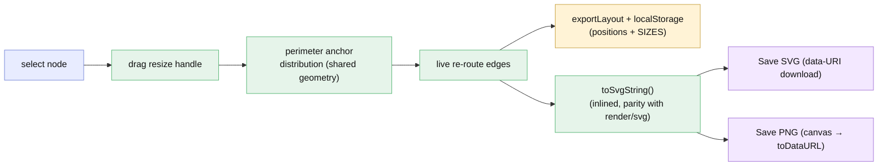

# Plan — interactive diagram editing: resize, distributed connectors, export

Status: as-built (v0.4.0) — original scope (items 1–8) shipped 2026-07-05; UAT round 1 additions (FR6 D6=C, FR7 D7=A) built, reviewed clean (6 rounds total), tested green (4 rounds, 301 unit + 62 e2e); report re-written 2026-07-05 (see `report/report.md`). At the UAT gate again (round 2).

**In one breath:** make the interactive HTML/DOM diagram genuinely *editable* — **resize
shapes** with drag handles, **auto-distribute edge anchors** around a node's perimeter so
hubs with many connections stay readable, and **export the edited state to SVG/PNG** from
the browser — with everything persisted and kept in parity with the static SVG renderer.

## Goal
Today the interactive view lets you drag nodes and the edges re-route (v2). Three gaps
remain, all from the user: (1) shapes are a fixed size; (2) when a node has many
connections they all leave/enter at roughly one point and overlap (v2 spreads edges that
share a border *side*, but a hub still clusters); (3) after arranging/editing a diagram in
the HTML view there's no way to save the result as an image. This feature closes all three.

## Context — what exists
- **Interactive runtime** `src/render/dom/runtime.ts` (the `.toString()`-serialized
  `vnmRuntime`, inlined into HTML exports and used by `mount`): draggable HTML node cards +
  an owned SVG edge layer, pan/zoom/fit/minimap, layout persistence
  (`exportLayout`/`importLayout` + localStorage), and — v2 — **edge port channels**
  (`computePorts`, mirroring `src/geometry.computePortOffsets`) that spread edges sharing a
  `(node, border-side)`.
- **Static SVG** `src/render/svg.ts` + `src/geometry` — must stay in **parity** with the
  runtime (the recurring lesson: a geometry change in one but not the other ships broken).
- **Model** `src/model` — `RoutedEdge.ports` already carries per-edge offsets.
- **Export** — `src/export/{html,png}`; PNG today is Node-only (resvg). The browser has no
  export path yet.

## Functional requirements
- **FR1 — Resize shapes.** A selected node shows resize handles; dragging one resizes the
  node (min-size clamp; live). The node's card + all connected edges update immediately;
  the size **persists** (layout sidecar + localStorage) and the static SVG / re-export
  honor it. Applies to the node-graph renderers (flowchart, class, state); **sequence is
  out of scope** (its lifeline layout is rigid).
- **FR2 — Auto-distributed connectors (D1=A).** An edge attaches to a point on the node's
  **whole perimeter** chosen by the direction to its other endpoint, and multiple edges
  to/from the same node **spread around the border** (not clustered on one side), spaced so
  each is legible. Recomputed live on drag/resize. Implemented once in shared geometry and
  applied in **both** the static SVG and the runtime (parity-guarded).
- **FR3 — Export the edited diagram (browser).** The interactive view gains **Save SVG**
  and **Save PNG** controls that download the **current** (dragged + resized + re-routed)
  diagram. SVG = the live positioned model serialized to our themed SVG string; PNG =
  that SVG rasterized in-browser via a `<canvas>` (no server, no resvg). Filenames sensible.
- **FR4 — Persistence.** Sizes + layout round-trip through the existing
  `exportLayout`/`importLayout` + localStorage, so a reload keeps every edit; the portable
  `layout.json` carries sizes too.
- **FR5 — Parity & determinism.** Static SVG and the inlined runtime produce the **same**
  anchor distribution and honor the same sizes; the `dom-runtime-parity` guard is extended
  to cover resize + perimeter distribution. Deterministic (no `Date.now`/`random`).

## Approach (recommended) + forks
- **D1 — auto-distribute connectors** (chosen; manual per-anchor drag deferred). Solves the
  readability problem with zero user effort and the least code.
- **D2 — resize does not trigger re-layout.** A resize is a manual edit; running dagre again
  would clobber it. A **reset-layout** toolbar control (⟲) discards every manual move + resize
  and returns to the computed layout, clearing the persisted layout so a reload stays reset
  (added in fix-round 2 per D5=A — see checklist item 8; closes TEST-001).
- **D3 — in-browser PNG via `<canvas>`** (serialize SVG → `Image` → canvas → download).
  No server, no headless browser; resvg stays the Node/CLI path. *(As-built: the rasterized
  canvas downloads via `toDataURL` rather than `toBlob` — same PNG, and the plain call stays
  compatible with the export's zero-network guard after REV-002 tightened it.)*
- **D4 — in-browser SVG built from the live model.** The runtime serializes the current
  positioned model (positions/sizes/routed edges) to our themed SVG using the **same
  drawing logic as `src/render/svg.ts`, inlined** into the runtime (keeps the exported
  image identical to `vnm render -f svg` of the edited state; the cost is a bit more code in
  the serialized runtime — parity-guarded).

## Architecture / where it lands
| Area | Change |
|---|---|
| `src/geometry` | perimeter anchor distribution (angle/direction based, spaced) — replaces/extends the per-side `computePortOffsets`; shared by SVG + runtime |
| `src/model` | node **size override** in the layout data + `layout.json` shape |
| `src/render/dom/runtime.ts` | resize handles + live resize; live re-anchor; a `toSvgString()` serializer; **Save SVG / Save PNG** toolbar buttons + canvas rasterizer; persist sizes |
| `src/render/svg.ts` | honor size overrides + the new perimeter distribution (parity) |
| `src/render/dom/payload.ts`, `src/layout` | thread sizes + anchor data through |
| `src/export/html.ts` | ensure the export buttons ship in the standalone file |
| tests + e2e | geometry distribution; resize round-trip; parity; e2e resize→reroute→Save SVG/PNG download a valid file |

## Changes checklist (build order)
1. [x] `src/geometry` — perimeter anchor distribution (pure, tested): given a node + its
       edges' directions, assign spaced border points around the whole perimeter.
       *(`raySide` + `computePerimeterPorts`; per-endpoint `{side,offset}` anchors.)*
2. [x] `src/model` + `src/layout` — node size override; thread it (and anchors) into the
       positioned model + `layout.json`. *(`RoutedEdge.ports` = anchors; `applyPositions`
       takes `sizes`; CLI `--layout` reads `{ positions, sizes }`; state layout recomputes.)*
3. [x] `src/render/svg.ts` — honor sizes + perimeter distribution. *(consumes
       `node.width/height` + baked `edge.path`; honored through the positioned model — no
       renderer change needed; verified by tests.)*
4. [x] `src/render/dom/runtime.ts` — apply the same distribution live; **resize handles**
       (select → drag handle → resize → re-anchor/re-route live) with min clamp; persist
       sizes via `exportLayout`.
5. [x] Runtime `toSvgString()` (inlined SVG serializer, parity with `render/svg.ts`) +
       **Save SVG** (data-URI download) + **Save PNG** (`<canvas>` rasterize) toolbar buttons.
       *(D4 byte-parity guarded; PNG rasterizes via `<canvas>.toDataURL` with explicit
       failure handling. The export's zero-network guard was tightened to flag only a
       real CSS `url(` token, so the plain call needs no obfuscation — REV-002/003.)*
6. [x] Extend `dom-runtime-parity` (hub distribution, resize re-route, size round-trip,
       `toSvgString` byte-parity + XML validity). *(The Playwright e2e — resize→reroute→Save
       SVG/PNG download — is phase ④'s job; the code is left driveable for it.)*
7. [x] README (the new interactions + export) + a bump to **0.3.0**.
8. [x] **Reset-layout control (D5=A, fix-round 2).** A ⟲ toolbar button +
       `RuntimeHandle.resetLayout()` that discards manual drags + resizes, restores every
       node's computed position + size, re-routes all edges (perimeter re-spread), and clears
       the persisted localStorage entry — pan/zoom left untouched (`resetView()` stays
       separate). Ships in the standalone HTML export. Makes D2's mitigation real (closes
       TEST-001). *(README interactive section documents the button.)*

## Tests
| Level | Verifies | Tool |
|---|---|---|
| unit | perimeter distribution (N edges → N spaced border points, deterministic); size override in model + layout.json round-trip | vitest |
| unit | static SVG honors sizes + distribution; parity: runtime == geometry for a hub + a resized node | vitest |
| unit | `toSvgString()` output is valid XML and matches `renderSvg` of the same edited model | vitest |
| unit | `resetLayout()`: drag+resize → restore computed positions/sizes, re-route edges, clear persistence, pan/zoom untouched (D5=A) | vitest |
| e2e | resize a node → card + edges update + stay distributed → reload keeps it; **Save SVG** downloads valid XML; **Save PNG** downloads a real PNG; no console errors | playwright |
| e2e | **Reset layout** button: drag+resize → click ⟲ → computed layout restored → reload stays reset (D5=A) | playwright |

## Out of scope (v0.3.0)
- **Manual per-anchor drag** (D1 deferred) and manual edge waypoint editing. *(UAT round 1 reopens
  this as proposed FR7 — see below, pending re-acceptance / fork D7.)*
- Resizing **sequence** participants (rigid layout) — export still applies to sequence.
- Editing node **content/labels** or adding/removing nodes.
- Any server-side export.
- Subgraph containers were never interactive in v0.3.0 (static dashed background). *(UAT round 1
  reopens this as proposed FR6 — see below, pending re-acceptance / fork D6.)*

## UAT round 1 additions (2026-07-05) — ACCEPTED (D6=C, D7=A) → v0.4.0
Delta from UAT round 1 (full analysis in `uat.md`; forks resolved in `decisions.md` D6/D7 at
re-acceptance, 2026-07-05). `/gogo:go` reruns ②→⑤ on **this same item** as **v0.4.0**.

- **FR6 — subgraph containers: auto-contain AND draggable group (D6=C).** Today a subgraph is an
  inert dashed background drawn once at layout coords; dragging a child out leaves it stranded and
  empty (the screenshot's defect), and the box itself can't be grabbed. FR6 ships both halves:
  - **auto-contain/follow** — on every drag / resize / reset, recompute each subgraph's bbox from
    its children's live positions + sizes (+ padding + title band) and update the rect; the static
    SVG honors the same recompute (parity-guarded).
  - **draggable group** — the container (border/title area) is itself a drag target: dragging it
    moves all member nodes together (edges re-route live); persists like any node move. Child
    membership is static (defined by the DSL) — dragging a child out does NOT un-group it; the box
    re-hugs via auto-contain.
- **FR7 — manual edge placement: per-anchor drag (D7=A).** Today edges are auto-distributed only
  (D1=A) and the edge layer is non-interactive (`pointer-events:none`). FR7 adds endpoint pinning:
  grab an edge endpoint (visible hit-target on select/hover) and drag it along the node border to
  pin a `{side,offset}` override for that end only; unpinned ends keep auto-distribute; overrides
  **persist** in the layout sidecar + localStorage, **reset-layout clears them**, and the static
  SVG honors them (parity-guarded). Waypoint editing stays deferred (D7=B rejected for now).

**Parity & persistence still bind (FR5/FR4).** Any FR6/FR7 geometry must be implemented in shared
form and honored in **both** the static SVG and the inlined runtime, extend the `dom-runtime-parity`
guard, round-trip through `exportLayout`/`importLayout` + `layout.json`, and be reachable by
`resetLayout()`. Deterministic (no `Date.now`/`random`).

**Not in this delta (stays out of scope):** editing node content/labels, add/remove nodes,
server-side export, resizing sequence participants.

### Changes checklist (v0.4.0)
1. [x] `src/geometry` — shared **subgraph auto-contain** (`subgraphBox` + `computeSubgraphBoxes`,
       recursive membership resolution; `SUBGRAPH_PADDING`/`SUBGRAPH_TITLE_BAND`) and a per-anchor
       **override** param on `computePerimeterPorts` (`EdgeAnchorOverride`; a pinned end is used
       verbatim and excluded from the auto-distribute spread). (FR6/FR7)
2. [x] `src/layout` — `layout()` re-hugs every container to its members via `computeSubgraphBoxes`;
       `applyPositions()` re-hugs after a move/resize AND accepts `anchors` (keyed by edge index),
       threading them to `computePerimeterPorts` for static-SVG parity. (FR6/FR7)
3. [x] `src/render/dom/runtime.ts` — **FR6:** live container rects recomputed from members on every
       render (`renderSubgraphs`/`subgraphWorldBox`, shared `sgBoxFrom`); a **group-drag** on the
       border/title band (`subgraphHit`, GRAB=10; open interior stays pannable) moves all members
       together (edges re-route, box follows, persists). **FR7:** endpoint **grab handles**
       (`.vnm-edge-handle`, shown on the selected node's incident edges) drag to pin `{side,offset}`
       (`anchorsOv`, `anchorFromPointer`, clamp); `computePorts()` honors pins; `buildSvg`/`svgSubgraph`
       recompute the container box in abs coords for `toSvgString` byte-parity.
4. [x] Persistence + reset — `LayoutData.anchors`; `exportLayout`/`importLayout` round-trip pins
       (only pinned edges, keyed by index); `resetLayout()` clears every pin (auto-distribute returns);
       group-drag member moves persist through the existing `positions` sidecar. (FR4)
5. [x] `src/cli/run.ts` — `--layout` reads `anchors` and threads them to `applyPositions`; version → 0.4.0.
6. [x] Version bump to **0.4.0** (`package.json`, CLI `VERSION`, `cli.test.ts`), README (subgraph
       interactions + anchor pinning).
7. [x] Tests — subgraph bbox recompute determinism + hug (`interactive-editing.test.ts`); toSvgString
       re-hug parity + anchor-pin round-trip/parity/reset-clears (`dom-runtime-parity.test.ts`);
       pointer-driven group-drag moves members / interior pans (`interactive-subgraph-drag.test.ts`).
       e2e left driveable via stable `.vnm-subgraph` / `.vnm-edge-handle` class names (phase ④).

## Diagram — intended design

