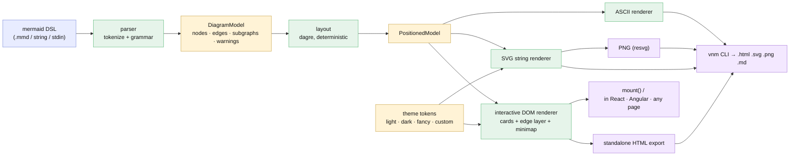

# Plan — very-nice-mermaid: a framework-agnostic Mermaid renderer (lib + CLI)

Status: **accepted** (user, 2026-07-03)

**In one breath:** turn this empty repo into an npm package + CLI that takes
Mermaid **flowchart DSL** in and produces **beautiful, interactive, themeable**
diagrams out — an embeddable framework-agnostic component for the browser, and
`html` / `svg` / `png` / `md (ascii)` files from the command line — with **our own
parser, layout, and renderer** (no mermaid.js at runtime, no headless browser).

## Goal

Mermaid's DSL is great; its default rendering and the existing CLI tools are not.
This project keeps the DSL and replaces everything after it:

- **Library** (`very-nice-mermaid` on npm): parse DSL → mount an **interactive**
  diagram (drag nodes to reorganize, edges re-route live, pan/zoom/fit, minimap,
  layout persistence) in any app — Angular, React, plain HTML — via a vanilla JS
  API and a `<very-nice-mermaid>` web component.
- **CLI** (`vnm`): render a `.mmd` file (or stdin) to a **self-contained
  interactive HTML file**, a static **SVG**, a **PNG**, or **ASCII art** in a
  markdown fence.
- **Themes**: `light` / `dark` / `fancy` built in; users define their own as a
  token set (JSON file for the CLI, object/CSS variables for the lib).

## Context — what we learned before designing

The repo is **empty** (greenfield). Two prior arts were analysed:

- **xplan** (`~/repos/xplan`) — the "very nice output" reference. Key finding:
  **xplan never parses mermaid**. It renders a structured JSON model (nodes with
  `x/y/w`) using ~5 hand-written React components: HTML **node cards** + an SVG
  edge layer with **orthogonal elbow routing anchored to measured card borders**
  (`web/src/components/diagramGeometry.ts`), one shared viewport hook
  (pan/zoom/drag/fit/persist, `useCanvasViewport.ts`), a scaled **minimap**, and a
  disciplined **design-token** system (muted base, few saturated accents, mono
  typography — `web/src/styles/tokens.ts`). No diagram library in its whole tree.
  What it *lacks* vs our goal: a DSL parser, an auto-layout pass, a standalone
  HTML export, multiple themes, and framework-agnostic packaging.
- **gogo's viewer** (this plugin's `assets/viewer/`) — proves the same rendering
  style works dependency-free in a single offline page, and shows the hybrid
  trap: it needs the 3 MB mermaid.js runtime just for parse+layout, and only in
  a browser — a dead end for a Node CLI that must emit SVG/PNG.

**Conclusion that shapes the whole design:** the beautiful output is a *renderer
over a positioned model*. Mermaid DSL is just an ingestion format. So we build:
`parser → model → layout → renderers`, and every output format is a renderer
over the same positioned model.

## Functional requirements

- **FR1 — Parse Mermaid flowchart DSL** (`flowchart`/`graph`, all five
  directions). v1 surface: node shapes (rect `[]`, rounded `()`, stadium `([])`,
  subroutine `[[]]`, circle `(())`, diamond `{}`, hexagon `{{}}`,
  parallelograms `[/ /]` `[\ \]`, cylinder `[( )]`); edge kinds (solid `-->`,
  open `---`, dotted `-.->`, thick `==>`), edge labels (`|txt|` and
  `-- txt -->`); `&` fan-in/out chaining; `subgraph … end` (incl. nested);
  `classDef` / `class` / `:::`; `style` (fill/stroke/color subset); `%%`
  comments; quoted labels + `<br/>` line breaks. **Lenient by default**: unknown
  constructs degrade gracefully with a structured warning (line/col); `--strict`
  turns warnings into errors. Parse errors always carry line/col.
- **FR2 — Auto-layout**: deterministic layered layout via **@dagrejs/dagre**
  (pure JS, runs in Node and browser), honoring direction and subgraph clusters.
  Same input → same positions, always.
- **FR3 — Interactive renderer** (browser): draggable node cards, **edges
  re-route live** while dragging (elbow routing off measured card borders),
  background pan, wheel zoom at cursor, fit-to-view, **minimap** (drawn to
  scale, click/drag to recenter), node selection. Layout persists to
  localStorage automatically and exports/imports as a portable
  `layout.json` sidecar.
- **FR4 — Framework-agnostic embedding**: a vanilla `mount(el, dsl, opts)` API
  **and** a self-registering `<very-nice-mermaid>` custom element (attributes:
  `theme`, `src`/inline DSL). Works in React/Angular/Vue/plain pages with zero
  wrapper code.
- **FR5 — Static SVG output**: a pure `renderSvg(dsl, {theme}) → string`
  function — no DOM required, so it powers the CLI in Node. Same visual
  language as the interactive renderer (shared geometry + tokens).
- **FR6 — PNG output**: rasterize the SVG via **@resvg/resvg-js** (native, no
  headless browser), `--scale` for HiDPI. Lazy-loaded optional dependency with a
  clear "install to enable png" error when absent.
- **FR7 — ASCII/markdown output**: unicode box-drawing rendering of the
  positioned model, emitted inside a fenced code block.
- **FR8 — Standalone HTML export**: one self-contained file (inlined CSS + JS +
  model, **zero network requests**) containing the full interactive renderer.
- **FR9 — Theming**: a theme is a **token set** (colors, radii, font stacks,
  edge style, spacing). Built-ins `light`, `dark`, `fancy` (curved edges,
  gradients/shadows). `defineTheme(partial)` merges over a base; the CLI takes
  `--theme dark` or `--theme ./my-theme.json`; the DOM renderer also respects
  CSS-variable overrides.
- **FR10 — CLI**: `vnm render <file|-> [-o out] [-f html|svg|png|md] [--theme …]
  [--strict] [--layout layout.json] [--scale N]` — format inferred from the
  output extension; stdin/stdout friendly; helpful diagnostics; exit codes.
- **FR11 — npm packaging**: ESM-first with an `exports` map (`.`, `./element`),
  TypeScript types, `bin` entries (`vnm`, `very-nice-mermaid`), Node ≥ 20,
  browser-safe core (no Node built-ins outside `cli/` + `export/png`).

## Approach (recommended) — and the forks it resolves

**Own parser + dagre layout + own renderers, one positioned model, one package.**

```
mermaid DSL ──parse──▶ DiagramModel ──dagre──▶ PositionedModel ──┬─▶ interactive DOM (lib / web component / HTML export)
             (FR1)                    (FR2)                      ├─▶ SVG string (FR5) ──resvg──▶ PNG (FR6)
                                                                 └─▶ ASCII (FR7)
```

The forks (full options + trade-offs in `decisions.md`; **accepting this plan
resolves them per these recommendations**):

- **D1 — parsing strategy: write our own parser** rather than embedding
  mermaid.js. Embedding gives full DSL coverage but drags a ~3 MB runtime into
  every consumer, *requires a browser* (so the CLI would need headless Chromium —
  exactly the heavyweight ugliness we're replacing), and still leaves us scraping
  SVG for a model. Own parser = small, runs everywhere, full aesthetic control;
  cost = we cover a (large) subset and grow it. A fixtures corpus of real-world
  mermaid files keeps us honest.
- **D2 — v1 scope: flowchart family only** (`flowchart`/`graph` — by far the
  most-used kind and everything the interactivity story needs). The
  model/renderer split is designed so sequence/state/class land later as new
  parser+renderer pairs without touching the core.
- **D3 — PNG via resvg**, not puppeteer: native SVG rasterizer, no browser
  download, works in CI.
- **D4 — one npm package** with subpath exports + `bin`, not a monorepo. Split
  into `@vnm/*` packages only if/when framework wrappers actually appear.

**Aesthetics we lift from xplan** (the reason its output looks good): orthogonal
elbow edges that leave/enter card borders perpendicularly; edge labels with a
background plate that punches through the line; mono typography for node text;
a restrained palette where only accents are saturated; hover micro-lift;
dashed/ghost styling available to themes; 60px fit padding; masonry-tight
spacing defaults.

## Architecture / module map

| Module | Responsibility | Runs in |
|---|---|---|
| `src/model/` | `DiagramModel`, `PositionedModel`, node/edge/subgraph/shape types, warnings | everywhere |
| `src/parser/` | tokenizer + flowchart parser → `DiagramModel` + diagnostics | everywhere |
| `src/layout/` | dagre adapter, cluster handling, determinism | everywhere |
| `src/theme/` | token model, `light`/`dark`/`fancy`, `defineTheme`, CSS-var emission | everywhere |
| `src/geometry/` | border anchoring, elbow + curved edge routing, content bounds | everywhere |
| `src/render/svg.ts` | positioned model + theme → SVG string | everywhere |
| `src/render/ascii.ts` | positioned model → unicode box text | everywhere |
| `src/render/dom/` | interactive renderer: cards, edge layer, viewport, minimap, persistence | browser |
| `src/element.ts` | `<very-nice-mermaid>` custom element | browser |
| `src/export/html.ts` | self-contained interactive HTML document | node + browser |
| `src/export/png.ts` | SVG → PNG via resvg (lazy import) | node |
| `src/cli/` | commander program `vnm render` | node |
| `src/index.ts` | public API: `parse`, `layout`, `renderSvg`, `renderAscii`, `renderHtml`, `mount`, `themes`, `defineTheme` | — |

## Changes checklist (build order)

1. [ ] **Scaffold**: `git init`; `package.json` (name `very-nice-mermaid`, ESM,
       `exports`, `bin`, Node ≥ 20), `tsconfig.json`, **tsup** build, **vitest**,
       **playwright** config, `fixtures/` with a real-world `.mmd` corpus, README stub.
2. [ ] `src/model/` — core types + warning/diagnostic shapes (unit-tested).
3. [ ] `src/parser/` — tokenizer, flowchart grammar, lenient/strict modes,
       diagnostics with line/col (largest test surface; corpus-driven).
4. [ ] `src/layout/` — dagre adapter + determinism + subgraph clusters.
5. [ ] `src/geometry/` — border anchor, elbow + bezier routing, bounds (pure, tested).
6. [ ] `src/theme/` — tokens, built-in themes, merge/validation, CSS vars.
7. [ ] `src/render/svg.ts` — static SVG (theme snapshots).
8. [ ] `src/render/ascii.ts` — box-drawing renderer (snapshots).
9. [ ] `src/render/dom/` + `src/element.ts` — interactive renderer + custom element.
10. [ ] `src/export/html.ts` — standalone page (asserted: zero external refs).
11. [ ] `src/export/png.ts` — resvg rasterization (optional dep, lazy).
12. [ ] `src/cli/` — `vnm render`, format inference, stdin/stdout, `--layout` sidecar.
13. [ ] **e2e** — playwright drives the exported HTML + the mounted component.
14. [ ] README (usage: lib, web component, CLI, theming guide) + packaging checks.

## Tests

| Level | What is verified | Tool |
|---|---|---|
| unit | parser: every shape/edge/label/subgraph/classDef; error+warning cases; **corpus fixtures parse** | vitest |
| unit | layout determinism; direction respected; no overlapping nodes | vitest |
| unit | SVG/ASCII snapshot per theme; SVG is valid XML; theme merge rules | vitest |
| unit | HTML export has zero external URLs; embedded model round-trips | vitest |
| e2e | drag node → edges re-route + persists across reload; pan/zoom/fit; minimap recenter; theme switch; custom element mounts in a bare page | playwright |
| CLI | all 4 formats produced from file + stdin; format inference; bad DSL → line/col error + non-zero exit | vitest (child_process) |

## Out of scope (v1)

- Non-flowchart diagram kinds (sequence/state/class/ER/gantt…) — architecture
  leaves the seam, D2.
- Manual edge waypoint editing and node label editing (drag-reorganize with
  auto re-routing **is** in scope; hand-bending individual lines is v2).
- React/Angular wrapper packages (the web component already embeds cleanly).
- Server / watch / live-reload mode.
- Full `%%{init}%%` directive surface (parsed, ignored with a warning).

## Diagram — intended design



*(No `charts/before/` baseline set: the repo is empty — a brand-new area has no
existing flow to draw.)*
