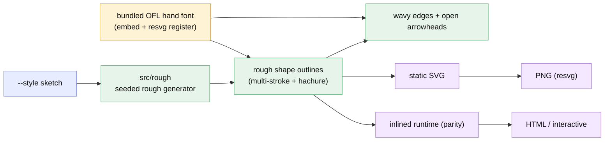

# Plan - sketch style: a hand-drawn (Excalidraw-like) rendering mode

Status: **as-built (v0.5.0)** - shipped flowchart + all native tiers (D6=B); awaiting UAT.
The definitive as-built account is [report/report.md](report/report.md).

**In one breath:** add an **Excalidraw-style hand-drawn look** - wobbly multi-stroke
shape outlines, sketchy open arrowheads, hachure-ish fills, and a handwriting font -
as a **new style axis** (`--style sketch`) that composes with the existing color
themes, is fully **deterministic**, and works across every output (SVG / PNG / HTML /
interactive), in parity between the static renderer and the inlined runtime.

## Goal
Themes today only change colors/tokens. The user wants a genuinely different *look* -
hand-drawn shapes and arrows, not just a palette. This adds a **drawing mode** on top
of themes: pick `sketch` and every shape gets a rough, hand-sketched outline, edges
become wavy with open sketchy arrowheads, and text uses a handwriting font - the
Excalidraw feel - while `light`/`dark`/`fancy` still control the colors.

## Context - what exists
- **Static SVG** `src/render/svg.ts` (`nodeShape` draws each shape as a clean
  `<rect>`/`<ellipse>`/`<polygon>`; edges use `toPath` + a filled-triangle `<marker>`).
- **Interactive runtime** `src/render/dom/runtime.ts` (the `.toString()`-serialized
  twin - MUST stay in parity; the recurring drift trap).
- **Geometry** `src/geometry` produces edge routes as point lists / path `d`.
- **Theme** `src/theme` = token sets (colors, radii, fonts, `edge.style` elbow|curved).
- **PNG** via `@resvg/resvg-js` (Node) - resvg needs any custom font **registered/embedded**.
- Renders must be **deterministic** (no `Date.now`/`Math.random` anywhere - snapshots + parity depend on it).

## Functional requirements
- **FR1 - `--style` axis (D1).** A new orthogonal option `style: "clean" | "sketch"`
  (CLI `--style`, library `renderX({ style })`, element `style` attr) - default
  `clean` (today's look). `sketch` composes with any `--theme` (colours) + `edge.style`.
- **FR2 - Rough shape outlines (D2=A).** In sketch mode every node shape (rect,
  rounded, stadium, subroutine, circle, diamond, hexagon, cylinder, parallelogram/-alt)
  renders as a **hand-drawn rough outline** - a slightly wavy path, drawn as **2 overlaid
  strokes** with small per-vertex jitter, plus an optional light **hachure** (or soft
  solid) fill. A deterministic "rough path" generator produces the geometry.
- **FR3 - Sketchy arrows.** Edges in sketch mode render as a **wavy stroke** and an
  **open, hand-drawn arrowhead** (two short strokes forming a `V`, slightly uneven) -
  not the clean filled triangle. Bolder/more visible than the clean arrowhead.
- **FR4 - Handwriting font (D3).** Bundle one **OFL/open-licensed** handwriting font;
  register it with resvg for PNG and **embed it (base64 `@font-face`)** in the
  self-contained SVG/HTML so the look is portable with no network. Sketch mode uses it;
  clean mode is unchanged. (Fallback to a system casual font if embedding is disabled.)
- **FR5 - Deterministic (D4).** All jitter/roughness is seeded from a stable key
  (node/edge id + vertex index) - same input → byte-identical output. No RNG.
- **FR6 - Everywhere + parity.** Sketch mode works for the static SVG, the PNG, the
  standalone HTML, and the **interactive** `mount()`/element (drag still re-routes, now
  with sketchy edges). The rough generator + font are shared/mirrored between
  `src/render/svg.ts` and the inlined runtime; the `dom-runtime-parity` guard covers it.
  Applies to the native tiers (flowchart/sequence/class/state); fallback (mermaid) types
  keep mermaid's own look (note it).

## Approach (recommended) + forks
- **D1 - style is a separate axis from theme** (not a new theme): `sketch` × `{light,
  dark,fancy}` = every combination, and it stays orthogonal to `edge.style`.
- **D2 - full rough.js-style sketch** (multi-stroke wobble), the authentic look the user
  showed - *not* the lighter single-imperfect-stroke option.
- **D3 - bundle + embed an OFL handwriting font** for portability (PNG via resvg + a
  self-contained SVG/HTML), over relying on a system font that may be absent.
- **D4 - deterministic seeded roughness** (mandatory; snapshots/parity require it).
- **D5 - our own tiny rough-path generator**, not the `rough.js` dependency: keeps the
  browser-safe-core bundle small, avoids a new runtime dep, and lets us inline it into
  the serialized runtime (parity). A few hundred lines; deterministic by construction.

## Architecture / where it lands
| Area | Change |
|---|---|
| `src/rough/` (new) | deterministic rough-path generator: `roughPolygon`, `roughEllipse`, `roughPath`, hachure fill, seeded jitter |
| `src/theme` | add the `style`/sketch knobs (roughness amount, stroke doubling, font family) to the token/options model |
| `src/render/svg.ts` | when `style==='sketch'`: draw shapes via `src/rough`, edges as rough paths + open arrowhead, use the hand font (embedded `@font-face`) |
| `src/render/dom/runtime.ts` | inline the rough generator + open-arrowhead + font so the interactive/HTML view matches (parity) |
| `src/export/{html,png}.ts` | embed the font (base64) in HTML; register it with resvg for PNG |
| `assets/fonts/` (new) | the bundled OFL handwriting font (+ its license) |
| `src/cli/run.ts`, `src/index.ts`, `src/element.ts` | thread `--style` / `{ style }` / attr |
| tests + e2e | rough determinism (byte-identical), parity (runtime==static for a sketch shape/edge), snapshots per style, e2e sketch renders + drags |

## Changes checklist (build order)
1. [ ] `src/rough/` - the deterministic rough generator (pure, heavily tested).
2. [ ] `src/theme` - the `style` axis + sketch knobs; thread `style` through render options.
3. [ ] `assets/fonts/` - pick + add an OFL hand font; font-embed helper (base64 `@font-face`) + resvg registration.
4. [ ] `src/render/svg.ts` - sketch shapes + rough edges + open arrowhead + hand font.
5. [ ] `src/render/dom/runtime.ts` - inline the same; parity guard extended.
6. [ ] `src/export/{html,png}` - embed/register the font; CLI/API/element `--style`.
7. [ ] Tests + e2e; README (the new `--style sketch`, a gallery shot); bump **0.5.0**.

## Tests
| Level | Verifies | Tool |
|---|---|---|
| unit | rough generator deterministic (same seed → identical path); hachure bounds; open-arrowhead geometry | vitest |
| unit | sketch SVG per shape is valid XML; font embedded (no network); clean mode byte-identical to today | vitest |
| unit | parity: runtime rough path == static rough path for a sketch shape + edge | vitest |
| e2e | `--style sketch` HTML renders wavy shapes/arrows, drags + re-routes, hand font applied, no console errors | playwright |

## As-built deviations (implement ②, 2026-07-09)
- **Style is threaded as a render *option*, not a theme token.** The plan said add
  sketch knobs "to the token/options model"; shipped as an orthogonal `style`
  option (SvgRenderOptions / HtmlExportOptions / InteractiveOptions / RuntimeOptions
  + `payload.sketch`), leaving the theme token sets (and their snapshots) untouched.
  Cleaner and keeps `defineTheme`/theme snapshots stable. Composes with any theme.
- **Fill = soft rough fill, not hachure lines.** FR2 explicitly allowed "(or soft
  solid)"; shipped a single rough closed fill path under the double outline. Hachure
  deferred (parity + scope). Reads as authentic hand-drawn.
- **Font family name is the real "Kalam"** (not an alias) - required so resvg (PNG)
  resolves the registered woff2 buffer by its internal family name. Bundled
  `Kalam-Regular.woff2` (OFL 1.1, `assets/fonts/OFL.txt`), base64-embedded.
- **Tier scope: ALL native tiers (D6=B, user 2026-07-09).** Sketch covers flowchart +
  sequence + class + state - SVG / PNG / HTML / interactive. The native static SVGs
  (`renderSequenceSvg`/`renderClassSvg`/`renderStateSvg`) draw via a shared
  `src/render/sketch-svg.ts` helper (rough rect/ellipse/line/open-arrow, seeded);
  class relations keep their UML head markers (semantic) on a hand-drawn line; state
  start/end pseudo-state dots stay clean (tiny semantic markers). Class/state
  interactive+HTML reuse the flowchart runtime (sketch for free via the payload);
  sequence interactive embeds the sketch SVG in the pan/zoom shell. **Only the
  mermaid.js fallback tier** keeps its own look - surfaced, not silently skipped:
  the CLI prints a note and the library async renderers + the element `console.warn`
  (REV-003).

## Out of scope (v0.5.0)
- Per-shape roughness controls / user-tunable wobble (one good default).
- Sketch for the **fallback** (mermaid) diagram types - they keep mermaid's look (noted).
- Multiple hand fonts / font picker (one bundled font).
- Hachure fill styling beyond one tasteful default.

## Diagram - intended design

