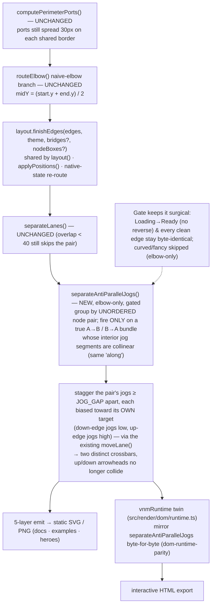

# Plan — state anti-parallel jog de-cramp (v0.6.2)

**In one line:** the two edges of an **anti-parallel pair** between vertically-stacked
nodes (state diagram `Loading --> Error : fail` / `Error --> Loading : retry`) both make
their horizontal jog at the **identical mid-y**, so they collapse into one merged crossbar
with the up/down arrowheads crammed 3px apart — the fix is a **single small, tightly-gated
post-pass** in the shared geometry (mirrored in the runtime twin) that staggers only a
genuine collinear anti-parallel bundle onto two lanes, leaving every other edge
byte-identical.

## Goal

Fix the anti-parallel edge tangle that the v0.6.1 light-contrast fix made visually
obvious - deferred there as **decision D1 option B** ("geometry de-cramp") and now
confirmed to survive - **with zero regression** to any diagram that already routes
cleanly. Ships as **v0.6.2**.

**Acceptance signal:** re-rendering `examples/src/state.mmd` at **clean/sketch x
light/dark** shows the `fail`/`retry` region as **two clearly separated edges** - no merged
crossbar, the up-arrow (retry into Loading) and down-arrow (fail into Error) visibly
distinct - while a full gallery + hero regression sweep shows **only the state diagram
changed** (flowchart, class, sequence, and all four README heroes byte-identical), the
`dom-runtime-parity` byte guard and all 397 unit tests stay green (snapshots update **only**
for the intended state-geometry change, each reviewed), and renders stay deterministic.

## Context — the tangle, verified in the code and the shipped asset

**Code is the source of truth. Diagnosis confirmed byte-for-byte against
`examples/svg/state-clean-light.svg`:**

| Edge | Path in the committed SVG | Horizontal jog |
|---|---|---|
| `fail`  (Loading→Error, down) | `M 114 276 L 114 306 L 147 306 L 147 336` | y=306, x[114,147] |
| `retry` (Error→Loading, up)   | `M 177 336 L 177 306 L 144 306 L 144 276` | y=306, x[144,177] |

Both jog at **the same y=306**. Their horizontal segments are **collinear and contiguous**
(fail covers x[114,147], retry covers x[144,177] - together one unbroken bar x[114,177]),
and the two final approach lanes (fail-into-Error at x=147, retry-into-Loading at x=144)
sit only **3px apart**. Ports on each node are fine (30px apart). The tangle is purely the
**overlapping collinear middle jogs**.

**Why both land at y=306 (root cause, `src/geometry/index.ts`):** these are adjacent-rank
edges with no dagre waypoints, so `routeElbow` (line 1098) takes its **naive-elbow branch**
(line 1122): `const midY = (start.y + end.y) / 2`. Both edges span the *same two borders*
(Loading bottom y=276, Error top y=336), so both compute `midY = 306`. The jog level is
chosen per-edge in isolation, with no awareness of the anti-parallel sibling → identical y →
collinear.

**Why the existing lane-separator doesn't rescue them (`separateLanes`, line 833):** it *is*
built to de-merge near-parallel runs, and it *does* see both horizontal jogs. But its
overlap gate rejects them: `LANE_MIN_OVERLAP = 40`, and the pair's parallel-axis overlap is
only **3px** (x[144,147]). Below the gate → left untouched. Lowering that global gate is not
an option (see Approach) - it would perturb other diagrams' barely-overlapping runs.

**Why the gate must be anti-parallel-specific (a third edge proves it):** the same SVG shows
`Loading→Ready` also jogging at y=306 (`M 84 276 L 84 306 L 46 306 L 46 336`), but it routes
**left** (x[46,84]) - well clear, no reverse edge, perfectly fine. Any fix that keys on
"collinear jog at the same y" alone would wrongly move it. The correct trigger is the
**unordered node pair having both directions** (A→B *and* B→A) - which `Loading→Ready` does
not.

**The shared-geometry contract this change lives inside:**
- All tiers route through **one** module, `src/geometry/index.ts`, via
  `layout.finishEdges()` (`src/layout/index.ts:62`), which runs `separateLanes` → label
  de-collision → bridges. Native state re-applies `finishEdges` after its pseudo-state
  re-route (`src/native/state/layout.ts:118`).
- Every geometry pass is **mirrored byte-for-byte** in the inlined interactive runtime
  `src/render/dom/runtime.ts` (its own `separateLanes` at line 1310, run at two sites:
  live `renderEdges` line 1726 and export `buildSvg` line 2588). The `dom-runtime-parity`
  test byte-compares the two.
- **Theme edge styles matter here:** `light` and `dark` use `edge.style: "elbow"`; **`fancy`
  uses `"curved"`** (`src/theme/index.ts:193`). `separateLanes` and this new pass are
  **elbow-only**, so **fancy state geometry is unaffected** (see D1) - a correction to the
  task's premise, which expected fancy to change.

## Functional requirements

- **FR1 — De-cramp a collinear anti-parallel elbow pair.** When two edges form an
  anti-parallel pair (`A→B` and `B→A` between the same node pair) whose interior jog
  segments are **collinear** (same perpendicular coordinate, so they merge into one bar),
  stagger the two jogs onto **distinct lanes ≥ a chosen gap apart** so they are no longer
  collinear/overlapping and each arrowhead reads distinctly. Flowchart family (flowchart +
  native state/class that share the geometry); **elbow only**.
- **FR2 — Direction-correct stagger.** Each edge's jog moves **toward its own target** (the
  down-going edge jogs lower, the up-going edge jogs higher / for an LR pair, toward its
  target x), so the two close *approach* lanes end on opposite sides and never form a new
  near-collinear pair. The elbow stays orthogonal and both border anchors stay put.
- **FR3 — Surgical gate (no regression).** The pass fires **only** on a genuine collinear
  anti-parallel bundle. Any edge that already routes cleanly - a non-reversed pair
  (`Loading→Ready`), a pair whose jogs already differ, a fan, a single edge, or any curved
  edge - stays **byte-identical**. Different node pairs never interact.
- **FR4 — Runtime-twin parity.** The pass is re-implemented byte-identically in
  `src/render/dom/runtime.ts` at both call sites, and `dom-runtime-parity` is extended to
  drive an anti-parallel fixture so the interactive HTML export == the static SVG.
- **FR5 — Deterministic re-render + version bump.** All 397 unit tests + snapshots + the
  parity guard stay green (snapshots update **only** for the intended state change); renders
  are byte-identical on a second run; the committed gallery (`docs/`, `examples/`) + README
  heroes are regenerated and **only** the state diagram's elbow variants change; ship as
  **v0.6.2** (package.json + `src/cli/run.ts` VERSION + the `test/cli.test.ts` assertion).

## Approach (recommended) + alternatives

**Recommended: a new gated post-pass `separateAntiParallelJogs` inside `finishEdges`,
reusing the existing `moveLane` mechanics, mirrored in the runtime twin.**

The pass is the natural sibling of `separateLanes` - same "de-merge collinear runs" job, but
scoped to the one case the overlap gate deliberately misses. It runs on the fully-routed
edge set (so it reads real geometry) and:

1. **Group by unordered node pair.** Reuse the exact idiom already in `computeLabelShifts`
   (`e.from < e.to ? from+"|"+to : to+"|"+from`). A group with ≥2 edges is an anti-parallel
   or duplicate bundle. `finishEdges` already receives `RoutedEdge[]`, which carries
   `from`/`to`, so no new plumbing is needed at the call site.
2. **Find each edge's interior jog segment** (the middle axis-aligned run - index `i=1` in a
   4-point naive elbow; identical detection to `separateLanes`, `i>=1 && i+2<len`). Consider
   only bundles whose jog segments are **collinear** (`|Δalong| <` a small tolerance). If
   they already differ, skip → byte-identical.
3. **Order by target, assign lanes.** Sort the collinear segs by each edge's **target-port
   perpendicular coordinate** ascending, then place them on evenly-spaced lanes `JOG_GAP`
   apart centred on the bundle's mean, in that order - so each jog moves toward its own
   target (FR2). Apply via the existing **`moveLane`** helper (moves both seg endpoints
   together, carries the label, keeps the elbow orthogonal + anchored) and rebuild `path`.
4. **Elbow-only + gated** exactly like `separateLanes` (`if (style !== "elbow") return`).

*Worked example (state `Loading↔Error`, `JOG_GAP=26`, mean y=306):* `retry` (target Loading,
y=276, smaller) → lane y=293; `fail` (target Error, y=336, larger) → lane y=319. Crossbars
now 26px apart (not collinear); the close verticals become retry x=144 y[276,293] and fail
x=147 y[319,336] - **no y-overlap**, cleanly separated.

**Why not the simpler options:**
- **Alt A — lower/loosen `separateLanes`' `LANE_MIN_OVERLAP` (or add a "collinear+contiguous"
  branch there).** *Rejected:* that gate is **global** to every elbow edge; loosening it can
  move other diagrams' barely-overlapping runs → regression, breaking the "clean edges
  byte-identical" contract. The anti-parallel gate can't.
- **Alt B — precompute a per-edge `jogOffset` in `computePerimeterPorts` (like `labelShift`)
  and apply it in `routeElbow`'s naive branch.** Elegant reuse of the pair-grouping and fully
  deterministic, but it spreads the change across four sites (`computePerimeterPorts`,
  `routeElbow`, and both twin equivalents), and `computePerimeterPorts` can't tell a
  naive-elbow edge from a waypoint-routed one. A single post-pass is more contained and reads
  real geometry. *Kept as the fallback if the post-pass proves awkward.*
- **Alt C — widen `PORT_STEP` for anti-parallel pairs.** *Rejected:* wider ports don't fix
  collinearity (still same y, just a longer merged bar) and would change port spread on every
  shared border.

## Changes checklist (build order)

1. **FR1-FR3 · `src/geometry/index.ts`** - add `separateAntiParallelJogs(edges, style)`
   (new `JOG_GAP` const, reusing `moveLane`/`LaneSeg`/`toPath`); the `edges` param type gains
   `from`/`to`. Gate: elbow-only, anti-parallel pair, collinear jogs.
2. **FR1 · `src/layout/index.ts`** - call it inside `finishEdges` adjacent to
   `separateLanes` (recommended: right after, so lane logic settles first). `RoutedEdge`
   already has `from`/`to`.
3. **FR4 · `src/render/dom/runtime.ts`** - mirror `separateAntiParallelJogs` byte-for-byte;
   invoke it beside the existing `separateLanes(routed)` (line 1726) and
   `separateLanes(routesB)` (line 2588). The twin's routed objects index-align with
   `edgeEls[i]` for `from`/`to`.
4. **FR4/FR5 · tests** - `test/geometry.test.ts`: unit assertion that an anti-parallel pair's
   two jogs end **≥ JOG_GAP apart** on the perpendicular axis and are no longer collinear,
   plus no-op cases (non-reversed pair, already-apart pair, single edge, curved). Extend
   `test/dom-runtime-parity.test.ts` to drive an anti-parallel fixture through the twin and
   byte-compare. Re-verify/refresh `test/interactive-ports.test.ts` and `test/route.test.ts`
   (both use anti-parallel state models) and update **only** the intended snapshots.
5. **FR5 · version bump** - `package.json` (`0.6.1`→`0.6.2`), `src/cli/run.ts:37` VERSION,
   `test/cli.test.ts:217` assertion.
6. **FR5 · regenerate assets** - `npm run build` → `npm run docs` → `npm run examples` →
   `npm run heroes`. `git diff` the assets; confirm **only** the state diagram's elbow
   variants changed and everything else is byte-identical; visually verify each.

## Tests

Because the product's output **is** rendered images, verification is both automated and
**visual**.

**Unit (`test/`):**
- **Geometry (new):** build an anti-parallel pair whose naive elbows are collinear; assert
  after `separateAntiParallelJogs` the two interior jog segments are **≥ JOG_GAP apart** on
  the perpendicular axis, no longer collinear, paths still orthogonal, both border anchors
  unmoved; and the direction rule (each jog toward its target). No-op guards: a non-reversed
  pair (`A→B`, `A→C`) unchanged; an already-separated pair unchanged; a single edge unchanged;
  curved unchanged; determinism/idempotence (second run byte-identical).
- **Parity:** `dom-runtime-parity` drives an anti-parallel state fixture and byte-compares
  `toSvgString()` to `renderSvg` (twin mirrors the new pass).
- **Snapshots update ONLY for the intended change:** expected to refresh -
  `test/__snapshots__/state-svg.test.ts.snap` (its inline MODEL has an `Idle↔Running`
  anti-parallel pair) for **light + dark** (fancy is curved → unchanged). Any other
  anti-parallel state fixture (`fixtures/order-state.mmd`, used by parity/route/interactive
  tests) is the **same intended fix**, not a regression - review each diff. No flowchart /
  class / sequence snapshot should move.

**Visual / e2e (the real spec):**
- **The fix:** re-render `examples/src/state.mmd` at **clean·light, clean·dark, sketch·light,
  sketch·dark** and eyeball the `fail`/`retry` region - **two separated edges, no merged
  crossbar, up/down arrowheads distinct.**
- **Regression sweep:** re-render the **whole** gallery (`npm run docs`, `npm run examples`)
  + all heroes (`npm run heroes`); `git diff` the assets and confirm **only** the state
  diagram's elbow variants (`state-clean-light/dark`, `state-sketch-light/dark`) changed -
  **`state-*-fancy` byte-identical (curved), flowchart/class/sequence byte-identical, all
  four README heroes (`state-machine` dark, `ci-pipeline` light, `microservices` fancy,
  `cache-lookup` sketch) byte-identical** (none contains an anti-parallel pair). Re-render
  twice → byte-identical (determinism).

## Out of scope

- **Curved / fancy** anti-parallel de-tangle - the elbow-only pass leaves fancy
  byte-identical (see **D1**); a bezier spread would be a separate, larger change.
- The **sequence** tier (own routing, excluded from the line work).
- Any change to `separateLanes`' global gate, to `computePerimeterPorts`/`routeElbow`, or to
  edges that already route cleanly.
- The v0.6.1 light-contrast token, and the prior legibility follow-ups (left/right side
  attachment, extreme-drag comb-stagger TEST-004, own-run-clamp REV-003) - untouched.

## Intended design (how the fix sits in the routing pipeline)

The subject is the **product's edge-routing pipeline** - where the collinear jog arises and
where the new pass de-cramps it - not the task list. `charts/flow.mmd` (intended) and
`charts/before/flow.mmd` (the as-is tangle at its real code sites) render in
`charts/diagrams.html`.

## Decisions needing your call

See `decisions.md`. In short: **D1** - the tangle exists in *all* themes, but `fancy` uses
**curved** edges, so an elbow-only fix (matching all prior FR9 lane work) leaves fancy
byte-identical while fixing clean·light/dark and sketch·light/dark. Recommended: **ship
elbow-only** (fancy's beziers already bow apart, so the tangle is milder there; de-tangling
curved pairs is a separate, larger change). Confirm, or ask to include curved.

## Summary (TL;DR)

- **What:** de-cramp the state diagram's anti-parallel edge pair (`Loading↔Error`) whose two
  elbows both jog at the identical mid-y (verified: both at y=306 in
  `state-clean-light.svg`), merging into one crossbar with arrowheads 3px apart - the v0.6.1
  D1-option-B deferral, now confirmed. Ships as **v0.6.2**.
- **Root cause:** `routeElbow`'s naive branch picks `midY=(start.y+end.y)/2` per edge in
  isolation → both anti-parallel edges get the same y; `separateLanes` skips them because
  their overlap (3px) is under its `LANE_MIN_OVERLAP=40` gate.
- **Approach (chosen):** one new **tightly-gated post-pass** `separateAntiParallelJogs` in
  `finishEdges` (reusing `moveLane`), firing **only** on a genuine collinear A→B/B→A elbow
  bundle and staggering it toward each edge's target - mirrored byte-for-byte in the runtime
  twin. Every clean edge (incl. `Loading→Ready`) and all curved/fancy stay byte-identical.
- **Blast radius:** **only the state diagram's elbow variants** change (clean·light/dark,
  sketch·light/dark); `state-*-fancy`, flowchart, class, sequence, and all four README heroes
  stay byte-identical; snapshots refresh only for `state-svg` (light+dark) and the parity
  fixture. 397 unit + parity guard stay green.
- **Next:** you accept (resolving **D1** - elbow-only vs also curved), then `/gogo:go` runs
  implement → review → test → report. **No code is written until you accept.**

## As-built notes (reconciled after ② → ④)

Shipped **exactly as planned** (FR1–FR5, elbow-only per D1→A). Three details emerged worth recording:

1. **The `state-svg.test.ts` snapshot did NOT change** (the plan predicted it would). That test's inline
   MODEL (`Idle↔Running`) routes as **straight 2-point verticals** on 30px-offset ports — there is no
   interior jog, so `separateAntiParallelJogs` correctly **no-ops** there. The pass genuinely fires on the
   real `examples/src/state.mmd` (`Loading↔Error`, verified 306→293/319) and on `fixtures/order-state.mmd`
   (`Paused↔Running`, verified staggered) — both have a multi-edge port spread that forces the collinear
   jog. Net: the change is *even more* surgical than predicted; zero stored snapshots moved.
2. **`test/dom-runtime-parity.test.ts` `expectedPaths` was made faithful** — it now routes through the real
   `finishEdges` (was a partial re-route that only matched because `separateLanes`/bridges happened to be
   no-ops on its fixtures). This turns the twin-drift guard into a true mirror of the shared pipeline and
   is what proves the runtime `separateAntiParallelJogs` is byte-identical to the geometry one.
3. **A bite-verified e2e guard was added** (`e2e/state.spec.ts`, `order-state` `pause`/`resume`): stashing
   the fix reproduces the collinear bug (diff=0), restoring it passes.

**Visual bar (the hard, user-set acceptance):** MET on all four elbow variants (`clean·light`, `clean·dark`,
`sketch·light`, `sketch·dark`) — `fail`/`retry` render as two clearly-separated staircases, no merge/cross,
comparably clean to `clean·fancy`. **No escalation to curving the pair was needed.**

Status: **accepted** (user, 2026-07-14) — D1 → A (elbow-only de-cramp; make the elbow lines not cross, fancy is the visual reference; escalate to curving the pair only if elbow-stagger doesn't read as clean as fancy)
Result: **as-built, awaiting UAT** (2026-07-14) — shipped elbow-only exactly as planned; visual bar met without the curve fallback; only the 4 state elbow variants changed; 401 unit + 85 e2e green; deterministic.
