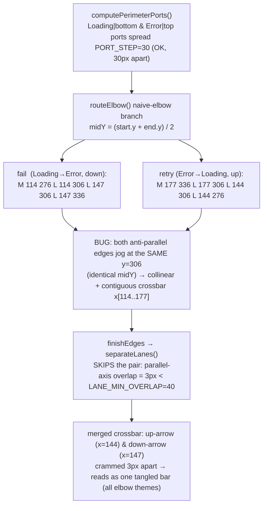
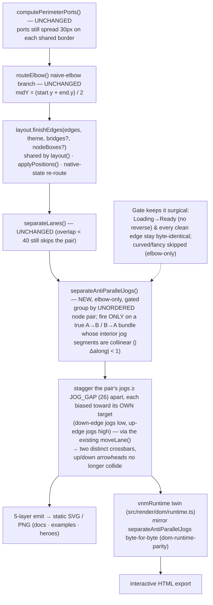

# Report — feature `state-antiparallel-decramp`

- **feature:** State anti-parallel jog de-cramp (v0.6.2) — stagger a collinear `A→B`/`B→A` elbow pair's jogs onto distinct lanes
- **status:** awaiting-uat
- **completed:** 2026-07-14
- **branch / commits:** `release/v0.6.2` (working tree, uncommitted — human orchestrator handles git/ship)

**What shipped, in one line:** a single tightly-gated post-pass, `separateAntiParallelJogs`, now runs inside `finishEdges` and staggers the two jogs of a genuine collinear anti-parallel elbow pair (the state diagram's `fail`/`retry`) ≥ 26px apart — turning one merged crossbar into two cleanly-separated arrows — with **zero regression** to any diagram that already routes cleanly, mirrored byte-for-byte in the interactive runtime twin.

## Run status / gaps

All phases completed on a clean green run — **no open issues**. Plan ① accepted (D1→A), implement ② in-context, review ③ APPROVE (one non-blocking nit, verified not observed), test ④ PASS with the hard visual bar met. One review nit (REV-001) remains logged as a documented latent invariant, empirically confirmed not to occur (see Review / Follow-ups). Two incidental, pre-existing, out-of-scope observations were noted by the tester (see Follow-ups) — neither is caused by or blocks this feature.

## Summary

The v0.6.1 light-contrast fix made an old routing tangle visible: on the state diagram, `fail` (Loading→Error) and `retry` (Error→Loading) both made their horizontal jog at the **identical mid-y**, collapsing into one merged crossbar with the up/down arrowheads crammed ~3px apart. This feature adds one small, surgical geometry pass that detects exactly that case — a genuine anti-parallel `A→B`/`B→A` elbow bundle whose interior jogs are collinear — and staggers the two jogs onto distinct lanes, each biased toward its own target. Every other edge stays byte-identical. Ships as **v0.6.2**.

## Planned vs shipped

**Shipped exactly as planned** (FR1–FR5, elbow-only per decision D1→A). No functional deviation. Three as-built details worth recording:

- **The `state-svg.test.ts` snapshot did not change** (the plan predicted a light+dark refresh). Its inline `Idle↔Running` model routes as **straight 2-point verticals** on 30px-offset ports — no interior jog — so the pass correctly **no-ops** there. The pass genuinely fires on the real `examples/src/state.mmd` (`Loading↔Error`) and on `fixtures/order-state.mmd` (`Paused↔Running`), both of which have a multi-edge port spread that forces the collinear jog. Net effect: the change is *even more* surgical than predicted — **zero stored snapshots moved**.
- **`dom-runtime-parity`'s `expectedPaths` helper was made faithful** — it now routes through the real `finishEdges` instead of a partial re-route (which only matched historically because `separateLanes`/bridges were no-ops on its fixtures). This upgrades the twin-drift guard into a true mirror of the shared pipeline and is what actually proves the runtime `separateAntiParallelJogs` is byte-identical to the geometry one.
- **A new bite-verified e2e guard was added** (`e2e/state.spec.ts`) for the `order-state` `pause`/`resume` pair.

## Implementation

The pass is the natural sibling of the existing `separateLanes` — same "de-merge collinear runs" job — but scoped to the one case `separateLanes`' overlap gate deliberately misses (an anti-parallel pair's parallel-axis overlap is only ~3px, below `LANE_MIN_OVERLAP=40`). It runs on the fully-routed edge set inside `finishEdges`, right after `separateLanes`, so it reads real geometry.

**Algorithm (as-built):**
1. **Group by unordered node pair** (`from < to ? from+"|"+to : to+"|"+from`, the same idiom as `computeLabelShifts`; `"|"` can't occur in a node id, so distinct pairs never collide). Only a group with ≥2 edges can be anti-parallel.
2. **Find each edge's interior jog** — the middle axis-aligned run (`i>=1 && i+2<len`, so both endpoints are bends and no border anchor detaches; `i=1` in a 4-point naive elbow). Require a uniform jog orientation across the bundle.
3. **Gate on collinearity** — every jog must share the same perpendicular `along` (`|Δalong| < 1`), i.e. they merge into one bar. If any already differ, the bundle reads fine → skip → byte-identical.
4. **Order by target, assign lanes** — sort by each edge's **target-side perpendicular coordinate** (the endpoint's coordinate on the lane axis), then place the jogs on evenly-spaced lanes `JOG_GAP=26` apart centred on the bundle mean, in that order. This makes each jog move toward its own target (FR2): the down-going `fail` jogs lower, the up-going `retry` jogs higher. Applied via the existing **`moveLane`** (moves both jog endpoints together, carries the label, keeps the elbow orthogonal + anchored); paths are rebuilt with `toPath`.
5. **Elbow-only + gated** (`if (style !== "elbow") return`), deterministic (fixed sort, no clock/RNG), and **idempotent** (a spread pair is 26px apart → no longer collinear → never re-fires).

**Worked example (state `Loading↔Error`, verified against `state-clean-light.svg`):** both jog at `midY=306`. `retry` (target Loading, y=276, smaller) → lane **y=293**; `fail` (target Error, y=336, larger) → lane **y=319**. Crossbars now 26px apart; the close approach verticals no longer overlap in y.

The pass is **mirrored byte-for-byte in the runtime twin** (`src/render/dom/runtime.ts`) and invoked at both call sites (`renderEdges` live view and `buildSvg` Save-SVG export). The twin threads `from`/`to` via the index-aligned `edgeEls` array (`routed`/`routesB` are both `edgeEls.map(...)`), uses `nAt`≡`n` and `pathPoly`≡`toPath elbow`, and produces byte-identical output — enforced by the `dom-runtime-parity` guard.

### Changes (as-built)

| File | Change | Note |
|---|---|---|
| `src/geometry/index.ts` | added | `separateAntiParallelJogs(edges, style)` + `JOG_GAP=26`; reuses `moveLane`/`LaneSeg`/`toPath`/`n`; placed after `shiftLabelOnSeg`. |
| `src/layout/index.ts` | modified | import it and call it inside `finishEdges` immediately after `separateLanes` (so lane logic settles first). Covers flowchart + native state/class via the shared pass. |
| `src/render/dom/runtime.ts` | modified | byte-for-byte twin of the pass; invoked beside `separateLanes` at both call sites (`renderEdges` ~1728, `buildSvg` ~2590). |
| `src/cli/run.ts`, `package.json` | modified | version `0.6.1` → `0.6.2`. |
| `test/geometry.test.ts` | added | unit block: stagger ≥ JOG_GAP, direction-correct, anchors unmoved, orthogonal, idempotent; no-op guards (non-reversed fan, already-apart pair, single edge, curved). |
| `test/dom-runtime-parity.test.ts` | modified | `expectedPaths` now routes through the real `finishEdges` (faithful twin mirror); new state `Loading↔Error` de-cramp + twin-parity test. |
| `test/cli.test.ts` | modified | `--version` assertion `0.6.1` → `0.6.2`. |
| `e2e/state.spec.ts` | added | real-browser regression guard for `order-state` `pause`/`resume` (bite-verified). |
| `docs/`, `examples/` | regenerated | only the 4 state elbow variants' geometry changed (see Before/after + Test outcome). |

## Decisions & rationale

See [decisions.md](../decisions.md).

| Decision | Choice | Reason |
|---|---|---|
| **D1** — elbow-only fix, or also de-tangle curved (fancy)? | **A — elbow-only**, with a stated fallback to curve *only* the anti-parallel pair if the elbow-stagger didn't read as clean as fancy | `light`/`dark`/sketch use `edge.style: "elbow"`; `fancy` uses `"curved"`. Curving clean/sketch would erase the elbow-vs-curved distinction that *defines* those styles. The elbow-stagger met the visual bar on all four variants, so **the fallback was not needed**; `state-*-fancy` stays byte-identical (already correct). |
| Placement of the pass | inside `finishEdges`, **after** `separateLanes` | Reads fully-routed geometry; lane logic settles first; one call site covers flowchart + native state/class. |
| Collinearity tolerance | `|Δalong| < 1` | Tight enough that only a genuinely merged bar qualifies; a spread pair (26 apart) never re-fires (idempotent). |
| Making `expectedPaths` faithful (implement-round call) | route it through the real `finishEdges` | Non-material test-only correctness improvement — the old partial re-route couldn't predict a firing pass; the faithful version turns the guard into a true mirror. Safe: no-op on every other fixture, so only the anti-parallel case changed. |

## Review outcome

**One round → APPROVE**, no blockers or majors. The fresh-eyes reviewer independently verified twin parity (constants, thresholds, sort/tie-break, rounding, path rebuild, group-iteration equivalence, `from`/`to` threading), gate surgicality (single edge / non-reversed fan / already-apart / curved all no-op; `Loading→Ready` byte-identical), determinism/idempotence, direction-correctness, and anchor invariance — and re-ran typecheck + 401/401 tests. **One nit (REV-001, non-blocking, verified not observed):** because the pass runs after `separateLanes` with no re-run, a staggered jog could *in principle* form a new near-collinear overlap with an unrelated third edge; the corpus is clean (`Loading→Ready` is far in x from the moved jogs). See [review/issues.json](../review/issues.json) / [review-01.md](../review-01.md).

## Test outcome

**One round → PASS.** Levels exercised:

- **Visual (the primary spec, inspected on real rendered PNGs):** before = the reported merged crossbar; after = `clean·light`, `clean·dark`, `sketch·light`, `sketch·dark` all render `fail`/`retry` as **two clearly-separated staircases** (down-arrow into Error, up-arrow into Loading, two crossbars at different heights, no merge/cross) — comparably clean to the `clean·fancy` reference. **The curved-pair fallback was not needed.**
- **CLI + API (unit):** `npm run typecheck` clean (reports `0.6.2`); `npm test` **401/401 green**; `npm run test:e2e` **85/85 green** (a new bite-verified guard added).
- **Regression sweep (verified at byte level):** only the 4 state-elbow SVG/PNG assets changed (`state-clean-light.svg`'s diff is exactly the two `fail`/`retry` paths; every anchor + other edge byte-identical). Flowchart/class/sequence + `state-*-fancy` byte-identical; README heroes byte-identical. Of 18 changed interactive HTMLs, exactly the 4 state-elbow ones have a changed baked `__vnm_payload`; the other 14 are pure additions of the shared runtime blob (0 payload deletions).
- **Determinism:** two independent full regenerations produced the identical changed-file set and byte-identical files (sha256 match on all 30 assets).
- **Interactive twin (FR4), hands-on:** the live `docs/interactive/state-clean-light.html` reproduces the identical stagger, zero console errors (driven via the project's Playwright/Chromium after a session-local MCP CDP hiccup — the check was **not** skipped).
- **REV-001 empirical check:** not observed on the full regenerated corpus.

See [test/issues.json](../test/issues.json) / [test-01.md](../test-01.md).

## Diagrams

The change is a routing-pipeline edit, so the as-built set is a single **flow** diagram — where the collinear jog arises and where the new pass de-cramps it. Open [diagrams.html](./diagrams.html) (same folder); source in [flow.mmd](./flow.mmd).

## Before / after comparison

A **flow** kind is present in both the before and after sets. What changed: the before diagram traces the two anti-parallel edges landing at the same `y=306` and `separateLanes` skipping them (3px < 40) → one merged crossbar. The after diagram adds the new `separateAntiParallelJogs` node between `separateLanes` and emit — the pair's jogs are staggered ≥ `JOG_GAP` apart, each biased toward its own target, and the twin mirrors it. `computePerimeterPorts` and `routeElbow` are unchanged in both.

**Before (as-is):**

**After (as-built):**

## Knowledge updates

- **`.gogo/knowledge/code-review-standards.md`** (owned) — added a verified gotcha for this feature: the anti-parallel de-cramp pass + its runtime twin, and the "make the parity helper a faithful `finishEdges` mirror" lesson (a partial re-route masks twin drift in `separateLanes`/bridges).
- **`.gogo/knowledge/tech-stack.md`** (proxy) — bumped the version note to v0.6.2 in the `## gogo overrides` section only.

No upstream (`CLAUDE.md` / `README`) suggestions.

## Follow-ups & known limitations

- **REV-001 (latent invariant, not observed):** the pass doesn't re-run `separateLanes` after staggering, so a spread jog could in principle create a new near-collinear overlap with an unrelated third edge. Not observed anywhere in the corpus. If a future diagram ever exhibits it, the fix is to run one more `separateLanes` pass (or re-check) after the de-cramp.
- **Curved/fancy anti-parallel de-tangle** — out of scope by D1→A; fancy already separates cleanly. A bezier spread would be a separate, larger change (D1 option B) if ever wanted.
- **Incidental, pre-existing, out of scope (tester-noted, not caused by this feature):** (1) `--style sketch` PNG export ignores `--scale` (resvg-js drops `fitTo.zoom` when `font` options are also passed) in `src/export/png.ts`; (2) a session-local Playwright-MCP CDP connectivity hiccup (worked around, not a product defect). Both are logged in [test-01.md](../test-01.md).

## Summary (TL;DR)

- **What shipped:** a single gated post-pass `separateAntiParallelJogs` in `finishEdges` (+ byte-for-byte runtime twin) that staggers a genuine collinear anti-parallel elbow pair's jogs ≥ 26px apart, each biased toward its target — the state diagram's `fail`/`retry` now read as two clearly-separated arrows. Version `0.6.1` → `0.6.2`.
- **Review verdict:** APPROVE — no blockers/majors; one non-blocking latent-invariant nit, verified not observed.
- **Test verdict:** PASS — hard visual bar met on all four elbow variants (no curve fallback), 401 unit + 85 e2e green, byte-level regression sweep clean (only the 4 state elbow variants changed), deterministic, live twin confirmed.
- **Follow-ups:** see above — REV-001 (latent, not observed) and two pre-existing out-of-scope tester notes.
