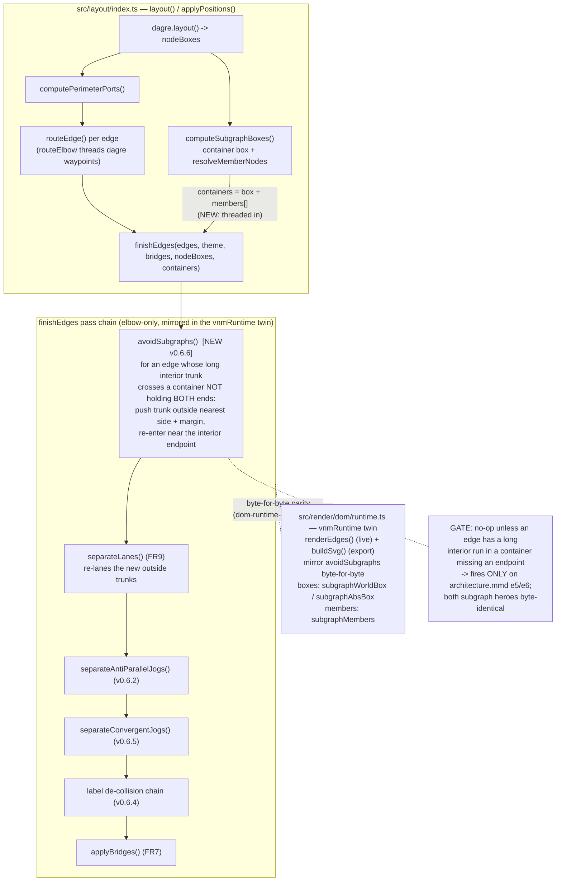
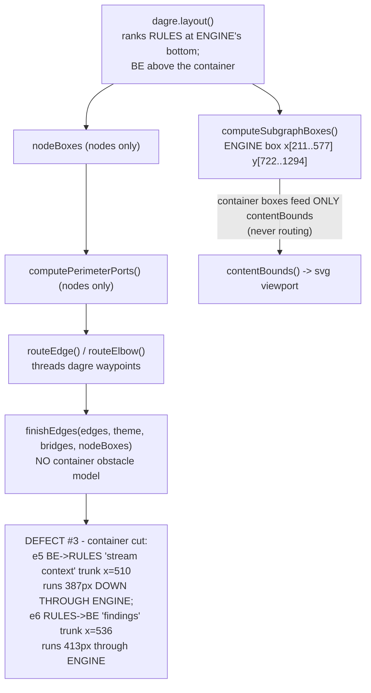

Status: **accepted** (user, 2026-07-15) — D1 → A (scoped avoidSubgraphs re-route), D2 → A (low re-entry connector)
As built: **shipped v0.6.6, 2026-07-15** — implemented as planned (D1=A/D2=A). Refinements vs the plan text: constants `SUBGRAPH_AVOID_MARGIN=28` / `SUBGRAPH_AVOID_MIN_CROSS=120` / `SUBGRAPH_AVOID_APPROACH=30`; an added idempotency guard (skip an approach-into-a-member run: `i==1 & from∈c`, or `i==len-3 & to∈c`); containers built by a new exported `computeAvoidContainers` and threaded via a new optional 5th `finishEdges` param. Gate verified by corpus scan to fire ONLY on `architecture.mmd`'s `BE↔RULES` (2 edges); both subgraph heroes + all snapshots byte-identical. See `report/report.md`.

# Plan — feature `subgraph-aware-routing` (v0.6.6)

Long edges route **straight down through a `subgraph` container box** instead of
around it. This ships **v0.6.6**: a single, tightly-gated post-route pass that pulls
an offending edge's long interior run **outside** the container it doesn't belong to,
and re-enters near its real endpoint — **provably no-op on the whole fixture corpus
(both subgraph heroes stay byte-identical)**, so it fixes the reported diagram without
touching any other render. This was **defect #3**, deferred from v0.6.5
(`dense-edge-routing`).

## Goal

On a dense `flowchart TB`, an edge from a node **outside** a container to a node
**inside** it (or an edge that merely passes over an unrelated container) currently
routes as a long vertical **through the container's interior**, crossing its border
and reading as an edge **impaling the box**. Route such an edge **around** the
container instead, so it only cuts in near its actual endpoint.

**Acceptance signal.** On `scratchpad/architecture.mmd`, the two `BE↔RULES` edges
(`stream context`, `findings`) no longer run the full height of the
`Validation Engine (Veris)` container; they route down the outside and enter `RULES`
(at the container's bottom) near the bottom. Every other diagram — especially the
subgraph heroes `microservices` and `nested-subgraphs` — renders **byte-identically**
to v0.6.5 (verified by snapshots + `dom-runtime-parity`).

## Context — what exists (verified against the v0.6.5 code)

The pipeline is `parse → layout(dagre) → PositionedModel → renderers`, with a
`vnmRuntime` **twin** (`src/render/dom/runtime.ts`) that re-implements the geometry
byte-for-byte so interactive/HTML exports match the static SVG (the `dom-runtime-parity`
guard). Routing lives in shared geometry (`src/geometry/index.ts`) and a post-route
pass chain (`finishEdges`, `src/layout/index.ts`).

**Verified root cause — the router has no obstacle model for containers.** I traced the
full flow and confirmed the prior finding against the code:

- **Container boxes are computed *after* layout and never reach routing.** `layout()`
  calls `computeSubgraphBoxes` (`src/geometry/index.ts:1670`) to hug each container to
  its members (`src/layout/index.ts:281`), but the result feeds **only `contentBounds`**
  (`src/layout/index.ts:337`) — never `computePerimeterPorts`, `routeEdge`, or
  `finishEdges`. `finishEdges(edges, theme, bridges, nodeBoxes)` takes **node** boxes
  only (`src/layout/index.ts:65`).
- **So the elbow router routes on nodes alone.** dagre ranks `RULES` (a deep sink) at
  the *bottom* of the tall `ENGINE` cluster, with `MCP`/`CONSOLE` above it. dagre steers
  the `BE→RULES` edge as a near-straight multi-rank vertical; `routeElbow`/`elbowThrough`
  (`src/geometry/index.ts:1319/1407`) thread it through dagre's waypoints with no notion
  that the vertical crosses `ENGINE`'s border and interior.

I confirmed this on the **real routed geometry** of `architecture.mmd` (built at
v0.6.5):

| Container `ENGINE` | box `x:[211..577] y:[722..1294]`; members `RULES, MCP, CONSOLE` |
|---|---|
| `e5 BE→RULES` "stream context" | trunk `x=510`, `y:394→1112` — **387 px inside ENGINE**; `BE` outside, `RULES` inside |
| `e6 RULES→BE` "findings" | trunk `x=536`, `y:1138→722`(+) — **413 px inside ENGINE**; `RULES` inside, `BE` outside |

`RULES` sits at the container **bottom** (`y:[1220..1280]`, box bottom `1294`), directly
under `BE`. So the trunk is *aligned* with `RULES` — the defect is not horizontal
misalignment, it is that the edge **enters the container at the top and traverses its
whole height** to reach an endpoint at the bottom. I rendered it (light + dark) to
confirm the visual: two verticals pierce the top border and run down the container's
empty right interior past `MCP` and `CONSOLE`.

**Key nuance (drives the design).** `RULES` is a *legitimate member* of `ENGINE`, so this
is **not** simply "an edge through an unrelated box." It is a **mixed-membership**
crossing: exactly **one** endpoint is inside. Both cases matter (one-in / one-out, and
the classic neither-in) and both share one gate: *fire unless **both** endpoints are
inside the crossed container.*

**The pass chain the fix must compose with** (`finishEdges`, mirrored in the twin's
`renderEdges` ~L1963 and `buildSvg` ~L2825):
`offsetLabelsOffLine (v0.6.4) → separateLanes (FR9) → separateAntiParallelJogs (v0.6.2)
→ separateConvergentJogs (v0.6.5) → label de-collision chain → applyBridges (FR7)`.
All are elbow-only, gated, deterministic, and lane-based (`moveLane`/`LaneSeg`/`toPath`).

## Functional requirements

- **FR1 — Container-avoid re-route.** A new post-route pass reshapes an edge whose long
  axis-aligned **interior trunk** runs through a container box that does **not contain
  both** of its endpoints: pull the trunk to just **outside** the nearest container side
  (+ a margin), and — when one endpoint is inside — drop the interior **re-entry corner
  down near that endpoint**, so the residual interior crossing is a short approach at the
  endpoint rather than a full-height pierce.
- **FR2 — Precise gate → zero corpus churn.** The pass **no-ops** unless it finds such a
  crossing. Verified against the code: on the entire fixture corpus (incl. both subgraph
  heroes) the **only** firing is `architecture.mmd`'s `e5`/`e6`; every other interior run
  has **both** endpoints inside its container. Non-container-crossing edges stay
  **byte-identical**.
- **FR3 — Byte-for-byte twin parity.** The pass is mirrored in both `vnmRuntime` routing
  paths; the container boxes it reads are the same in geometry and twin (`computeSubgraphBoxes`
  ≡ `subgraphWorldBox`/`subgraphAbsBox`), and membership is the same
  (`resolveMemberNodes` ≡ `subgraphMembers`).
- **FR4 — Elbow-only, deterministic, idempotent.** Curved (fancy) and sketch are
  untouched; re-running the pass on its own output is a no-op (the trunk is already
  outside).
- **FR5 — Composes with drag/resize + state.** `applyPositions` (live re-route) threads
  container boxes too; the `native/state` re-route passes an empty container set (state
  has no subgraphs → no-op).
- **FR6 — Version bump** 0.6.5 → 0.6.6 across the four sites.

## Approach — the option analysis (this is the crux)

Obstacle-aware orthogonal routing is genuinely hard, and this touches the core routing
that four shipped passes (v0.6.2/6.4/6.5 + FR7) and the byte-for-byte twin all depend on.
I evaluated four options honestly.

### (a) Post-route container-avoidance re-route — **RECOMMENDED (scoped)**

A new gated pass in `finishEdges`, in the exact idiom of `separateConvergentJogs`.
**Detect** each edge's longest axis-aligned interior run that lies inside a container box
whose membership does **not** include both endpoints; **push** that trunk just outside the
nearest container side + margin; for a one-endpoint-inside edge, **lower the re-entry
corner** to near the interior endpoint.

- **Correctness:** Fixes the reported case cleanly and covers the whole "at least one
  endpoint outside a crossed container" family (both one-in-one-out and the classic
  neither-in "unrelated box"). I **prototyped** it on `architecture.mmd` and rendered the
  result: the two verticals now route down the outside of `ENGINE` and cut into `RULES`
  near the bottom — the interior is clean. It does **not** attempt diagonal crossings,
  multi-obstacle detours, or nested mixed-membership (documented limitations).
- **Scope:** Small and additive — one new geometry function + one param on `finishEdges`,
  mirrored in two twin paths. Same shape as the v0.6.5 change.
- **Regression risk:** **Low, and measured.** The gate is proven to fire **only** on the
  repro across the entire corpus, so all `*.snap`, `examples/`, `assets/` heroes, and the
  interactive HTML twins stay byte-identical (only the version-bump files and the inlined
  twin source change). Residual risk is confined to the two edges it reshapes.
- **Composition:** Runs **early in `finishEdges`, before `separateLanes`**, so the
  re-routed trunks get lane-separated against everything else and any new outside-lane
  overlap is cleaned up by the existing passes. Elbow-only, so it's disjoint from
  curved/sketch.

### (b) Obstacle-aware orthogonal routing — **DEFER**

Feed container boxes as obstacles into the router and route around them (A*/visibility-graph
orthogonal routing).

- **Correctness:** The most correct — handles diagonals, multiple obstacles, nesting.
- **Scope:** **Large.** Replaces/augments the core `routeElbow`/`elbowThrough` model that
  is threaded through dagre waypoints and re-mirrored in the twin. A new obstacle model +
  path search + full parity re-mirror.
- **Regression risk:** **High.** Changes routing for **every** diagram, not just subgraph
  ones; byte-identity would be very hard to preserve → broad snapshot/hero churn.
- **Verdict:** Too big and too risky for one version. The scoped nudge fixes the reported
  case with zero corpus churn; revisit obstacle routing only if scoped re-routes prove
  insufficient across many real diagrams.

### (c) Layout-level (influence dagre) — **REJECT**

Nudge dagre so the edge/nodes don't force a through-container path.

- dagre places `RULES` at the container bottom because it is a deep sink; dagre's cluster
  routing offers no "avoid crossing a sibling container interior." Re-weighting ranks to
  move `RULES` up distorts the intended semantics and won't generalize. Not a viable
  primary fix.

### (d) Opposite-sides refinement — **FOLDED INTO (a)**

"Only re-route edges whose endpoints straddle a container they don't fully belong to" —
this is exactly (a)'s firing gate (*skip only when both endpoints are inside*). Adopted as
the gate, not a separate option.

### Recommendation & scope for v0.6.6

**Ship (a), scoped**, folding in (d)'s gate. It is the smallest change that fully fixes
the reported diagram, provably churns nothing else, and composes with every prior pass and
the twin. Full obstacle routing (b) stays deferred.

**In v0.6.6**
- New gated pass `avoidSubgraphs` (working name) in `src/geometry/index.ts`, run **first**
  in `finishEdges` (before `separateLanes`), handling **both axes** (TB vertical + LR
  horizontal trunks — the machinery is symmetric).
- Thread container boxes + membership through `finishEdges` and both twin routing paths.
- Version bump + tests + visual verification.

**Deferred / out (documented as known limitations)**
- Full obstacle-aware routing (b).
- **Nested** mixed-membership crossings (an edge crossing an outer *and* an inner
  container with mixed membership) — v0.6.6 handles the outermost crossed container.
- Diagonal/curved trunk crossings, and cases where one trunk-out shift doesn't fully clear
  a multi-run interior — best-effort.
- **Re-porting** the interior endpoint (switching its `computePerimeterPorts` side from
  top to the container-facing side) for an even cleaner approach — v0.6.6 keeps the
  top-entry-with-low-connector (prototype-validated; avoids touching the most
  parity-mirrored function).

## Changes checklist (build order)

1. **`src/geometry/index.ts`** — add `avoidSubgraphs(edges, containers, style)` where
   `containers = { box, members:Set<nodeId> }[]`. For each edge, find its longest interior
   axis-aligned run inside a container box whose `members` don't include **both** endpoints;
   `moveLane` the trunk to `nearest container side ± MARGIN`; when one endpoint is inside,
   lower the interior re-entry corner to near that endpoint's border. Reuse
   `moveLane`/`LaneSeg`/`toPath`. Elbow-only, gated (min interior length), idempotent.
   Export it and a small `AvoidContainer` type. Add `SUBGRAPH_AVOID_MARGIN`.
2. **`src/layout/index.ts`** — extend `finishEdges(edges, theme, bridges, nodeBoxes,
   subgraphs?)`; call `avoidSubgraphs` **first** (before `separateLanes`). Build the
   `containers` arg in `layout()` and `applyPositions()` from the already-computed
   `computeSubgraphBoxes` + `resolveMemberNodes` membership. `native/state` passes
   `undefined`/`[]` (no-op).
3. **`src/render/dom/runtime.ts`** — mirror `avoidSubgraphs` byte-for-byte; call it first
   in **both** `renderEdges` (~L1963, boxes via `subgraphWorldBox`) and `buildSvg` (~L2825,
   boxes via `subgraphAbsBox`), with membership from `subgraphMembers`.
4. **`test/geometry.test.ts`** — unit tests (see Tests).
5. **`test/dom-runtime-parity.test.ts`** — an `architecture.mmd` case that fires the pass;
   assert the live runtime output == static `finishEdges`, and `toSvgString() == renderSvg`
   (both themes). Update the existing `finishEdges(...)` call (L190) for the new param.
6. **Version bump 0.6.5 → 0.6.6** — `package.json` (L3), `src/cli/run.ts` (L37),
   `test/cli.test.ts` (L217), `docs/_config.yml` (L22).
7. **Regenerate the interactive HTML twins** (`npm run docs`) — expected churn is the
   inlined twin source only (rendered geometry byte-identical on every gallery diagram).

## Tests

**Unit (`test/geometry.test.ts`)** — `avoidSubgraphs`:
- **Fires on the repro:** on `architecture.mmd`'s routed edges, `e5`/`e6`'s longest
  interior `ENGINE` run is pushed outside the box (trunk `x` now beyond `577`), and the
  interior residual is a short approach near `RULES`; other edges are byte-unchanged.
- **No-ops on both-in:** an edge fully inside one container is untouched.
- **Neither-in synthetic:** an edge straddling an unrelated container (neither endpoint
  inside) is pushed out (covers the classic case the corpus doesn't exercise).
- **Elbow-only:** curved + sketch inputs are byte-identical.
- **Idempotent:** a second pass is a no-op.

**Parity (`test/dom-runtime-parity.test.ts`)** — the architecture DSL fires the pass; the
live `renderEdges`/`buildSvg` output equals static `finishEdges`; `toSvgString() ==
renderSvg` for light + dark (the ultimate byte-parity check).

**Regression sweep (layout invariant + CI):** re-run all unit + snapshot tests — assert
**zero** churn to `*.snap`, `examples/`, `assets/` heroes; version-bump files + inlined
twin source are the only expected diffs. `--version → 0.6.6`. Confirm the v0.6.2 stagger,
v0.6.4 label offsets, v0.6.5 convergence + deskewer are intact.

**Visual (the hard acceptance bar) — mandatory, on real PNGs, light AND dark:**
- `scratchpad/architecture.mmd` — the `BE↔RULES` verticals route around `ENGINE` and
  enter `RULES` near the bottom; the container interior is clean.
- `fixtures/microservices.mmd` and `fixtures/nested-subgraphs.mmd` — **pixel-identical**
  to v0.6.5 (the subgraph heroes must not move).
- Spot-check a non-subgraph hero (e.g. `state-machine`) unchanged.

**Interactive (drag) — verify no regression:** dragging `RULES`/`BE` re-runs the live
pass; confirm it stays deterministic/idempotent and never strands an edge (extends the
subgraph-drag e2e coverage).

## Out of scope

- Full obstacle-aware routing (option b) and any diagonal / multi-obstacle / nested
  mixed-membership routing.
- Re-porting the interior endpoint's border side (keep top-entry-with-low-connector).
- Any change to curved (fancy) or sketch routing, or to dagre layout/ranking (option c).
- Changing container box computation, padding, or membership rules.

## Intended design

Where the new `avoidSubgraphs` pass slots into `finishEdges` (run first, before
`separateLanes`), reading the container boxes threaded from `computeSubgraphBoxes`, and
mirrored byte-for-byte in both `vnmRuntime` routing paths.

**Before (as-is)** — container boxes are computed post-layout and feed only
`contentBounds`; the router has no obstacle model, so `BE→RULES` pierces `ENGINE`:

The `.mmd` sources live in `charts/intended-design.mmd` and `charts/before/flow.mmd`
(offline viewers alongside).

## Summary (TL;DR)

- **What:** v0.6.6 fixes **defect #3** — long edges piercing a `subgraph` container — with
  one gated post-route pass, `avoidSubgraphs`, that pulls an edge's long interior trunk
  **outside** a container it doesn't fully belong to and re-enters near its real endpoint.
- **Why the scoped fix:** obstacle-aware routing (option b) is large and high-regression;
  the scoped re-route (option a + gate d) fixes the reported diagram and, **verified against
  the code**, fires **only** on `architecture.mmd`'s two edges across the entire corpus —
  both subgraph heroes stay **byte-identical**.
- **How it composes:** elbow-only, deterministic, idempotent; runs **first in `finishEdges`**
  so `separateLanes` and the v0.6.2/6.4/6.5 passes clean up around it; **mirrored
  byte-for-byte** in both `vnmRuntime` routing paths (parity-guarded).
- **Prototype-validated:** a hand-routed prototype of `architecture.mmd` renders the two
  edges cleanly around `ENGINE` — the target look is achievable with local per-edge geometry,
  not a router rewrite.
- **Next:** accept the approach + scope (decisions **D1**–**D2** below), then `/gogo:go`.

Status: as-built (shipped v0.6.6) — see `report/report.md`; feature at the UAT gate (`awaiting-uat`)
