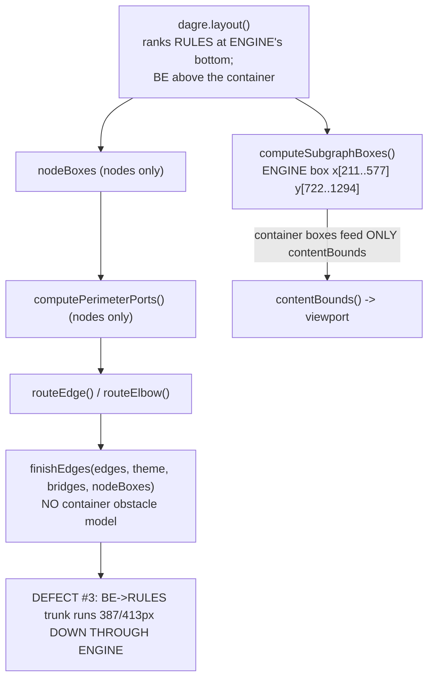
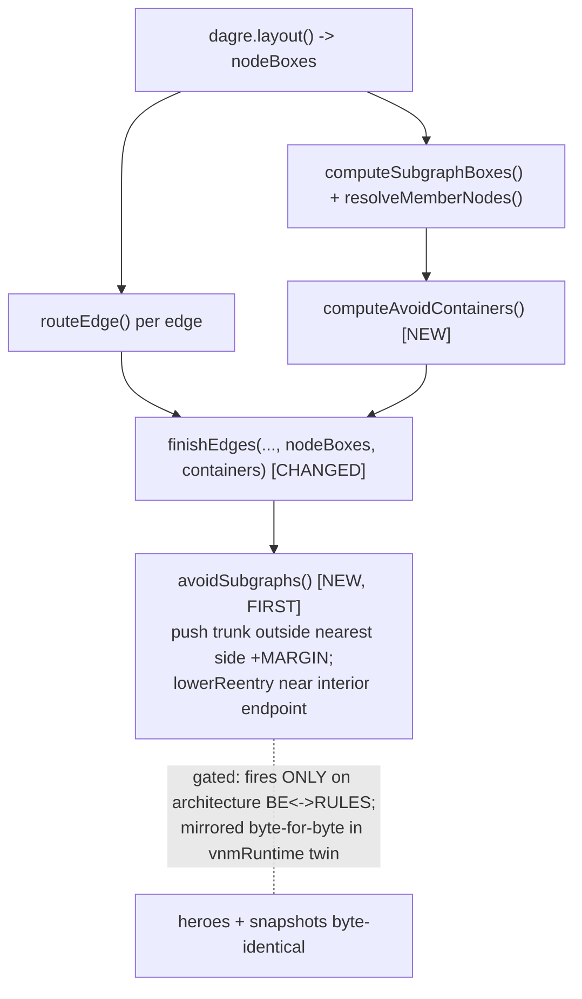

# Report — feature `subgraph-aware-routing` (v0.6.6)

**What shipped:** a single gated, elbow-only post-route pass — **`avoidSubgraphs`** — that pulls an edge's long interior trunk **out** of any `subgraph` container it doesn't fully belong to and re-enters near its real endpoint. It fixes **defect #3** (long `BE↔RULES` edges piercing the `Validation Engine` container on `architecture.mmd`) while firing on **only** those two edges across the entire fixture corpus, so every other diagram — both subgraph heroes included — renders byte-identical to v0.6.5.

## Run status / gaps

All five phases completed. ① plan accepted (D1→A, D2→A) · ② implement (2 rounds: build + review-fix) · ③ review (APPROVE, 2 agent-fixable findings, both fixed→verified) · ④ test (PASS for scope, 1 non-blocking out-of-scope note) · ⑤ report.

- **Open issues:** none blocking. **TEST-001** (minor, needs-user-decision) is a **pre-existing, out-of-scope** parser bug (see Follow-ups + `decisions.md` D3) — not a v0.6.6 regression.
- **Suites:** 426 unit tests + typecheck green; `--version` → 0.6.6.

## Summary

On a dense `flowchart TB`, an edge from a node **outside** a container to a node **inside** it routed as a long vertical straight **through** the container's interior (crossing its border, reading as an edge impaling the box). The router had **no obstacle model for containers** — container boxes were computed *after* layout and fed only `contentBounds` (the viewport), never routing.

v0.6.6 adds `avoidSubgraphs` as the **first** pass in `finishEdges`: for an edge whose long axis-aligned **interior trunk** pierces a container box that does **not** hold **both** endpoints, it pushes that trunk just **outside the nearest container side + a margin** and (when one endpoint is inside) drops the re-entry corner to a short approach near that endpoint. It handles **both axes** (TB vertical / LR horizontal), is **deterministic + idempotent**, and is **mirrored byte-for-byte** in the `vnmRuntime` twin. **Chosen over** full obstacle-aware routing (option b), which would have changed routing for every diagram at high regression risk.

## Planned vs shipped

Shipped **exactly** the accepted plan (D1=A scoped re-route, D2=A low re-entry connector), with two refinements surfaced during build/review:

| Planned | Shipped |
|---|---|
| `avoidSubgraphs` pass run first in `finishEdges`, both axes, threaded containers | Done — run first (before `offsetLabelsOffLine`/`separateLanes`); `computeAvoidContainers` builds the obstacle set |
| Push trunk outside nearest side + margin; lower re-entry near interior endpoint | Done — `SUBGRAPH_AVOID_MARGIN=28`, `lowerReentry` with `SUBGRAPH_AVOID_APPROACH=30`, using the edge's own border anchor (no `computePerimeterPorts` touch) |
| Gate fires only on the reported case | Done — `along` strictly inside cross-span **AND** parallel overlap ≥ `SUBGRAPH_AVOID_MIN_CROSS=120`; corpus scan proves it fires only on `architecture.mmd` `BE↔RULES` |
| Mirror byte-for-byte in both twin routing paths | Done — `avoidSubgraphs` + `avoidContainersFrom` in `renderEdges` (world) + `buildSvg` (abs) |
| Version 0.6.5 → 0.6.6; regenerate docs/examples/heroes | Done — 4 sites; regen churn is inlined-twin-source + version only |
| (refinement, not in the literal plan) | **Idempotency guard**: skip an approach-into-a-member run (`i==1 & from∈c` / `i==len-3 & to∈c`) so the lowered re-entry residual never re-fires regardless of its length |

## Implementation

The change is **small and additive** — one new geometry function + one param on `finishEdges`, mirrored in two twin paths (the same shape as the v0.6.5 change).

**`src/geometry/index.ts`** — new exported `avoidSubgraphs(edges, containers, style)` (+ `AvoidContainer` type, `SUBGRAPH_AVOID_MARGIN/MIN_CROSS/APPROACH` constants, private `lowerReentry`). Per edge it finds the **longest interior axis-aligned run** (`i>=1 && i+2<len`) that pierces a container whose `members` don't include both endpoints, pushes it to `nearest side ± MARGIN` via the existing **`moveLane`** (keeps the elbow orthogonal + connected, carries the label), then `lowerReentry` shortens the interior residual near any inside endpoint. New exported **`computeAvoidContainers`** pairs each `computeSubgraphBoxes` box with its `resolveMemberNodes` member set.

**`src/layout/index.ts`** — `finishEdges` gains an optional 5th param `subgraphs?: ReadonlyArray<AvoidContainer>` and calls `avoidSubgraphs` first. `layout()` and `applyPositions()` pass `computeAvoidContainers(...)`; native/state + class call sites pass nothing → `[]` → no-op (FR5).

**`src/render/dom/runtime.ts`** — byte-for-byte twin `avoidSubgraphs` + a small `avoidContainersFrom(boxOf)` helper, called **first** in both `renderEdges` (`subgraphWorldBox`) and `buildSvg` (`subgraphAbsBox`), membership from `subgraphMembers`. Same constants, same interior-run rule, same skips, `nAt`≡`n`, `pathPoly`≡`toPath(...,"elbow")`.

**Version** 0.6.5 → 0.6.6: `package.json`, `src/cli/run.ts`, `test/cli.test.ts`, `docs/_config.yml`.

### As-built changes

| File | Change |
|---|---|
| `src/geometry/index.ts` | `avoidSubgraphs` + `lowerReentry` + `computeAvoidContainers` + `AvoidContainer` + 3 constants (+164 lines) |
| `src/layout/index.ts` | `finishEdges` 5th param + `avoidSubgraphs` call; `layout()`/`applyPositions()` pass containers; imports |
| `src/render/dom/runtime.ts` | twin `avoidSubgraphs` + `avoidContainersFrom`; called first in `renderEdges` + `buildSvg` (+112 lines) |
| `test/geometry.test.ts` | 8 `avoidSubgraphs` unit tests (TB fire/both-in/neither-in/elbow-only/no-containers/idempotent/entry-sliver + LR horizontal) |
| `test/dom-runtime-parity.test.ts` | parity helper passes containers (L190); 3 arch cases + 1 LR twin-parity + 1 drag-parity |
| `test/cli.test.ts`, `package.json`, `src/cli/run.ts`, `docs/_config.yml` | version 0.6.6 |
| `docs/interactive/*.html` (18) | regenerated — inlined twin source growth only (0 rendered-path changes) |

## Decisions & rationale

- **D1 → A (scoped `avoidSubgraphs` re-route).** Ship the small, provably-zero-churn fix rather than full obstacle-aware routing. **Reason:** obstacle routing (option b) is large and changes routing for *every* diagram (high regression); the scoped nudge fixes the reported case and, verified by corpus scan, fires only on `architecture.mmd`'s two edges. Documented limitations (diagonal/nested/multi-obstacle) accepted.
- **D2 → A (low re-entry connector).** Keep the interior endpoint's existing port; drop a short approach connector near it. **Reason:** cleanest risk/scope trade — `lowerReentry` uses the edge's own border anchor, so it never touches `computePerimeterPorts` (the most parity-mirrored function).
- **(build-time) Idempotency guard.** A synthetic case showed the lowered re-entry residual could exceed `MIN_CROSS` when the endpoint sits far from the crossed side, re-firing on a second pass. **Reason/fix:** skip a run adjacent to a **member** anchor — it is that endpoint's own approach, not a foreign pierce — guaranteeing idempotency for any geometry (the real `architecture` residual was already safe at 98 < 120).
- **D3 (test) → surfaced, non-blocking.** `microservices.mmd`'s `Core services` subgraph never renders (pre-existing parser membership-order bug, out of scope). **Reason:** byte-identical to `master`; the plan excludes membership-rule changes. Left for the user to optionally ticket separately.

## Review outcome

**Verdict: APPROVE** — 2 findings (1 minor, 1 nit), **no blockers/majors**, both agent-fixable test-coverage gaps. The reviewer verified twin byte-parity line-by-line (the repo's #1 trap), confirmed the parity reference is faithful (not bypassing the pass), and confirmed state/class layouts pass no containers → runtime no-op. Both findings **fixed → verified**:

- **REV-001 (minor):** the horizontal (LR) branch shipped untested → added an LR unit test (geometry `moveLane`/`lowerReentry` x-branch) + an `flowchart LR` parity fixture that fires the pass (twin horizontal branch now byte-parity guarded).
- **REV-002 (nit):** the drag path re-runs the pass but wasn't fired under repositioning → added a drag-parity case (deterministic + `toSvgString()`==`renderSvg` after a live drag).

Detail: [`../review/issues.json`](../review/issues.json) · [`../review/review-01.md`](../review/review-01.md).

## Test outcome

**Verdict: PASS** for the feature scope. **The hard acceptance bar was met on real rendered PNGs (light + dark):** the `BE↔RULES` edges route down the **outside** of the `Validation Engine` container and re-enter near `RULES`; the interior (`MCP surface`, `Veris console`) reads **clean**, no impaling verticals; the `RULES` re-entry is short/clean.

- **No-regression (paramount):** corpus scan → gate fires on **only** `architecture.mmd`'s `BE↔RULES`; every fixture no-ops, idempotent. `nested-subgraphs` (real members, containers=2) is a genuine both-in no-op; `microservices` byte-identical. Regenerated `examples/` + `assets/` heroes: **0 changed files**. Docs: **0 rendered-path changes**. 2× re-render byte-identical. Prior invariants (v0.6.2/6.4/6.5, FR7) intact.
- **Levels:** CLI (svg/png/html, light+dark, exit 0) · unit/parity (426 green) · interactive — live Playwright drag of **both** `BE` and `RULES`: trunks stay outside the re-hugged container, zero stranded edges, zero console errors (FR5).
- **1 finding — TEST-001 (minor, out-of-scope):** see Follow-ups.

Detail: [`../test/issues.json`](../test/issues.json) · [`../test/test-01.md`](../test/test-01.md).

## Diagrams

See [`./diagrams.html`](./diagrams.html) (offline). As-built set: `flow.mmd` (the `finishEdges` pipeline + twin mirroring), `activity.mmd` (the per-edge/run/container decision flow). Before set in [`./before/`](./before/).

## Knowledge updates

- `code-review-standards.md` (owned) — added a verified `subgraph-aware-routing` gotcha (a new `finishEdges` pass needs its twin at BOTH runtime call sites, the parity reference must pass the same containers, and prove a gated pass with the rendered corpus).
- `tech-stack.md` (proxy — `gogo overrides` only) — recorded v0.6.6: `avoidSubgraphs` pass, the version bump, and defect #3 resolved.

## Before / after comparison

**Flow (present in both):**

_Before — the router has no obstacle model; `BE↔RULES` pierce `ENGINE`:_

_After — `avoidSubgraphs` runs first with a container obstacle model:_

**What changed:** container boxes now reach routing (via `computeAvoidContainers` → `finishEdges`' new param) and `avoidSubgraphs` reshapes only the offending trunks; the before graph's `contentBounds`-only dead-end is replaced by a gated, mirrored obstacle pass. No kinds removed; `activity.mmd` (the decision flow) is **added** in the after set (no before equivalent).

## Summary (TL;DR)

- **Shipped:** v0.6.6 `avoidSubgraphs` — a gated, elbow-only, idempotent post-route pass (first in `finishEdges`, mirrored byte-for-byte in the `vnmRuntime` twin) that routes a trunk **around** a container it doesn't belong to and re-enters near its endpoint. Fixes defect #3 on `architecture.mmd`.
- **Review:** APPROVE — 2 agent-fixable test-coverage findings, both fixed → verified; twin parity confirmed line-by-line.
- **Test:** PASS — hard acceptance bar met on real light+dark PNGs (trunks outside, interior clean, clean re-entry); zero corpus churn (both subgraph heroes + all snapshots byte-identical); FR5 drag verified live.
- **Follow-ups:** **TEST-001** — a pre-existing, out-of-scope parser membership-order bug hides `microservices.mmd`'s `Core services` box (byte-identical to `master`; not a v0.6.6 regression). Optional separate ticket — the user decides. Also deferred by design: full obstacle-aware routing, and diagonal/nested/multi-obstacle crossings.
