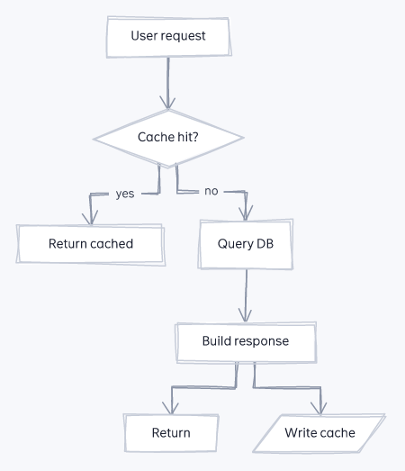

# very-nice-mermaid

[](https://github.com/ZawadzkiB/very-nice-mermaid/actions/workflows/ci.yml)
[](https://www.npmjs.com/package/very-nice-mermaid)
[](./LICENSE)
[](#install)

A framework-agnostic **Mermaid flowchart** renderer. It keeps Mermaid's DSL and
replaces everything after it with **our own parser, layout, and renderers** — so
you get **beautiful, interactive, themeable** diagrams with **no `mermaid.js`
runtime and no headless browser**.

<p align="center">
  
</p>

- **Library** — parse DSL and `mount()` an **interactive** diagram (drag + resize nodes,
  edges re-route live, pan / wheel-zoom / fit, minimap, layout persistence) in
  any app, plus a `<very-nice-mermaid>` **web component**.
- **CLI** (`vnm`) — render a `.mmd` file (or stdin) to a **self-contained
  interactive HTML** file, a static **SVG**, a **PNG**, or **ASCII** in a
  markdown fence.
- **Themes** — `light` / `dark` / `fancy` built in; define your own as a token
  set (JSON for the CLI, an object or CSS variables for the library).
- **Sketch style** — a hand-drawn (Excalidraw-like) look via `--style sketch`:
  wobbly multi-stroke outlines, open arrowheads, and a bundled handwriting font.
  A separate axis from `--theme`, so it composes with any palette. Deterministic
  and self-contained (the font embeds as base64 — zero network). Works for
  flowchart, sequence, class, and state diagrams, across SVG / PNG / HTML /
  interactive.

```
mermaid DSL ──parse──▶ DiagramModel ──dagre──▶ PositionedModel ──┬─▶ interactive DOM (lib / web component / HTML)
                                                                 ├─▶ SVG string ──resvg──▶ PNG
                                                                 └─▶ ASCII
```

## Quick start

**CLI** — no install needed, just `npx`:

```bash
# an interactive, self-contained HTML page you can open in any browser
npx very-nice-mermaid render diagram.mmd -o diagram.html --theme dark

# …or a static SVG / PNG / ASCII
npx very-nice-mermaid render diagram.mmd -o diagram.svg
echo 'flowchart LR; A[Hi] --> B([There])' | npx very-nice-mermaid render - -f md
```

**Library** — mount an interactive diagram in three lines:

```ts
import { mount } from "very-nice-mermaid";

mount(document.getElementById("diagram")!, `
  flowchart LR
    A[Start] --> B{Choice}
    B -->|yes| C([Done])
    B -->|no| D[Fix] --> A
`, { theme: "dark" });
```

**Web component** — zero wrapper code, works in any framework:

```html
<script type="module">import "very-nice-mermaid/element";</script>
<very-nice-mermaid theme="fancy" style="height: 420px">
  flowchart LR
    A[Start] --> B{Choice} --> C([Done])
</very-nice-mermaid>
```

## Gallery

| Light | Dark | Sketch |
|---|---|---|
|  |  |  |

Drag nodes to reorganize (edges re-route live), scroll to zoom, and the layout
persists across reloads. `--theme fancy` adds curved edges and glow;
`--style sketch` renders the whole diagram hand-drawn (and still composes with
any theme).

## Install

```bash
npm install very-nice-mermaid
# PNG output is optional — install the native rasterizer only if you need it:
npm install @resvg/resvg-js
```

Requires **Node ≥ 20**. ESM-only, with TypeScript types.

## Library API

```ts
import {
  parse, layout,
  renderSvg, renderAscii, renderMarkdown, renderHtml, renderPng,
  renderSvgAsync, renderHtmlAsync, renderMarkdownAsync, // type-routed (any diagram)
  mount, mountAsync, themes, defineTheme,
} from "very-nice-mermaid";

const dsl = `
flowchart LR
  A[Start] --> B{Choice}
  B -->|yes| C([Done])
  B -->|no| D[(Store)]
`;

// Pure string renderers (work in Node and the browser):
const svg = renderSvg(dsl, { theme: "dark" });     // → SVG string
const sketch = renderSvg(dsl, { style: "sketch" }); // → hand-drawn SVG (composes with any theme)
const md  = renderMarkdown(dsl);                    // → ```-fenced ASCII
const html = renderHtml(dsl, { theme: "fancy", style: "sketch" }); // → standalone interactive page
const png = await renderPng(dsl, { scale: 2, style: "sketch" });   // → Uint8Array (needs @resvg/resvg-js)

// Or work with the pipeline directly:
const model = parse(dsl, { strict: false });        // → DiagramModel (+ warnings)
const positioned = layout(model, { theme: themes.light });
```

Every renderer accepts a **DSL string**, a parsed **`DiagramModel`**, or an
already-positioned **`PositionedModel`**.

### Sync (flowchart) vs. async (every diagram type)

The `renderSvg` / `renderAscii` / `renderMarkdown` / `renderHtml` functions above
are **synchronous** and handle the **flowchart family** (they run the built-in,
no-dependency parser + layout). Give one a raw **non-flowchart** string and it
throws a clear error rather than misparsing it into a garbage flowchart.

To render **any** Mermaid diagram type from a raw string, use the `…Async`
twins. They run Mermaid's `detectType` router and dispatch: **flowchart** via the
sync fast path, **sequence / class / state** re-skinned into our themed engine,
and **everything else** (pie, gantt, ER, gitgraph, mindmap, …) via the bundled
**mermaid.js fallback** engine. They are async because those tiers load mermaid
(and, in Node, a jsdom DOM) lazily — so flowchart-only users never pay for it.

```ts
import { renderSvgAsync, renderHtmlAsync, renderMarkdownAsync } from "very-nice-mermaid";

const svg  = await renderSvgAsync(`sequenceDiagram\n  A->>B: hi`);   // native sequence
const svg2 = await renderSvgAsync(`pie title P\n  "A": 1\n  "B": 2`); // mermaid fallback
const html = await renderHtmlAsync(`stateDiagram-v2\n  [*] --> On`);  // native state
```

> **Headless note:** in Node, layout-heavy fallback types (gantt/ER/gitgraph/…)
> render degenerately under jsdom, so the CLI/async path reports a clear
> `fallback-render-unavailable` error for them (they render correctly in a real
> browser). Pie and the native tiers are unaffected.

`mount()` and the `<very-nice-mermaid>` element route **every** type automatically
(see below) — no need to pick sync vs. async yourself.

### Interactive `mount()`

```ts
import { mount } from "very-nice-mermaid";

const handle = mount(document.getElementById("diagram")!, dsl, {
  theme: "dark",
  minimap: true,        // default true
  persist: true,        // auto-save layout to localStorage (or pass a string key)
});

handle.fit();                       // fit-to-view
handle.zoomIn(); handle.zoomOut();
handle.resetLayout();               // discard manual moves + resizes + anchor pins → computed
const layoutJson = handle.exportLayout();   // portable { positions, sizes, anchors, transform }
handle.importLayout(layoutJson);            // restore a saved layout (positions + sizes + anchors)
const svg = handle.toSvgString();           // the current edited diagram as themed SVG
handle.setTheme(themes.fancy, themes.fancy.cssVars());
handle.destroy();
```

Drag a node and its edges re-route live off the card borders; **select a node and
drag a corner handle to resize it** (the card and every connected edge follow, with
a minimum-size clamp). Edges **auto-distribute around the whole node perimeter** by
the direction to their other end, so hubs with many connections stay readable. The
background pans, the wheel zooms at the cursor, and the layout — **positions *and*
sizes** — auto-persists (debounced) to `localStorage`, so a reload keeps every edit.
Changed your mind? The toolbar's **Reset layout** button (⟲) discards every manual
move, resize **and anchor pin**, returns the diagram to the computed layout, and clears
the persisted layout so a reload stays reset (pan/zoom is left as-is — that's
`resetView()`'s job). `handle.resetLayout()` does the same from code.

**Subgraph containers are interactive (0.4.0).** A `subgraph` box **auto-contains**
its members — it recomputes its outline from its children's live positions and sizes
on every drag / resize / reset, so it hugs the cluster and is never left stranded when
you pull a child out. Grab the container's **dashed border or title band** to **drag
the whole cluster** as a group (every member moves together and edges re-route live —
the open interior still pans the canvas). Membership is fixed by the DSL: dragging a
child out doesn't un-group it, the box just re-hugs. The static SVG honors the same
recompute, so `vnm render -f svg` and **Save SVG** match.

**Pin an edge where you want it (0.4.0).** Select a node to reveal small **anchor
handles** at its incident edge endpoints; drag one along the border to **pin that end**
to a `{ side, offset }` of your choice, overriding the auto-distribute for that end only
(the other end keeps auto-distributing). Pins **persist** in the layout sidecar +
`localStorage`, are honored by the static SVG (parity), and are cleared by **Reset layout**.

In the portable `layout.json`, pins live under an **`anchors`** map **keyed by edge
index** (`positions`/`sizes` are keyed by stable node id; edges have no ids to key on).
Each entry is `{ source?: {side,offset}, target?: {side,offset}, from, to }` — the
`from`/`to` node ids record which edge the index referred to when it was saved. Because
the map is index-based it is **diagram-version-specific**: on import (both `importLayout`
and the CLI `--layout`) an out-of-range index is dropped, and a stored `from`/`to` is
used to **re-map a pin to its edge if the diagram's edges were reordered** (or drop it if
that edge is gone) — so a stale sidecar never silently pins a *different* edge. Sidecars
written before this validation (no `from`/`to`) still import, bounds-checked only.

**Save the edited diagram** from the toolbar: **SVG** downloads the current
positioned + resized model serialized to our themed SVG (identical to
`vnm render -f svg` of the same state), and **PNG** rasterizes that SVG in-browser
via a `<canvas>` — no server, no headless browser. Both controls ship in the
standalone HTML export, and `handle.toSvgString()` returns the same SVG string. The
portable `exportLayout()` sidecar (and the CLI's `--layout`) now carries per-node
size overrides alongside positions.

> **0.3.0 breaking change (model API).** To support perimeter distribution,
> `RoutedEdge.ports` changed shape: `source`/`target` are now perimeter anchors
> `{ side, offset }` (`side` is `"top" | "bottom" | "left" | "right"`), not the old
> scalar offsets. Code that read `edge.ports.source` / `edge.ports.target` as a
> number must now read `.offset` (and may read `.side`). The persisted `layout.json`
> sidecar is unaffected — it carries positions, sizes, **edge anchor pins** (0.4.0,
> keyed by edge index), and the view transform.

`mount()` routes **every** diagram type: a flowchart mounts immediately, while a
raw sequence / class / state / fallback string returns the handle **synchronously**
and finishes rendering **asynchronously** (it loads mermaid, then swaps the render
in). Prefer `await mountAsync(el, dsl, opts)` when you need the settled handle.

## Web component

The `<very-nice-mermaid>` element self-registers on import. It reads the diagram
from its inline text (or a `src` attribute), a theme from the `theme` attribute,
and the hand-drawn look from a boolean `sketch` attribute — zero wrapper code in
React / Angular / Vue / plain HTML.

```html
<script type="module">
  import "very-nice-mermaid/element";
</script>

<very-nice-mermaid theme="dark" style="height: 420px">
  flowchart LR
    A[Start] --> B{Choice} --> C([Done])
</very-nice-mermaid>

<!-- hand-drawn: the boolean `sketch` attribute (separate from the CSS `style` attr) -->
<very-nice-mermaid theme="light" sketch style="height: 420px">
  flowchart LR
    A[Start] --> B{Choice} --> C([Done])
</very-nice-mermaid>

<!-- or load the DSL from a file -->
<very-nice-mermaid theme="fancy" src="./pipeline.mmd" style="height: 420px"></very-nice-mermaid>
```

## CLI

```bash
vnm render <file|-> [options]

  -o, --output <file>       output file (default: stdout)
  -f, --format <fmt>        html | svg | png | md   (inferred from -o if omitted)
  -t, --theme <name|path>   light | dark | fancy, or a theme .json file
  -s, --style <clean|sketch> drawing style: clean (default) or hand-drawn sketch
      --strict              treat parser warnings as errors
      --layout <file>       apply a portable layout.json (node positions + sizes)
      --scale <n>           PNG scale factor (HiDPI)
      --background <color>  background color, or 'transparent'
      --title <title>       HTML document <title>
```

```bash
vnm render diagram.mmd -o diagram.html --theme dark   # interactive page
vnm render diagram.mmd -o diagram.svg                 # static SVG
vnm render diagram.mmd -o sketch.svg --style sketch   # hand-drawn look
vnm render diagram.mmd -o diagram.png --scale 2       # HiDPI PNG
cat diagram.mmd | vnm render - -f md                  # ASCII to stdout
```

`--style sketch` composes with any `--theme` and works for flowchart / sequence /
class / state diagrams (the mermaid.js fallback types keep their own look).

Format is inferred from the `-o` extension; diagnostics go to **stderr** with
`line:col`; exit code is non-zero on error. Both `vnm` and `very-nice-mermaid`
are installed as bins.

## Supported DSL (v1)

Flowcharts only (`flowchart` / `graph`, directions `TB`/`TD`/`BT`/`LR`/`RL`):

- **Shapes** — rect `[]`, rounded `()`, stadium `([])`, subroutine `[[]]`,
  circle `(())`, diamond `{}`, hexagon `{{}}`, parallelograms `[/ /]` `[\ \]`,
  cylinder `[( )]`.
- **Edges** — solid `-->`, open `---`, dotted `-.->`, thick `==>`; labels via
  `-->|text|` or `-- text -->`; `&` fan-in/out chaining; `<`/`x`/`o` arrow ends.
- **Structure** — nested `subgraph … end`, `direction` inside a subgraph.
- **Styling** — `classDef`, `class`, inline `:::class`, `style`.
- **Misc** — `%%` comments, quoted labels, `<br/>` line breaks.

> **Interactive vs. static rendering** — the static **SVG** / **PNG** output
> draws each node's full shape silhouette (diamonds, hexagons, cylinders, …). The
> interactive renderer — `mount()`, the `<very-nice-mermaid>` element, and the
> standalone **HTML** export — draws every node as a **rounded card**, varying
> only the corner radius (stadium / circle → pill). Expect the interactive / HTML
> view to differ from `renderSvg` / PNG for non-rectangular shapes.

Parsing is **lenient** by default: unknown constructs degrade to a structured
warning carrying `line`/`col`. `--strict` (CLI) / `{ strict: true }` (API) turns
warnings into errors.

## Theming

A theme is a **token set**: colors (including per-role node fills/strokes),
radii, font stacks, spacing, edge style (`elbow` | `curved`), and effects.

```ts
import { defineTheme, themes } from "very-nice-mermaid";

const ocean = defineTheme(
  {
    colors: { background: "#04283b", surface: "#0b3b57", accent: "#39c0ed" },
    edge: { style: "curved" },
  },
  { base: "dark", name: "ocean" },
);

renderSvg(dsl, { theme: ocean });
```

- **CLI custom theme** — pass a JSON file of the same (partial) token shape:
  `vnm render d.mmd -o d.svg --theme ./my-theme.json`. See
  [`theme.example.json`](./theme.example.json) for an annotated, copy-paste
  starting point with every token. Only include the keys you want to change —
  the rest inherit from `light`.
- **CSS variables** — the DOM renderer applies `theme.cssVars()` (`--vnm-*`) to
  its root, so you can override colors from your own stylesheet:

  ```css
  .my-diagram { --vnm-surface: #fff; --vnm-accent: #e91e63; --vnm-edge: #888; }
  ```

## Development

```bash
npm run build       # tsup → dist/ (ESM + .d.ts)
npm run typecheck   # tsc --noEmit
npm run build && npm run test:all   # build, typecheck, all tests below
```

### Tests

Three layers, run independently:

```bash
npm run test:unit   # pure unit (parser, layout, geometry, svg, ascii, theme, html)
npm run test:cli    # CLI integration — spawns the built `vnm` bin end-to-end
npm run test:e2e    # Playwright — drives the real interactive renderer in Chromium
npm test            # unit + CLI integration together (vitest)
npm run test:all    # build + typecheck + vitest + Playwright
```

- **Unit** — the pure pipeline: DSL → model → layout → SVG/ASCII, theme merging,
  the HTML-export/runtime parity guard.
- **CLI integration** (`test/cli.test.ts`) — runs the actual built binary via
  `child_process`: all four formats to files and stdout, format inference, every
  fixture rendered (valid XML SVG, zero-network HTML), PNG scaling, built-in and
  custom-JSON themes, `--layout` / `--strict` / `--title` / `--background`, and
  the error paths (bad DSL with line/col, zero-node input, unreadable files).
- **e2e** (`e2e/*.spec.ts`) — the exported HTML and the `<very-nice-mermaid>`
  element in a real browser: drag-to-reroute, pan / wheel-zoom / fit / zoom
  buttons, minimap, layout persistence, the `exportLayout`/`importLayout` handle
  API, per-theme edge geometry, subgraph rendering, and a console-error-free
  interaction session. Needs `npx playwright install chromium`.

## License

MIT
