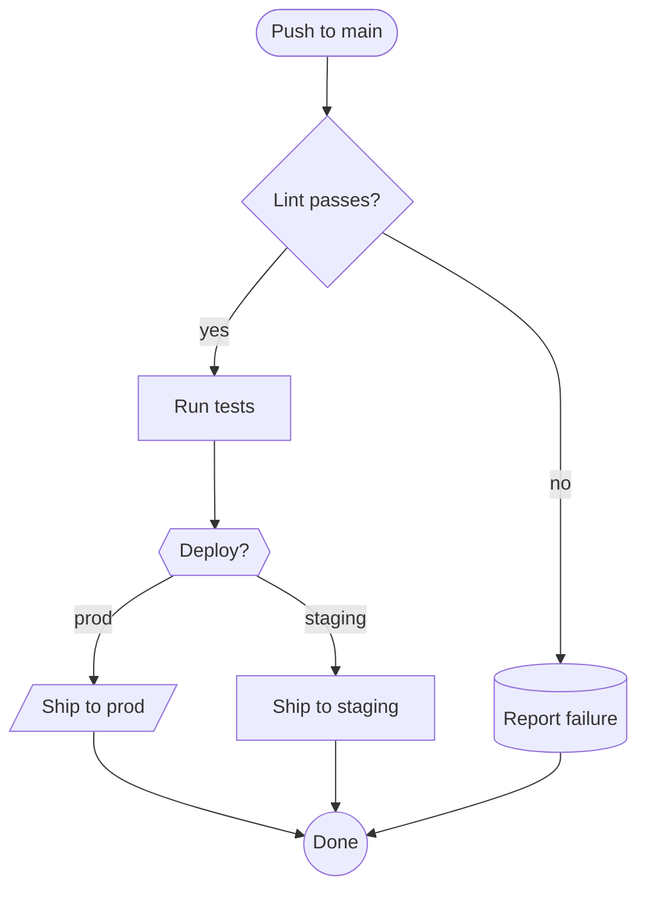
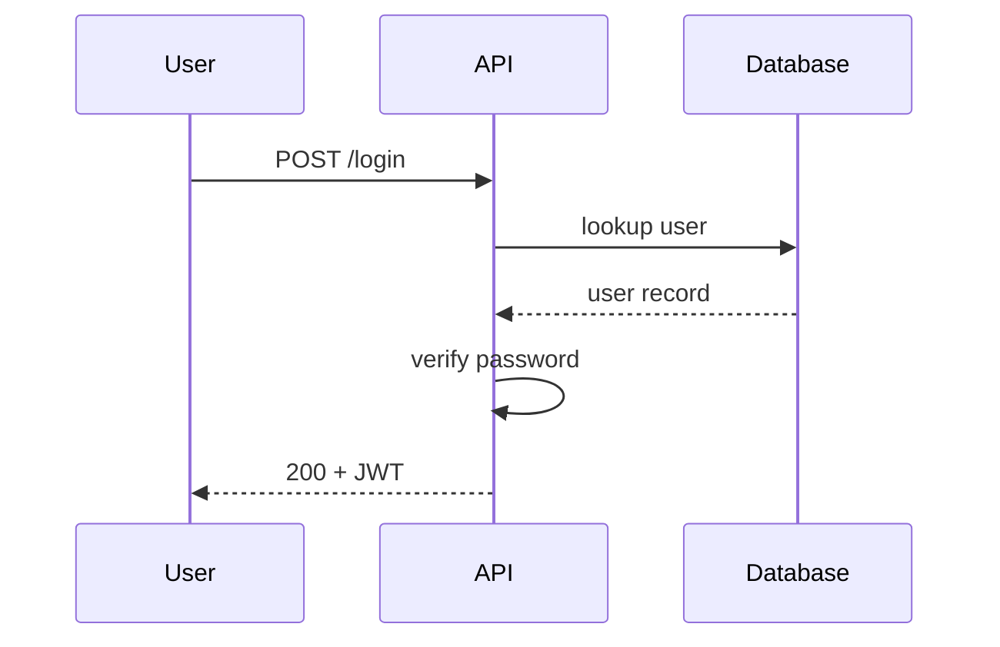
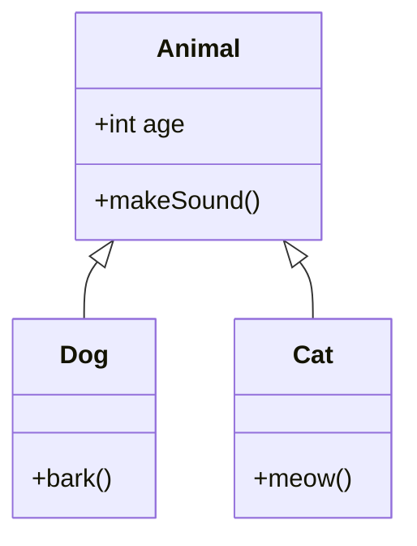
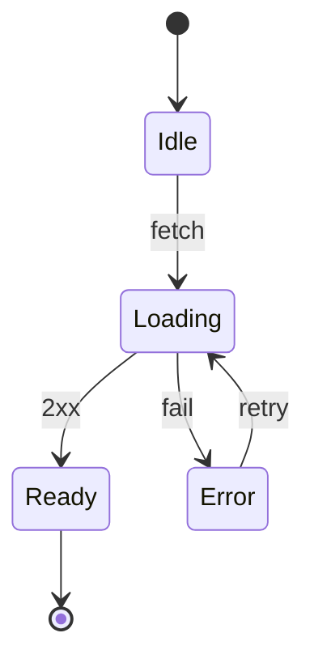

# Live gallery
{: .no_toc }

Every diagram below is the **real interactive HTML export** — the exact file
`vnm render diagram.mmd -o out.html` produces, embedded in an `<iframe>`. It runs
entirely in your browser, no server involved.

> **Try it:** drag a node and its edges re-route live off the card borders. Scroll
> to **zoom** at the cursor, drag the empty background to **pan**, and use the
> toolbar to fit / reset / **Save SVG · PNG**. Grab a corner handle on a selected
> node to **resize** it.

Each section shows the DSL, one diagram live, and a grid of every **style × theme**
combination — click any thumbnail to open that one full-screen. These are
regenerated from the current renderer on every `npm run docs`, so they never drift.
{: .fs-3 }

1. TOC
{:toc}

---

## Flowchart



<iframe class="vnm-embed" src="{{ '/interactive/flowchart-clean-dark.html' | relative_url }}" title="Interactive flowchart (dark)" loading="lazy"></iframe>

[Open full-screen ↗]({{ '/interactive/flowchart-clean-dark.html' | relative_url }}){: .btn .btn-outline }

<div class="vnm-thumbs" markdown="0">
  <a href="{{ '/interactive/flowchart-clean-light.html' | relative_url }}" target="_blank"><span class="cap">clean · light</span></a>
  <a href="{{ '/interactive/flowchart-clean-dark.html' | relative_url }}" target="_blank"><span class="cap">clean · dark</span></a>
  <a href="{{ '/interactive/flowchart-clean-fancy.html' | relative_url }}" target="_blank"><span class="cap">clean · fancy</span></a>
  <a href="{{ '/interactive/flowchart-sketch-light.html' | relative_url }}" target="_blank"><span class="cap">sketch · light</span></a>
  <a href="{{ '/interactive/flowchart-sketch-dark.html' | relative_url }}" target="_blank"><span class="cap">sketch · dark</span></a>
  <a href="{{ '/interactive/flowchart-sketch-fancy.html' | relative_url }}" target="_blank"><span class="cap">sketch · fancy</span></a>
</div>

---

## Sequence



<iframe class="vnm-embed" src="{{ '/interactive/sequence-clean-dark.html' | relative_url }}" title="Interactive sequence diagram (dark)" loading="lazy"></iframe>

[Open full-screen ↗]({{ '/interactive/sequence-clean-dark.html' | relative_url }}){: .btn .btn-outline }

<div class="vnm-thumbs" markdown="0">
  <a href="{{ '/interactive/sequence-clean-light.html' | relative_url }}" target="_blank"><span class="cap">clean · light</span></a>
  <a href="{{ '/interactive/sequence-clean-dark.html' | relative_url }}" target="_blank"><span class="cap">clean · dark</span></a>
  <a href="{{ '/interactive/sequence-clean-fancy.html' | relative_url }}" target="_blank"><span class="cap">clean · fancy</span></a>
  <a href="{{ '/interactive/sequence-sketch-light.html' | relative_url }}" target="_blank"><span class="cap">sketch · light</span></a>
  <a href="{{ '/interactive/sequence-sketch-dark.html' | relative_url }}" target="_blank"><span class="cap">sketch · dark</span></a>
  <a href="{{ '/interactive/sequence-sketch-fancy.html' | relative_url }}" target="_blank"><span class="cap">sketch · fancy</span></a>
</div>

---

## Class



<iframe class="vnm-embed" src="{{ '/interactive/class-clean-light.html' | relative_url }}" title="Interactive class diagram (light)" loading="lazy"></iframe>

[Open full-screen ↗]({{ '/interactive/class-clean-light.html' | relative_url }}){: .btn .btn-outline }

<div class="vnm-thumbs" markdown="0">
  <a href="{{ '/interactive/class-clean-light.html' | relative_url }}" target="_blank"><span class="cap">clean · light</span></a>
  <a href="{{ '/interactive/class-clean-dark.html' | relative_url }}" target="_blank"><span class="cap">clean · dark</span></a>
  <a href="{{ '/interactive/class-clean-fancy.html' | relative_url }}" target="_blank"><span class="cap">clean · fancy</span></a>
  <a href="{{ '/interactive/class-sketch-light.html' | relative_url }}" target="_blank"><span class="cap">sketch · light</span></a>
  <a href="{{ '/interactive/class-sketch-dark.html' | relative_url }}" target="_blank"><span class="cap">sketch · dark</span></a>
  <a href="{{ '/interactive/class-sketch-fancy.html' | relative_url }}" target="_blank"><span class="cap">sketch · fancy</span></a>
</div>

---

## State



<iframe class="vnm-embed" src="{{ '/interactive/state-clean-fancy.html' | relative_url }}" title="Interactive state diagram (fancy)" loading="lazy"></iframe>

[Open full-screen ↗]({{ '/interactive/state-clean-fancy.html' | relative_url }}){: .btn .btn-outline }

<div class="vnm-thumbs" markdown="0">
  <a href="{{ '/interactive/state-clean-light.html' | relative_url }}" target="_blank"><span class="cap">clean · light</span></a>
  <a href="{{ '/interactive/state-clean-dark.html' | relative_url }}" target="_blank"><span class="cap">clean · dark</span></a>
  <a href="{{ '/interactive/state-clean-fancy.html' | relative_url }}" target="_blank"><span class="cap">clean · fancy</span></a>
  <a href="{{ '/interactive/state-sketch-light.html' | relative_url }}" target="_blank"><span class="cap">sketch · light</span></a>
  <a href="{{ '/interactive/state-sketch-dark.html' | relative_url }}" target="_blank"><span class="cap">sketch · dark</span></a>
  <a href="{{ '/interactive/state-sketch-fancy.html' | relative_url }}" target="_blank"><span class="cap">sketch · fancy</span></a>
</div>

---

## Reproduce these

Every asset on this page is generated by the built CLI:

```bash
npm install -g very-nice-mermaid

# the interactive HTML embedded above:
vnm render flowchart.mmd -o flowchart.html --theme dark
vnm render flowchart.mmd -o sketch.html   --theme light --style sketch

# the static thumbnails:
vnm render flowchart.mmd -o flowchart.png --theme dark --scale 2
```

In this repo, `npm run docs` regenerates the whole gallery from
[`examples/src/*.mmd`](https://github.com/ZawadzkiB/very-nice-mermaid/tree/master/examples/src).
