# Examples

> Auto-generated by `npm run examples` — **do not edit by hand.**
> Every diagram type rendered in each `--style` (clean / sketch) and theme (light / dark).
> Regenerated on each run so the gallery always matches the current renderer.

## Class

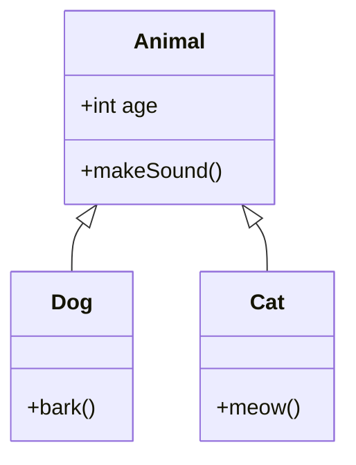

| | Clean | Sketch |
|---|---|---|
| **Light** | 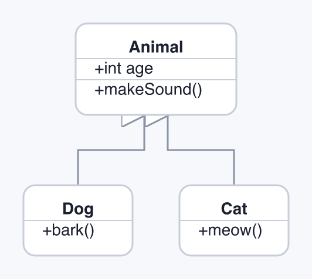 | 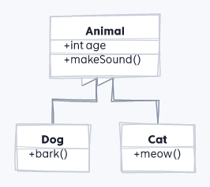 |
| **Dark** | 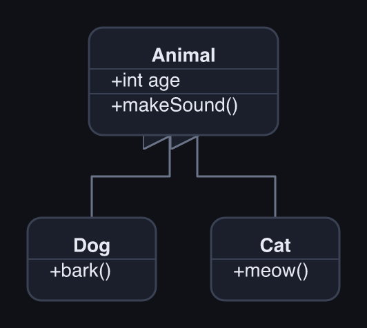 | 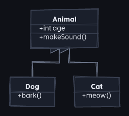 |

## Flowchart

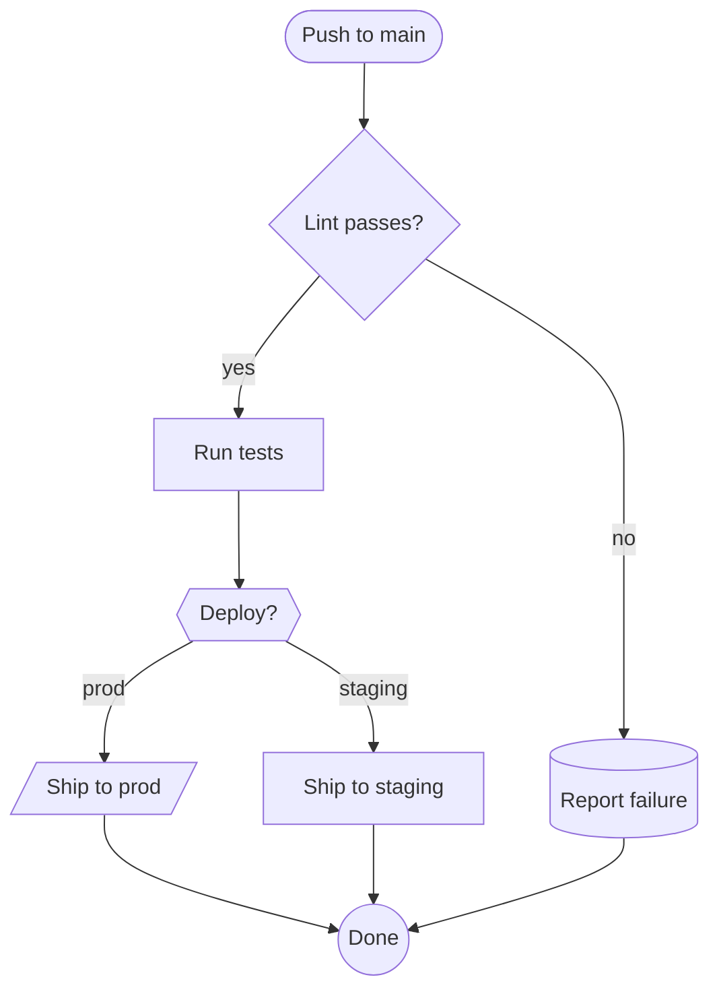

| | Clean | Sketch |
|---|---|---|
| **Light** | 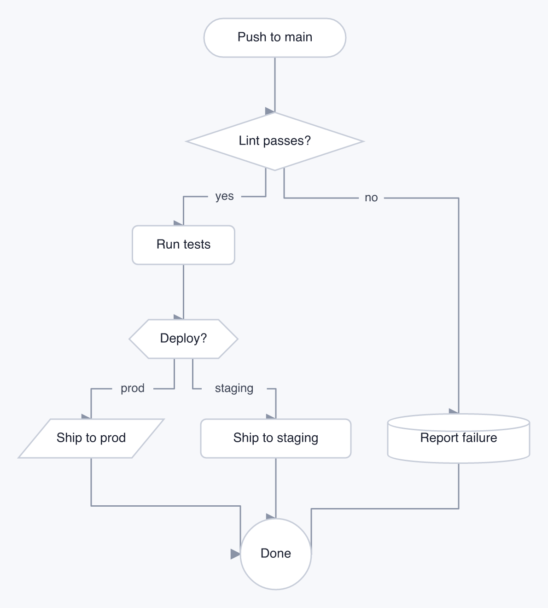 | 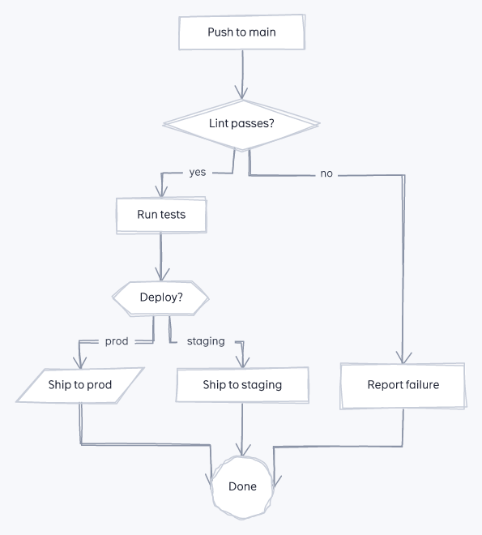 |
| **Dark** | 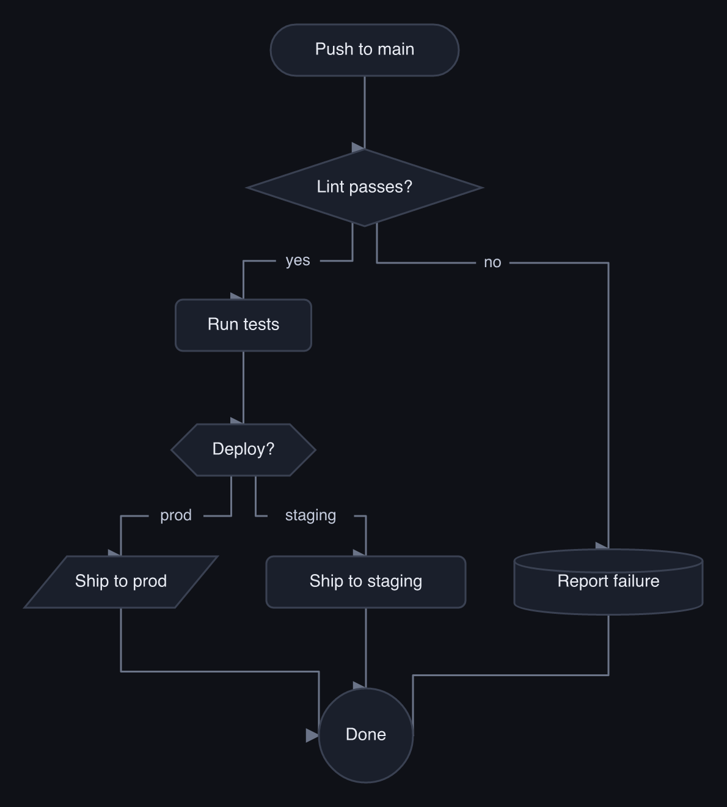 | 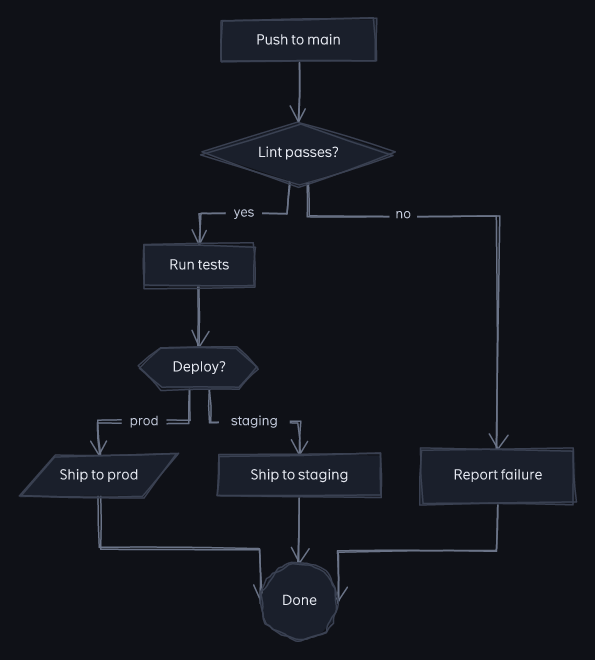 |

## Sequence

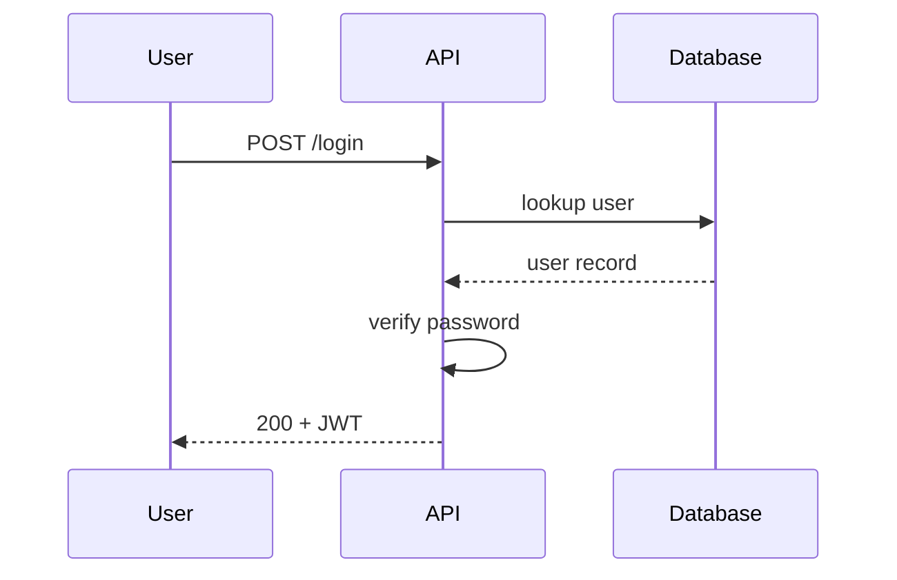

| | Clean | Sketch |
|---|---|---|
| **Light** | 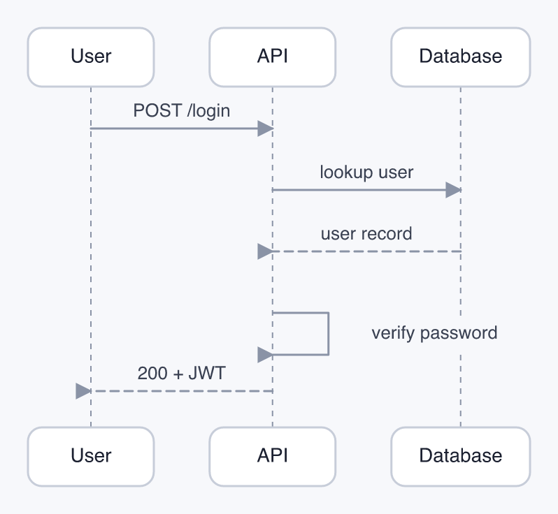 | 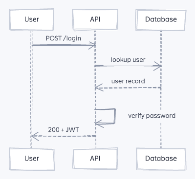 |
| **Dark** | 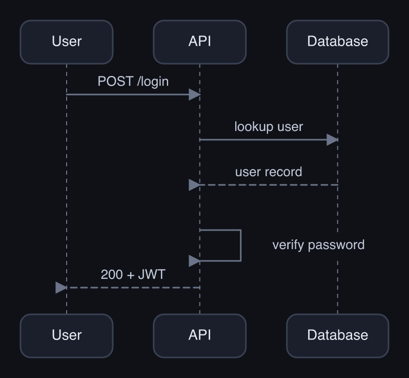 | 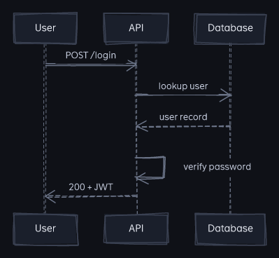 |

## State

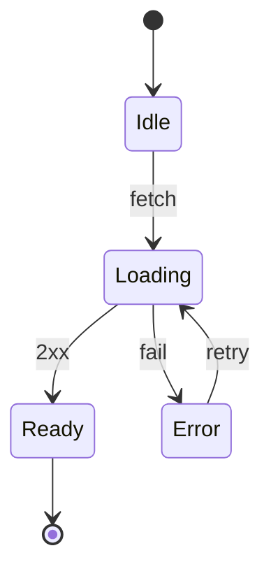

| | Clean | Sketch |
|---|---|---|
| **Light** | 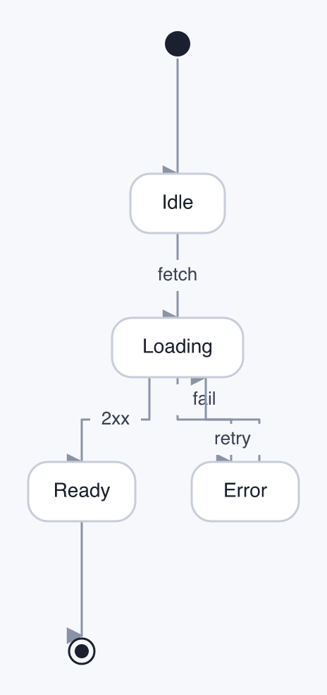 | 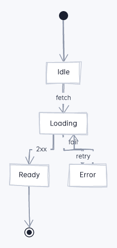 |
| **Dark** | 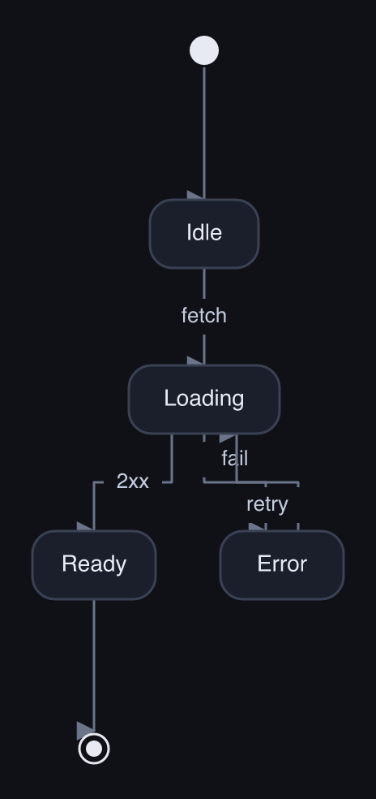 | 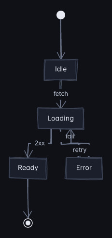 |

